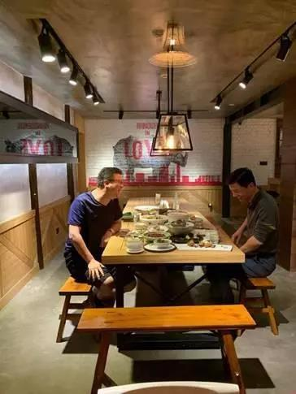

##正文

有人的地方就有江湖。

从2014年第一届乌镇互联网大会开始，在这场朝堂盛宴之下，每年都会组织一场民间夜宴。

用夜宴主办者丁磊的话说，白天这里是庙堂，到了晚上就是江湖。

江湖，自然有着江湖的生存法则。

大佬的资历和威望固然重要，但真正的江湖地位，取决于各自手握的能量。

于是，江湖上就有了帮派，帮派之间也就有了联盟。

《水浒传》中，看似大家亲如兄弟，但宋江上梁山后，让新老头领们分左右而列，从此也形成了晁盖与宋江的两个大山头。

同样，2017的第四次乌镇夜宴，也不那么了如往日的纯粹。

丁磊还像以往那样，在一张长条桌上，跟一群各路英雄们推杯换盏。

而新加入的刘强东却只待了一会儿，就起身告辞而去，去筹办一场属于自己的夜宴。

有人说，年少时的经历，往往对成年后都会造成深深的影响。

政事堂觉得，这还是有道理的。

高级知识分子家庭出身，曾经是北京电信前100个用户之一，年少不知愁滋味，长大后甚至去养猪的丁磊，在他主持的夜宴上，大家没有什么尊卑，坐的都很随意；

而靠着乡亲们众筹鸡蛋走出宿迁，必须要出人头地的刘强东，他所筹办的“东兴宴”，座次严格按照各自公司的市值与职级排行，秩序异常分明。

 

这张图被广为流传后，很多人都在调侃，这一桌的大佬们，几乎占据了中国互联网总市值的半壁江山。

而之所以说半壁，则是因为占据了另一半的马云并没有来。

汉初平元年，公元190年。

关东诸侯聚于酸枣，共推袁绍为盟主，十八路大军起兵讨伐董卓，天下为之震荡。

可惜，一年不到，关东诸侯便陷入到纷乱的内战当中，讨董第一猛将孙坚更是折戟沉沙。

这次联盟的1800多年后，2017年，乌镇也举行了一场名为“东兴”的诸侯夜宴，刘强东王兴等人围绕在盟主马化腾身边，仿佛要组成联军共讨马云。

甚至在白天的活动上，讨马先锋刘强东更是将矛头直指“挣钱很难受”的马云：“在这么富有的情况下，国家还有几千万人口生活在极端贫困的状态下，我想这是中国人，特别是已经富起来的人的耻辱。”

幸好马云没有长成肥头大耳，否则这一席话下来，还真容易被误认为是酒池肉林的“马太师”。

 

历史往往有着迷之相似。

讨董先锋孙坚起家于下邳，后逝于长沙太守任上，而讨马先锋的刘强东祖籍宿迁就是古下邳，后改成的湘潭，距离长沙市也不过30公里。

当年参加了东兴夜宴的各路诸侯们恐怕没有谁会想到，东兴夜宴随着明尼苏达的一场“连环记”，也从此成为了绝响。

 

就像武侠小说中，在门派与正邪的利益之下，个人的友谊与爱恨，往往是微不足道的。

同样，互联网这个江湖，个人恩怨往往要放在后面，各位企业的创始人必须要为自家门派的利益服务。

与马云结怨多年，乌镇夜宴从来不喊马云的丁磊，在2018年的夜宴中，终于主动邀请了马云，两位浙江老乡在乌镇的夜色中，慢慢回味着当年他们在西湖搞的华山论剑。

 

一壶浊酒喜相逢，古今多少生意，都在笑谈中。

于是，就在丁磊与马云乌镇破冰后，丁磊回去就停止了网易考拉的继续投资，并在半年后把这个亲儿子打包卖给了马云。

因此，每一年的乌镇夜宴，哪些大佬们坐在一起，哪些大佬分道扬镳，往往也是中国互联网格局变化的一个缩影。

2017的东兴夜宴成为绝响并非偶然，因为第二年，他们自己就打成了一锅粥。

马化腾的腾讯与张一鸣的今日头条全面开战,

刘强东的京东面对被黄峥的拼多多打得节节败退。

王兴的美团进军网约车，抢夺程维滴滴的核心业务。

........

这是自然界的历史必然，当这个红利结束之后，曾经一个饭桌上的小伙伴，自然而然就会刀兵相向。

从2018年开始的互联网寒冬以及各位存量博弈杀红了眼的巨头。

决定了2019年的乌镇夜宴，丁磊桌对面的，就只剩下了一个“与世无争”的李彦宏。

 

从占据了中国互联网的半壁江山，到如今只能两人青梅煮酒论英雄，很多人都不明白，为什么2017年会是乌镇夜宴最后的辉煌。

不过，相信看了最近几期政事堂Pro的读者必然很清楚，因为大洋彼岸的一个大商人，他来了，他来了，他带着礼物走来了........

##留言区
 

