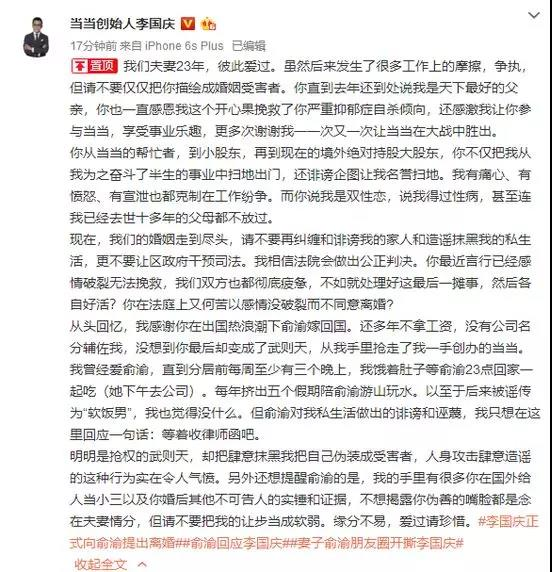

##正文

《致命女人》这部今年最红的美剧，竟在昨夜竟演绎成了现实版。

 

前几天，当当创始人李国庆因为“冲冠一摔为红颜”迅速走红网络。

而他老婆，当当实际控制人俞渝也不甘弱势，朋友圈里面直接开撕李国庆，其狗血程度，比当当上卖的小说还夸张。

梅毒、同性恋、家暴、吃软饭、转移财产......

美剧中三个大渣男的毛病，李国庆一个人凑齐了。

 

而李国庆也不甘示弱，随后放出了“手握俞渝在国外给人当小三，以及婚后不可告人的实锤”。

 

看着这对“致命鸳鸯”，你骂我梅毒同性恋，我骂你给别人当小三，不得不令人慨叹，贵圈真TMD乱。

作为近期最大的瓜，很多网友们开始了福尔摩斯般的调查，甚至根据俩人给出的信息，把李国庆的“基友”马铭泽也挖了出来。

 

更多的很多媒体也纷纷开始了站队。

有站在女方角度，赞美女性意识崛起，大骂男方渣男的。

有站在男方角度，解读心机婊在一步步获取公司控制权的。

不过，一贯走冷静路线的政事堂表示，今天不参合狗血了，从逻辑的角度跟大家分享一下，这一场狗血撕逼发生的必然性。

 

说起来，这位夫妻档的创业组合看似很完美，但却有着结构性缺陷。

李国庆在校的时候是北大学生会副主席，一毕业就进入到国务院秘书处，甚至在当当创建和发展的过程中，李国庆也一直负责政府公关事务。

而俞渝是纽约大学的国际商务MBA，毕业后进入到华尔街工作，在当当的发展过程中，也一直对接风投以及国际资本。

这就使得男方的行为准则是权力，女方的行为准则是资本，两者看起来工作是互补的，但意识形态上却有着巨大的冲突。

对于从上大学开始就一直跟权力打交道，并从秘书工作起步的李国庆来说，上下级关系和对权力依附是深入骨髓的。

由于当当是他自己一手创立的，因此在李国庆眼中，“雷霆雨露，俱是君恩”，俞渝无论是在家里还是在公司，权力和义务都是李国庆赐给的。

套用《满城尽带黄金甲》的一句台词，很容易理解创始人李国庆的心态，那就是“朕赐给你，才是你的。朕不给，你不能抢！”

 

但是，俞渝却不一样，对于从MBA读书开始，到华尔街做投资咨询，就一直跟资本做游戏的职业女性来说，她和李国庆从闪电结合、闪电怀孕开始，就是一笔投资。

不同于李国庆在学校期间就积累了大量的政治资本，俞渝最大的资本就是她自己。她选择李国庆结婚的本质，就是将自己作为资本，注入到李国庆的创业项目，成为项目的主要合伙人。

因此，在俞渝的眼中，这就是一笔平等的资本交易。

 

只不过，权力与资本，两位创始人意识形态截然不同的矛盾，被当当早期的高速发展掩盖了。

看到俞渝带动了公司的高速发展，李国庆不仅愿意把更多的权力“赐给”老婆，更享受在家里和公司都有着上级般权力的感受，视俞渝为依附于她的一个下级。

而不断拿到更多资本的俞渝，也愿意把自己视为成本，为李国庆付出更多，所以虽然之前李国庆在家里和公司的各种坏脾气和臭毛病，但看到资本的不断扩张，俞渝也没啥不能忍的。

可以说，在婚后很长的一段时间内，伴随着当当的高速发展，公司一度压着京东和淘宝打，夫妻两个人都能各取所得，没有谁有啥不满意的。

 

但是，随着当当的高速增长停滞，以及2017年以来互联网进入寒冬，这对夫妻之间在意识形态上埋藏的不可调和矛盾，就会迅速爆发。

在李国庆的眼中，自己娶的老婆也是自己的下级，或者说是“臣子”，放出去的权力，他可以随时的收回。因此，当公司出现问题之时，他自然会希望整个公司能按照自己的意图转型，并否决他不满意的战略。

但是在俞渝的眼中，李国庆不过是自己选择的一个合伙人，当这个合伙人不再符合资本的利益，甚至损害到自己投入的资本利益之时，她就会不顾夫妻情谊，毫不犹豫的联合其他资本将李国庆踢出去。

这是资本与权力之间固有的冲突，因此，在这对夫妻的眼中，自己都没有错，都在做着符合自己价值观的事情。

不同于共同信仰资本的默克多与邓文迪，或者共同信仰权力的潘石屹与张欣，虽然情况均有女方“谋夺资本”之嫌，但意识形态的相似，使得这两对的矛盾都是可以调和的，就算不能复合，最起码也不会相互之间撕逼如此严重。

但是李国庆和俞渝就不同了，李国庆按照权力的准则，认为依附于自己的媳妇必须服从于自己，而俞渝则按照资本准则，认为创始人也要为资本服务，不符合资本的利益就得走人。

于是，在矛盾不可调和之下，俩人开始了一场无底线的撕逼大战，各方连最低线的东西都爆了出来，导致谁也无法收场，形成了一个双输的结局。

没办法，这对“致命鸳鸯”的命运，从他们开始的那一刻，就已经被写好了结局.......

结局，也许就是俞渝的资本将战胜李国庆的权力。

关联文章：一场狗血的“逼宫”大戏

##留言区
 

