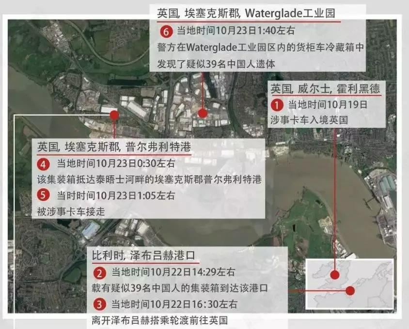
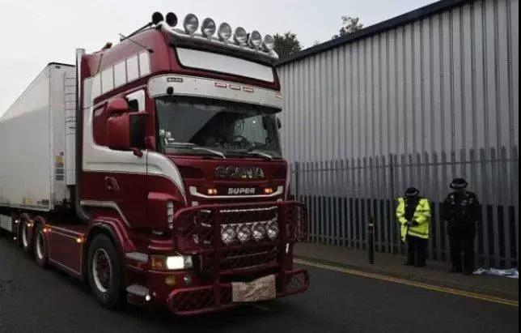
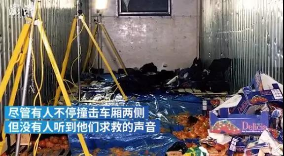
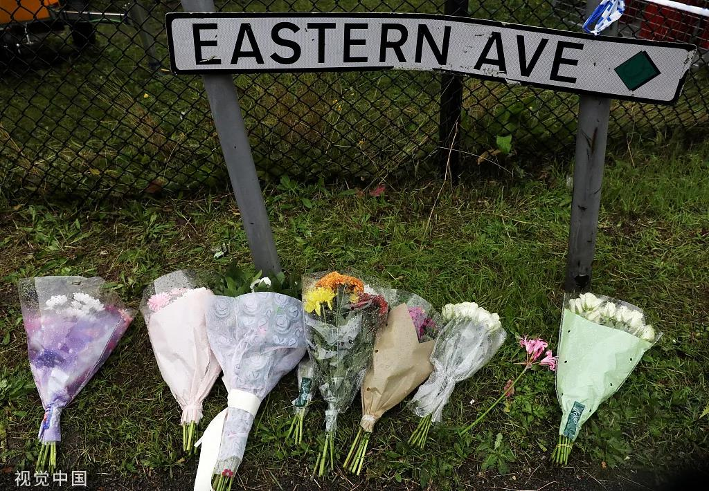

##正文

泽布吕赫，比利时第二大港，由于海峡对岸就是英国，自古以来就是北海重要的海运枢纽。

在这座吞吐近四千万吨总货物的繁忙港口内，来自世界各地的货轮将鲜花、乐高等装上集装箱运往世界各地。

可是，10月22日这一天，没有人会想到，有一个密闭的集装箱内，里面装的是39个活生生的人。

他们跟着数千个集装箱一起被装上货轮，在英吉利海峡上漂泊了10个小时后，到最终在泰晤士河东边的港口上岸。

 

上岸后，这个装载了39人的货柜被一辆在保加利亚注册的卡车载走，由一位名叫罗宾逊的爱尔兰司机开着车，驶向了沃特格莱德工业园。

 

当罗宾逊到达了工业园，打开货柜检查货物的时候，他被吓傻了，集装箱里面装的是39具已经被冻僵了的尸体。

而这39个人，据英国媒体称，全部都是我们黑眼睛黑头发黄皮肤的同胞，其中，还有一名未成年。

 

昨晚看到这则新闻的时候，政事堂感到了难以遏制的心痛，因为现在无论是比利时和英国的港口监管部门，都部署了嗅探犬和二氧化碳探测设备。

因此，偷渡者如果想要规避探查，就不得不采用完全密封的冷藏集装箱。

于是，在至少十五个小时的运输过程中，极度的缺氧和零下25度的寒冷成为了这39名同胞的噩梦。

很难想象在低温缺氧下，这三十多个同胞们在生命的最后时刻是如何的绝望，在这异域他乡，他们叫天天不应叫地地不灵，只能活活的被困死在这个卡车里面。

 

昨天晚上，当看到同胞们去世新闻的时候，政事堂的好多朋友都对此表示不能理解。

有说可以搞签证滞留的，有很多办法可以黑下来；也有说华人海外的收入都很好，黑月嫂都是五千刀月薪起步，很难理解出现这样的情况。

的确，很多中国人已经富裕了起来。

把时间往前拨到2015年，那个时候，中国的富豪们在英国疯狂购入资产，很多英国人惊呼，中国人几乎买下半个英国，甚至两个中国富豪一度为一座170亿的度假村公司打得不可开交。

英国Channel 4频道对此还拍了一部专题记录片《中国富豪移民在英国》，就以独特的视角展示了那些移居至英国的中国富豪和他们的子女，在当地隐秘而奢华的生活。

但是，上面的只是全中国很小的一部分。

咱们十四亿中国人当中，十亿人没有坐过飞机，十三亿人没有出过国，只是有一部分人先富起来了而已，还有很多的同胞们并没有跟着一起富裕起来。

其中，就包括这梦想着去英国实现“英国梦”的这三十九名同胞。

他们不知道偷渡的风险吗？

**我想，这一行的风险与收益真正如何，他们并不知道！**

就像今年的诺贝尔经济学奖颁给了研究“探索贫穷根源”，专家们发现，贫穷的第一条原因，就是信息的获取不足。

要知道，2000年6月18日，就有个与本次事件几乎一模一样的案件。

都是从比利时向英国偷渡，同样也是集装箱运人，同样也是司机毫不知情，同样也都有东欧黑社会组织的影子.......

在十九年前的那次事故中，司机在上路不久便关闭了车上唯一的通风管，在高温与缺氧之下，60名同胞在密闭货柜里被困超过18个小时，其中58人被活活的憋死。

 

很多人都以为他们是因为穷疯了，才会选择这么一条九死一生之路。

其实现实恰恰相反，从两个幸存者的口中得知，十九年前被憋死的同胞们，并不像我们想象的那么穷。

他们大部分人的家境都还可以，但是他们被“蛇头”们许诺，在英国可以赚到大钱，而且可以飞机直飞伦敦，于是就相信了“蛇头”们的鬼话，走上了一条不归路。

他们到了塞尔维亚，下飞机就被转手给了欧洲的黑社会组织，随后，他们就像货物一样几经转卖，最终跟其他的几组人在比利时汇合，被一起装进了一个集装箱，和十九年后一样运往英国。

最终，那辆白色卡车被警察拦下的时候，58具尸体杂乱地躺在七箱西红柿中间的金属地板上，散发着难以言喻的恶臭，这个场面甚至成为了那位拦下卡车的警察“永远挥之不去的噩梦”。

那么，有着如此的前车之鉴，为什么还有人前赴后继的搏命去英国呢？

其实，到了现在这个年代，想要出国有的是“合法”的模式。

凭借着某宝上商家强大的山寨能力，可以以非常低的价格，造出来一套新的身份以完成合规的出国手续，不仅成本比集装箱低很多，而且也不需要冒着生命风险。

早年，蛇头们还是值得尊重的，但是随着这几十年来偷渡行业的发展，整个产业链上形成了庞大的利益集团，在偷渡的每一步每一个环节都能获取巨大的利益。

譬如连偷渡的费用蛇头也将其变为金融化，赚取巨额的贷款利息，过程中，偷渡者就像猪仔一样，被“倒卖”好几手，每个中间人按照处理多少进行分配。

最终，到了外国之后只能在当地黑社会的控制之下打工，甚至很多女性还在还贷的威胁之下被迫卖淫。

所以，为了维护整个产业链的巨大利益，蛇头们还在采用这些最原始的方式，把人作为货物，在多个黑社会组织中层层的抽血。

各自为了利益的最大化，便不断的压缩成本，那怕前几年叙利亚内战的时候，一个集装箱也不会装超过十个人，而蛇头们此次却为了压缩“货物”成本，和上次将58个人活活憋死一样，最终葬送了我们39位同胞宝贵的生命。

人最宝贵的是生命，这个运人的集装箱就像一个潘多拉的魔盒，里面流淌着罪恶的鲜血。

 

回想十九年前的那一场惨案，最终幕后的黑手由于证据不足而被释放，只是处理了几个小喽啰。

十九年后，惨案再一次的上演.......

两者之间是否有着必然的关系，政事堂不敢断言。

但是，如果想让逝者安息，如果不让同胞们再次遭受劫难，我们就应该敦促英国政府把此案的罪魁祸首抓出来，让他接受法律与道德的审判！

 

  
##留言区
 

