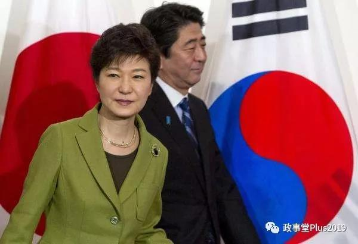

##正文

这是本系列的第六篇文章，依旧，看懂多少算多少。

就像俗话说的，要看个人的奋斗，也要看历史的进程。
 
东亚各国在二战后能够发展起来，除了我们骨子里的勤奋基因之外，很重要的是踩中了历史的进程。
 
以日本和韩国为例。
 
二战之中，美国的主要对手并不是德国而是日本，无论是珍珠港偷袭带来的耻辱还是太平洋战争中日本人对美军造成的巨大伤亡，使得美国二战后想把日本拆回一个农业国。
 
同样，朝鲜半岛的地理位置决定了，韩国对于美国的地缘意义并不大，以至于美国甚至向苏联表示了，韩国不在其保护范围之内，最终让斯大林下定决心开打。

但是，很有意思的是，随着朝鲜战争的爆发，日本的命运改变了。

从1953年开始，虽然朝鲜战争结束了，但是日本却成为了制约社会主义在亚洲扩张的航母。美国开始全力推动武装日本的政策，并谋求两国的军事同盟关系，日本的工业基础得以从一片废墟中重新恢复。

同样，同样有意思的是，一场越南战争，也改变韩国的命运。

从1961年，随着肯尼迪强势介入越南，韩国也成为了制约社会主义国家的重要棋子。美国开始全力扶持韩国政府，甚至推动了军官朴正熙发动军事政变，干点了文官政府，换上了一个强势的军政府，所以也才有了所谓的汉江奇迹。

所以，大家记住两个时间点。

日美关系和韩美关系的重构，美国对两者的大力扶持，分别在53年和61年。

而53年和61年的区别是什么呢？

53年的日本靠上的是艾森豪威尔的共和党政府，61年的朴正熙靠上的是肯尼迪的民主党政府，而且一靠就是8年，中间两党都赢得了连任，这让日本和韩国有足够的时间，建立一整套的政治生态结果。

那么，同样是儒家文化圈的国家，结果有什么不同呢？

共和党扶持的日本，很快形成了政治门阀的体系，民主党扶持的韩国，很快形成了经济财阀的体系。

虽然看起来很相似，但却有着细微的区别。

在日本，虽然商社的规模很大，但却被几个大的政治家族们所控制，首相就在几个家族之间轮流坐。（安倍的爸爸、叔叔一门三首相，以及一大群的门生故吏，长期控制日本政局）

而韩国恰恰相反，流水的总统，铁打的财阀，以三星为代表的财团控制着韩国的每一个角落。（继承朴正熙的朴槿惠连政治班底都没有，只能靠闺蜜干政）

 

当然，回顾东北亚的历史就会明白，财阀与门阀的这两种模式走到最后，必然会诱发系统性的问题。

所以说，如果回顾1980年美国大选共和党的里根干掉了民主党的卡特，对于东北亚的未来，起到了关键而根本性的作用。

因为这一次的美国政局变换，使得太平洋彼岸的东北亚，在财阀政治和门阀政治之间，取得了至关重要的平衡。
  
##留言区
 无留言