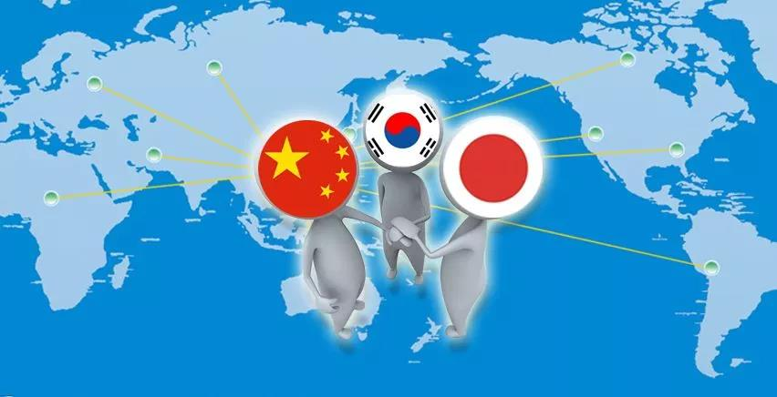
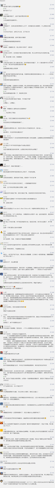

##正文

昨夜 ，随着区块链在新闻联播的播出，一夜之间，区块链热度飞涨，甚至全球的虚拟币炒家们都将目光汇聚于中国。

以“迅雷链”的迅雷单日暴涨107.8%为代表，一大批中概股开始了狂飙，比特币更是24小时内涨幅逾30%，创下近一个月的新高。

一时之间，各种空气币的炒家突然“集体复活”，又开始了疯狂炒作虚拟货币的春天来了。

但是，在政事堂看来，春天是区块链技术和应用的，但是对于ICO的炒家们而言，却是凛冬将至。

那么，区块链的未来，究竟是什么呢？值得政治局开会学习？

这些年，政事堂也见了不少相关的专家或者大鳄，但他们没有一个能说明白的。

原因很简单，因为他们都不懂历史与政治。

想要理解区块链的意义，就要把时间拨到22年前，那一年，东南亚经济危机爆发。

在1997的东盟国家首脑会议上，受到经济危机重创的马来西亚总理马哈蒂尔，根据正在推进的欧元区，提出了“亚元区”的设想，希望能够避免危机的再次上演。

当然，在民主党执政时期，这种事情肯定是搞不起来的。

不过，随着共和党总统小布什的上台，在2001年上海APEC会议上，机遇出现了。

在APEC会上，欧元之父蒙代尔提出了未来世界将形成欧元区、美元区和亚元区三足鼎立的局面。

之后，蒙代尔还建议亚洲组成共同货币，在每个国家不放弃本币的情况下，让“亚元”在亚洲能够流通。

熟悉历史的都会知道，刚刚起步的欧元区为了亚洲如此尽心竭力，这一招叫做“联吴抗曹”，欧洲需要亚洲帮忙分担美国的压力。

不过，着眼于组建亚元区的巨大利益，以及未来抵御风险的作用，亚洲也愿意跟欧洲联盟，亚元的建议迅速获得许多亚洲国家的积极响应。

好了，关键的时刻来了。

**2006年，亚洲开发银行推出了一款亚洲的虚拟货币，ACU币**，这个货币是根据东亚三国和东盟十国的货币价值、GDP以及贸易规模，加权后，得出的一款虚拟货币。

ACU币类似于欧元推出前搞的ECU币，使得亚洲各国货币对美元脱钩而对ECU币挂钩，能够维持各个成员国之间的汇率稳定，这样迅速提升成员国之间的贸易与投资，加强各国之间的经贸联系。

在这个过程中，虽然亚开行不要求各国的货币跟ACU币挂钩，但是各国可以根据ACU币来调整各国的财政与货币政策，使得各国的货币机制逐步向未来的亚元”靠拢，也为亚元的横空出世奠定基础。

按照路线图，经贸之间的合作以及财政货币政策的统一，将使得东亚和东南亚将像欧盟一样，组成一个政治与经济的超级联合体。

 

但是，很可惜，ACU币和亚元最终夭折了。

原因有二。

一个是国际地缘上的，随着06年后，民主党赢得美国的参众两院，08年奥巴马夺得总统大位，亚洲的地缘黄金期迅速失去，试图推动亚洲一体化的卢武铉和安倍很快就被赶下台了，之后一系列事件更使得东亚与东南亚陷入巨大的内耗。

另一个是亚洲内部，由于各国的历史原因、政治体制、宗教信仰、意识形态等方面存在着巨大的差异，使得各方之间有着巨大的不信任；而且中日韩、东盟之间对于货币主导权方面也有着激烈的内部争夺，谁都不愿意舍弃各自的利益以推动联盟的前进。

最终，利益方面的撕扯，使得亚洲错过了地缘的历史性机遇期。

好了，写到这里，大家明白了区块链的政治意义了吗？

区块链有两大特征，**一个是可溯源和不可修改，另一个是分散式账本的去中心化。**

而对于亚洲未来共同的虚拟货币来说，**区块链的可溯源和不可修改，解决了亚洲各国之间的不信任问题；而区块链的分布式账本和去中心化，又解决了亚洲各国的货币主导权之争。**

可以说，区块链的技术，直接使得十多年前困扰我们的问题，通过技术，拥有了真正可以解决的方案。

所以，回顾13年前，亚开行主导了亚元前身的ACU币，如今的亚投行又会利用区块链技术搞出来什么呢？

不言而喻！

对此，我们也准备了很久！

亚投行是2014年成立的，而根据周小川的说法，央行在2014年开始大规模的开始研究区块链技术，恐怕这两者并非巧合。

而且，在全球区块链企业专利排行榜中，央行不仅跟阿里一起稳居前三，也是榜单上唯一的官方机构。

看到了这里，我们回忆一下过去的六年，把亚投行、B&R倡议，中日关系的破冰、中韩关系的回暖、RECP区域全面经济伙伴关系的推动，与昨天政治局组织学习区块链联系起来，我们就会发现，我们的祖国正在布一盘非常大的棋局。

 

这盘大棋即将启幕，回顾1997，万事俱备，只欠东风！

东风一起，一场席卷亚洲的金融狂潮将喷涌而出！亚洲地缘的历史性重组也将指日可待！

建国70年以来，前辈们一棒一棒的接力赛，如今终于传递到了我们的手里。

我们这代年轻人是幸运的，因为我们将亲自经历新中国历史上最激动人心的时代，亲自参与中华民族的伟大复兴，亲自见证中华文明回归世界强国之林的辉煌时刻！

##留言区
 

