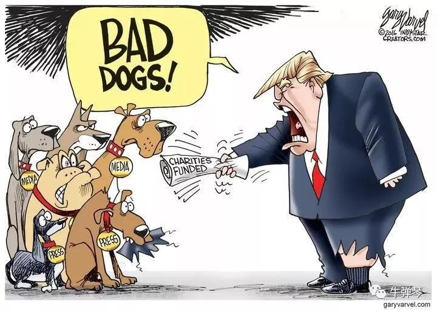
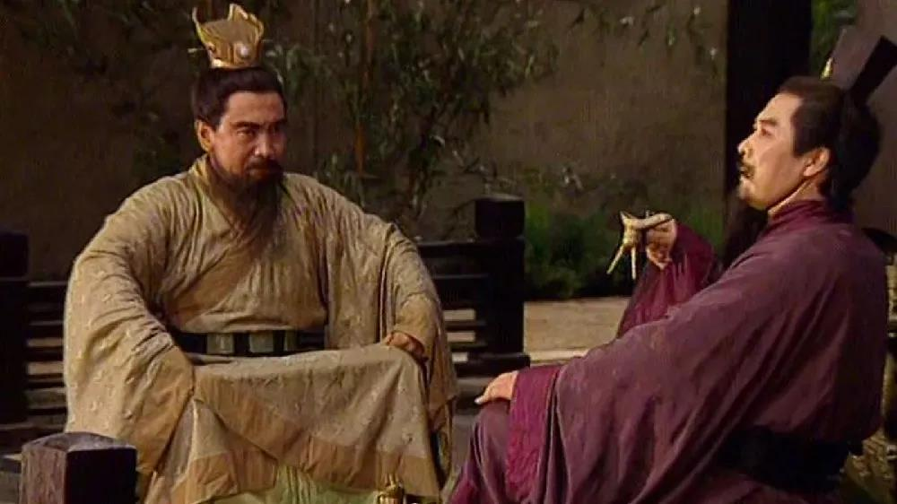

##正文

“刚刚，有一件非常大的事情发生了！”

今天一早，特朗普就迷之自信的发了一条“字数越少事情越大”的推特。

 

就在全世界一头雾水的时候，很快答案也就出来了。

美国媒体纷纷爆出，经特朗普早些时候批准，美国军方对极端组织“伊斯兰国”（ISIS）头目巴格达迪发起斩首行动，并将其击毙。

 

目前，美军正在对其进行DNA鉴别中。

 

作为全球头号恐怖分子，巴格达迪在2010年成为极端组织头目，通过资本运作开启了恐怖主义的新模式，他决策精明、财力雄厚、心狠手辣，会毫不犹豫地清除包括盟友的一切拦路石。

由于巴格达迪抓到俘虏后会一律枪毙或砍头，并拍下行刑过程发布到网上。美国《时代》杂志将其称为“全世界最危险的人”。

可是在今天，这个全世界最危险的人，被全世界最有权势的人给做掉了。

 

不过，此番疯王特朗普“疯起来连自己人都打”的动作，令很多人都是一脸懵逼。

俗话说“敌人的敌人就是朋友”。

由于巴格达迪一直在跟亲俄罗斯的叙利亚、伊朗和伊拉克交战，甚至逼着俄罗斯都不得不亲自出手打击，因此巴格达迪也一直被很多媒体视为美国圈养的一条“狗”。

可是今天，“狡兔死走狗烹”，狗主人竟然把狗宰了，跌破了一大群人的眼镜。

 

当然，特朗普的此次突袭并非没有预兆，如果把最近埃尔多安入侵叙利亚，特朗普舍弃库尔德盟友的事情联系起来，我们就会发现巴格达迪之死，是特朗普跟埃尔多安、普京做的一场“世纪交易”。

记得前些天，在土耳其悍然入侵叙利亚的时候，很多人给出了各自的猜测。

对此，政事堂得出了一个结论，特朗普肯定跟埃尔多安达成了一个秘密交易，这个秘密交易对于特朗普有着非常重大的意义。

甚至在昨天小号的留言中，政事堂也重复了这个判断，不过政事堂绞尽脑汁，也没判断出埃尔多安的厚礼是哪个。

 

而今天新闻一出，巴格达迪死了，埃尔多安的礼物就展现了出来，特朗普的中东交易的牌就明了。

这笔交易能够让特朗普顶着国内巨大的舆论压力，放弃多年的盟友库尔德武装卖给了埃尔多安，是因为埃尔多安把巴格达迪卖给了特朗普。

正是因为手握巴格达迪这个筹码，埃尔多安才敢于悍然出兵攻击库尔德，这正是因为这个筹码，特朗普才说起了糊涂话，并勒令美国政府终止了对土耳其的制裁。

说起来，土耳其对巴格达迪的藏身之处了解，并不偶然。

伊斯兰国控制的伊拉克北部油田，是没有出海口的，而且西侧的叙利亚、南侧的伊拉克，东侧的伊朗都是伊斯兰国的死对头，想要把石油兑换成美金与军火，他们只能选择从北侧的土耳其“出口”。

 

而且，巴格达迪被传出过多次死讯，但他距离死神距离最近的一次，是在2015年10月被伊拉克空军的空袭受伤，根据伊朗通讯社报道，由于医疗条件不足，巴格达迪在土耳其情报机构的帮助下前往土耳其就医，避开了伊朗和伊拉克情报机构的追捕。

所以，明白了土耳其对伊斯兰国的控制力，就能明白，埃尔多安有着跟特朗普交易的重要筹码。

也就是说，在这笔“世纪交易”当中，埃尔多安出卖了巴格达迪以换取对库尔德人的攻击，特朗普出卖库尔德人以换取对巴格达迪的突击，美土两国领导人各取所需。

特朗普需要兑现自己上台时对美国民众承诺的消灭ISIS，让士兵们回家，埃尔多安需要向土耳其民众证明自己能够扼杀库尔德的独立力量，秀出土耳其的力量。

因此，这笔土美世纪交易的达成，使得特朗普与埃尔多安各自兑现了承诺，而这些兑现的承诺，又会在接下来的选举中兑换成选票。

估计，接下来特朗普与埃尔多安的见面，将是一场惺惺相惜的“青梅煮狗论英雄”。

 

而随着这一笔“世纪交易”的达成，整个中东的地缘也将出现巨大的变化。

不仅埃尔多安和特朗普拿到了自己想要的，伊朗、伊拉克、叙利亚三个国家的政府也同时消灭了ISIS和库尔德两个最头疼的对手，确保了政权的稳固。

而收益最丰厚的，则是一度被压着打的普京，他不仅建立了盟友的什叶派之弧，还通过调节各方冲突，成为了中东的实际话事人。

看似，这笔交易取得了一个皆大欢喜的大结局。但是，国际地缘上，有人获益就必然有人要收到损失。

无论巴格达迪还是库尔德武装，都是民主党的奥巴马时代崛起的，他俩虽然对美国以及其盟友们也造成了巨大的威胁，但就像当年蒋公用杨永泰之策，收服各路军阀那样，他俩也是美国控制中东各国最重要的两颗棋子。

说的通俗一点，巴格达迪和库尔德武装，就是民主党黄老爷们用来讹诈中东土豪家族们的“假麻子”。

 

黄老爷们好不容易养起来的假麻子，可结果县长特朗普刚上任，就出城把他们给毙了。

 

因此，接下来的剧情，几乎是可以推导出来的。

特朗普县长与民主党的黄四郎们，接下来肯定要有一场死战。而特朗普手下不少共和党力量因为剿匪而没有了银子，也会暗中跟民主党暗通款曲。

虽然通过剿匪让特朗普赢得了民心，但是却树立了不死不休的敌人并埋下了内部分裂的种子，这不仅会使得县长特朗普对于“花姐”这样的外部力量愈发依赖，也会使得美国的政局更加混乱.......

最后，通过此次事件展现出来的交易艺术，政事堂希望特朗普能够赢得美国国内的博弈。

毕竟，既然特朗普能够通过交易解除对中东各国的禁锢，那么美国在东亚插入的楔子以及编织的死结，也许同样能够以交易的方式解决。

##留言区
 

