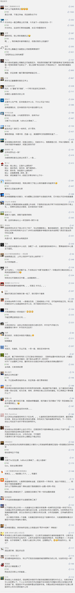

##正文

今天我大A股真的牛气了一把，在区块链概念的带动下，一路高歌猛进，区块链逾百股在竞价时刻就一字板涨停。

 

在区块链概念利好的带动下，已有超过500家A股上市公司公布了和区块链直接或者间接的关系。

甚至这个周末，更是有无数的金融民工在公司昼夜加班，把公司PPT从智能制造改成了区块链.......

与此同时，有关区块链的研报也密集出炉，不少券商人士表示，周末所有人都像打了鸡血一样地加班，电话铃狂响不停。

与金融民工疯狂转发区块链类似，房地产的置业顾问们这个周末也没有闲着。在他们的带动下，一系列“马云买房”的图片，一时之间遍布于互联网。

 

网上更是有不少人信誓旦旦的表示，当天看到了孙宏斌陪同“未来房子不如大葱”马云，甚至连马云卖的房子平数与价格，也仿佛真的一般被广泛传播。

于是，就像金融民工们打了鸡血周末纷纷加班打电话那样，置业顾问们也纷纷以马云也买房子为由，拿起了电话疯狂邀约客户。

不过，很可惜的是，就在置业顾问们刚刚用马云都来买房子的话术邀请客户来售楼处之际，马云很快就安排公关老总王帅出来发微博辟谣。

 

 

很显然，这位中国最懂政治的商人，第一时间就把自己跟房地产进行剥离，根本不给地产商蹭自己流量的机会。

而就跟置业顾问炒作马云是为了在行情不好的时候多卖房子一样，上市公司和券商们拼老命炒作区块链的也是为了尽快的拉高出货。

不出意外，融创地产接下来的促销去库存活动，会跟上市公司的股东减持公告一样准时到来。

不要以为这些临阵磨枪的区块链公司花了多少的心思，这些上市公司的区块链专利加在一起，都没有马云一家的多......

 

那么，未来中国区块链的发展方向会是如何呢？

这一波区块链，并不是一个市场行为，而是一个政策行为，按照政事堂的判断，那就是中国正在从**“互联网+”**向**“区块链+”**来迈进。

政府用一只看不见的手，来引导资金和人才向这个领域涌入，最终，通过市场的手段，降低整个行业的融资成本以及用人成本。

或者用政事堂习惯的说法，那就是“启动基建，摊平成本，发展动能”。

因此，我们回顾一下中国互联网的发展，就会知道接下来的红利在哪里。

1999年，随着三大网络运营商的成立，电信、联通、网通的宽带迅速将中国的台式电脑们连接了起来，因此缔造了百度和腾讯。

2008年，随着四万亿启动，四通一达的基建也将中国的物流联系了起来，因此缔造了天猫、京东、拼多多。

2014年，随着“互联网+”战略的启动，大量的共享经济将手机连接了起来，因此缔造了微信和支付宝。

2019年，随着“区块链+”战略的启动.....

很显然，未来我们会通过区块链技术，将中国庞大的数据连接起来，然后缔造新的巨头。

接下来，区块链领域的确会出现99年的运营商、08年式的四通一达或者14年式共享交通等一波基建浪，会诞生一些独角兽。

但是，就像当年四万亿，短期来看，买中建的股票收益高，但长远来看还是买万科的房子收益大。

同样，区块链领域适宜于短期的资本投资，但长远来看，**要看到区块链所连接的产业，才是最适合把自己作为资本投入进去的地方。**

而作为中国新一代基建区块链连接的，是数据，因此未来能够利用区块链的数据获得收益的公司，必然是拥有庞大计算力的公司。

这样结论也就出来了。

根据目前云计算的市场份额来看，这一波“区块链+”最大的受益者，除了央行的金融领域之外，恐怕就是马云的阿里云和任正非的华为云。

##留言区
 

