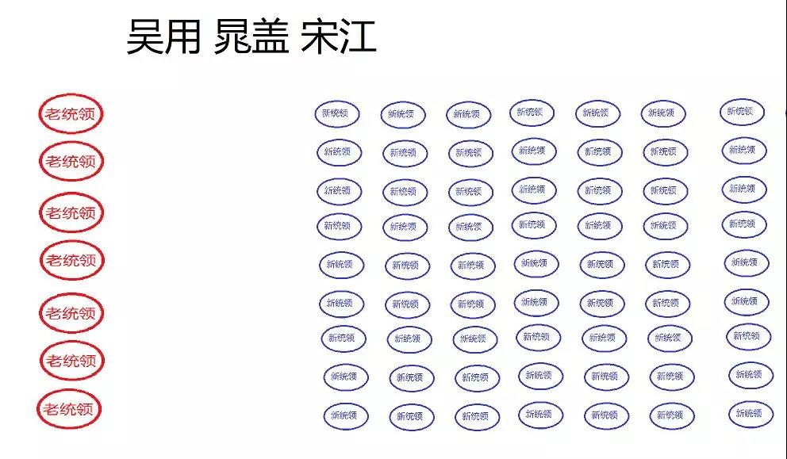

##正文

最近，连续写了几篇区块链和新能源汽车的文章，今天，应该是给这一系列的文章做一个总结了。

其实，无论是区块链还是新能源汽车，我们中国花这么大的力气，投入这么多的资本，究竟是要做什么呢？

答案很简单，那就是重新制定规则。

规则有多重要呢？

举一个例子，我国在2016年之前，运载火箭的直径最大是3.35米。这个直径是由火车轨道的宽度决定，因为运火箭的火车经常要走穿山的隧道。

火车的轨道宽度，又是根据古罗马军队铺设的道路宽度来的，而道路的宽度又是根据罗马战车的宽度决定的。

至于罗马战车的宽度，是由两匹马的屁股宽度决定的......

因此，21世纪运载火箭技术，依然被两千多年前古罗马的马屁股所制约。

而这，就是规则的重要。

 

所以我们再来汽车领域，西方已经发展了一百多年，建立了非常完善的制度体系、标准体系以及专利技术壁垒。

而且，这些还都是根据西方各种传统习惯和法律制定的，中国沿着传统的路径发展处处受制，几乎没有超越的可能性。

更重要的是，西方百年打造了的品牌价值，也是压在我们头上的一座大山，奥拓就算技术达到了奥迪的水平，也卖不出来奥迪的价格。

不过，当我们换成了新能源汽车的赛道，那么大家就要重新在一个起跑线上比拼，这个时候，中国的人口优势就体现出来了，十四亿脱贫的人口比整个西方发达国家加在一起都要多。

同理，发展区块链技术也是如此，西方的现代金融体系拥有了五百多年的历史，国际结算使用美元的历史也有近百年，全球的大宗交易几乎都是以美元计价的。

因此，如果我们强行推人民币国际化，成本与承受的压力远高于我们的想象，而且还会带来巨大的汇兑风险。

可是，如果换成区块链技术为基础的新赛道，跟发展新能源汽车一样，增量的蛋糕使得博弈受到的压力就会降低很多。

而且，中国储备的大量技术就将体现制度优势，尤其是移动互联网支付的基础，更将使得我们在区块链结算方面拥有先发优势。

此后，我们就可以在新航道之下，根据自己来制定规则。

 

说起来，这种新航道的超越，其实不难理解，过去十年移动互联网对互联网的新赛道超越，大家都能清晰的看得到。

从80年代个人计算机时代开始，英特尔与微软组成了著名的wintel联盟，这个联盟通过强大的积累，取得了市场的绝对垄断，使得个人电脑的创始者乔布斯都被赶出了苹果。

当时，没有人会相信有谁能够击败wintel。

但是，到了移动互联网时代，这个超级联盟就被轻易的推翻了。

打败wintel联盟的，并不是其他的台式机芯片公司和桌面操作系统，而是在手机这个新航道之下，移动芯片的高通与移动操作系统的安卓。

而且，随着移动端操作系统这个新航道的发展，移动芯片和移动操作系统还将平板电脑、智能电视等其他领域也揽入囊中。

可以说，虽然到现在高通和谷歌也没有实力在台式机上跟wintel联盟竞争，但是，在新航道飞速发展的他们，已经不需要再回归旧航道了，他们已经实现了对传统行业的降维打击。

同理，我们发展新能源汽车以及区块链的本质，也是开启一个公平的新航道，摆脱旧航道的束缚，利用我们的人口基数优势来取胜。

回顾最近，华为手机被安卓系统卡得死死的，但是，当全球的新能源汽车生产基地都汇聚中国，中国成为新能源汽车最大消费市场的时候，新航道也就开启了。

可想而知，就像高通在新赛道反超英特尔，安卓在新赛道反超微软一样，新航道开启之后，阿里的平头哥芯片和华为的鸿蒙系统，就可能成为新的高通和安卓。

同理，区块链领域也是如此，以人民币为基础计价的数字货币，也将在新赛道跟美元并行前进。

 

至于那些比较新能源汽车与传统能源汽车的效率，比较区块链与传统计算的效率，觉得新的技术效率未必赶得上传统技术的朋友，其实还是对中国优势不够了解。

回顾一下高铁与磁悬浮竞争就会明白，论效率，磁悬浮比高铁有着巨大的优势，但是中国把高铁量产化之后，规模化拉低的成本后，廉价的高铁迅速使得磁悬浮建设变成了亏本的买卖。

同样，当年液晶击败了技术更先进的等离子，也是类似的道理，中国市场的巨大消费能力能够迅速摊平那些差距不大的成本。

可以说，新中国自建国以来最熟悉的反超模式，就是打扫房子重新请客。

而这些，都是刻在我们基因里面的。

 

就像今天说的，老二通过新赛道反超老大，这是中国几千年以来流传下来的经验，连街头听评书的老大爷都能给你掰扯一通。

譬如《水浒传》中，宋江带队伍上梁山，这个时候就涉及到了原大佬晁盖和新大佬宋江之间的平衡与重新排座。

此时，如果按照梁山的传统，对于新上山的宋江非常不利。

因为晁盖麾下的旧头领主要分作三股。

第一部分是阮氏三雄、刘唐、白胜这样的晁盖铁杆，他们截的巨额生辰纲银子，是梁山能够招兵买马，兄弟们吃香喝辣的资本。

第二部分是杜迁、宋万、朱贵这些原本跟着王伦建立梁山的头领，梁山最早的根据地，建的房子和堂口就是他们搞的。

第三部分是林冲，是他砍了王伦，确立了梁山的晁盖体系，不仅功劳比前面两组都大，而且武功也是当时梁山的一哥。

我们回顾一下55年的授勋就会明白，晁盖身边那些“苏区时期”的头领们，凭借资历是要吊打宋江身边那些“延安期间”的头领们。

因此如果按照传统赛道，宋江会输的一塌糊涂。

那么，宋江是怎么玩的呢？他在聚义厅上是这么建议的：

>宋江道:“休分功劳高下,梁山泊一行旧头领去左边主位上坐,新到头领去右边客位上坐,待日后出力多寡,那时另行定夺。”

>《水浒传》施耐庵

老辣的宋江不仅通过新老统领的分别站队，避免自己的队伍被梁山一把手晁盖统战，而且还把未来可能加入的新头领们拉到了自己这边。

更重要的是，把追随晁盖的老统领的功绩一举抹掉，然后以此为时点重新计算。

所以，对比一下目前的新能源汽车和区块链领域的发力我们也会明白，我们也在学宋江，搞新旧领域的分开站队，避免新领域被传统势力侵入，与此同时，我们也在欢迎美日欧等国家的新势力加入到我们当中。

这样，我们就可以利用新领域的重新计分，把传统领域的计分清零，在新的航道开始一场新的赛跑。

而历史告诉我们，只要沿着这条路来走，是能赢的。

文字很难体现人口基数的巨大优势，如果我们把梁山聚义厅的坐席用画图的方式展现出来，我们就会明白，二哥宋江赢大哥晁盖是历史的必然：

 

所以呢，政事堂一贯是反对那些打打杀杀，整天喊着要干掉“晁盖”的那批人，现在年轻人读的书实在是太少了。

中国几千年的历史写的很明白，像宋江这样的老二，只要在新航道“闷声大发展”，不断的招募新头领，接下来的局势是什么样子呢？

嗯，在晁盖临死前，梁山聚义厅的座位，大概应该是这样的：

 

真的有必要把“反贼”两个字刻在脑门上吗？

沿着新航道奔跑的二哥宋江根本不需要对抗大哥晁盖，巨大的内部压力就会逼着晁盖带着老统领去打旧航道的“曾头市”，他多撞几次迟早要“领盒饭”。

 

到时候咱们要做的，就是学习宋江披麻戴孝，狠狠的痛哭流涕一番。

然后，咱们再接过晁盖哥哥替天行道的大旗，继承晁盖哥哥的伟大遗志，在区块链、新能源等一系列的新航道下继续发力，带领兄弟们一起打造梁山命运共同体........

 

近期关联文章：

从马云看区块链的红利所在

蔚来CFO火线辞职，新能源车走向何方？

##留言区
 

