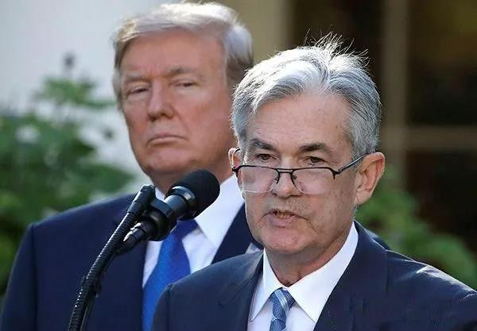
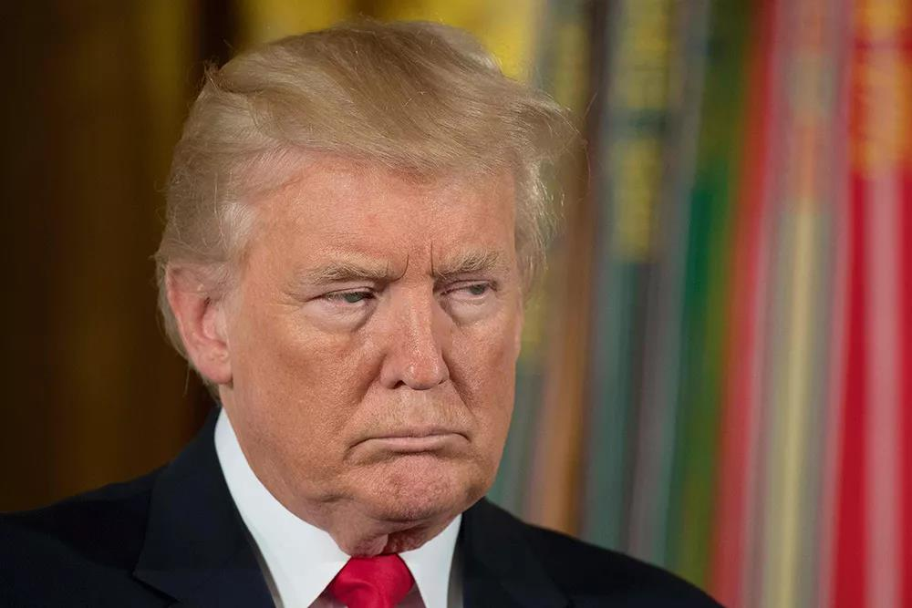
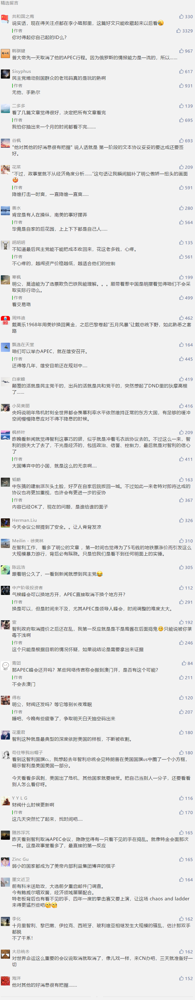

##正文

今天凌晨，全球同时爆出了两则大新闻。

一个是美联储如约降息，将联邦基金利率目标区间调至1.50%-1.75%，另一个则是智利作为主办方，取消了下个月万众瞩目的APEC峰会。

作为全球经济的“央妈”，美联储从今年下半年开始，从加息强行转向了降息，三个月之内的连续三次降息，将联邦利率下降了75个基点。

因此，美联储是否继续降息，中国是否跟着降息，成为了经济相关人士们热议的话题。

不过，政事堂就不从经济角度分析，从政治的角度来看一下，接下来中美的利率会怎么走。

自特朗普执政以来，随着其大规模的减税以及增加政府开支，美国经济一路向好，股市屡创新高。

但是，减税和扩大政府开支是一把双刃剑，美国目前的债务总额已激增至23万亿美元，每年要支付的利息都要超过5000亿美金。

因此，对于特朗普来说，最近三个月利率下降了75BP，最起码每年就可以少还1700亿美金的利息......而特朗普想尽办法东拼西凑，才搞出来25亿美元来建墙。

而且，由于特朗普上台后推行的大规模减税，美国各个行业都吹起了投资泡沫，很多企业在市场行情好的情况下进行大规模的投资。

譬如国际油价今年中东冲突那么多还一直没涨上去，原因之一就是美国公司举债在页岩油投入了巨资，直接带动了全球能源的供过于求。

因此，为了防止这些减税期间大规模上杠杆的公司爆掉，在大选来临之际，特朗普只能选择降息放水来救这些自己的票仓。

尤其是去年执掌预算大权的众议院被民主党接管之后，积极的财政政策已经不用想了，只能通过美联储搞积极的货币政策了。

还记得今年上半年的时候，政事堂判断美联储主席鲍威尔是在跟特朗普唱双簧么？

现在看来，三个月降息三次，如此紧急的降息，已经证明了嘴上说着不要，身体却很诚实的鲍威尔才是特朗普的铁杆支持者。

 

因此，美国接下来是否降息，不用看什么经济数据，直接看特朗普就可以了。

我们可以看到，之前两次降息的时候，特朗普都在大骂鲍威尔利率没有降够，而这次却没有继续骂。

这意味着，**今年特朗普式的降息，结束了。除非黑天鹅，年底之前美联储不会继续降息。**

而特朗普今天凌晨没有继续炮轰美联储，选择把继续降息筹码留到明年，也就意味着，**他对其他的好消息很有把握.......**

 

好了，知道了美国降息的逻辑，也就会知道中国的政策逻辑了。

这是因为外部能够影响中国货币政策的，全球只有美国。

如今，在能够判断出美联储今年不会继续降息的情况下，**中国在年底之前没有必要去强行改变自己的去杠杆节奏，因此，央行的基准利率不会下调。**

不过，就像政事堂上半年时判断的，财政的子弹会在上半年集中打出去，因此可以预见的是，下半年经济增速会略逊色，因此，**面对美联储的降息，我们有可能会通过小幅降准来应对。**

至于LPR，属于中央既定的路线图，只会加速推进，利率方面会推动市场化。

 

说完美联储的降息，再说一下昨夜APEC的取消，两者其实关联还不小。

原定于下个月的APEC峰会被取消的导火索，是智利政府10月6日把地铁票价提高三毛钱，而民众怒火被点燃，大规模的抗议从18日持续至今仍无平息的迹象。

于是，原定于11月16至17日的APEC峰会，以12月2至13日的联合国气候大会均被临时取消。

**不得不慨叹，智利人民闹事儿不会挑时候。**

APEC峰会来的都是政府首脑及其团队，联合国的气候大会更是有着数万花着公款的高级公务员们过来待个十几天，这是对智利经济的一次强刺激，可闹事儿直接把里子面子都大赚的生意给搞黄了。

当然，智利的问题实际上是全球问题的一个缩影。

联合国气候大会，原定在巴西召开的，结果民粹的博尔索纳罗干掉前政府上台后，直接放弃了前政府减排的承诺，导致会议不得不迁移至智利。

悲剧的是，智利的民众也会用脚投票来换政府......

 

当然，巴西跟智利只是全球政局变化的一个缩影，发达国家中，英国脱欧、法国黄马甲、德国难民、意大利极右翼、西班牙加泰罗尼亚......传统的欧洲列强们一个都没跑得了.....

而在这个历史的过程中，特朗普上台后的一系列刺激政策，虽然使得美国获得了一些缓解，但是把全球的问题都放大了。

随着特朗普政府的减税和勒令跨国企业利润回流，全球的资本都在向美国回流，这使得新兴市场的矛盾开始迅速激化。

更重要的是，特朗普对全球主要经济体挑起的贸易群战，更是直接导致了全球经济震荡，直接冲击了全球产业链上面的制造业国家和资源国。

像印度这样的，还可以通过欺负邻居转移一下国内矛盾，而美国后院的那些国家就没办法转移了，因此，无论是巴西、阿根廷、委内瑞拉还是此次出事儿的智利，问题都在加速激化，也都引发了政局的激烈动荡。

但是，智利此次闹事儿时间如此之巧，不得不引起怀疑。

本次，智利的两个峰会，跟特朗普都有着不小的关系，一个是对特朗普极大的利好，而另一个则是不小的利空。

借助APEC这个全球瞩目的平台，特朗普可以向国内展示自己谈判的艺术，将协议的效果放大化，尽可能多的争取选民支持。

而联合国气候峰会，则是全球主要国家汇聚起来，对退出协议的特朗普的一次围剿，各国大概率会继续增加减排的尺度，让退出巴黎协定的特朗普在骄傲的美国选民面前备受打击。

 

而此次智利的骚乱，对特朗普是一个不小的打击。

一方面，对于特朗普利好的APEC，特朗普很难再借助这个全球瞩目的平台，拿到他预期的超级宣传。

而另一方面，联合国的气候峰会，大概率会另换地点，选择波恩、纽约、日内瓦、维也纳这样的联合国驻地举办，由于这些国际都市媒体汇聚，虽然会议推迟了，但是特朗普遭受的压力和负面舆论却增大了。

因此，考虑到特朗普能够操纵美联储为自己的连任降息，不得不怀疑，智利这一场导致两场国际重要会议取消的骚乱，搞不好也有一只看不见的手在背后操纵。

##留言区
 

