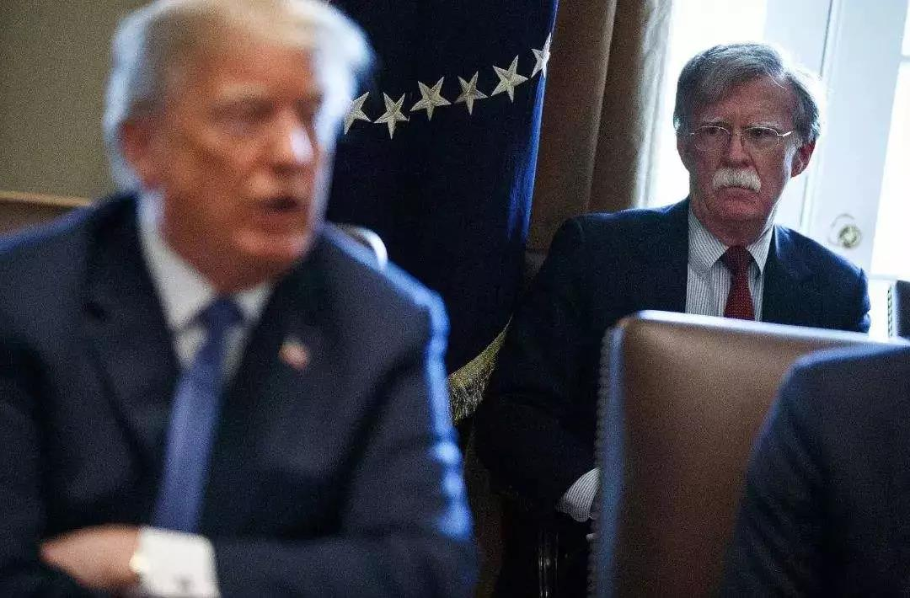
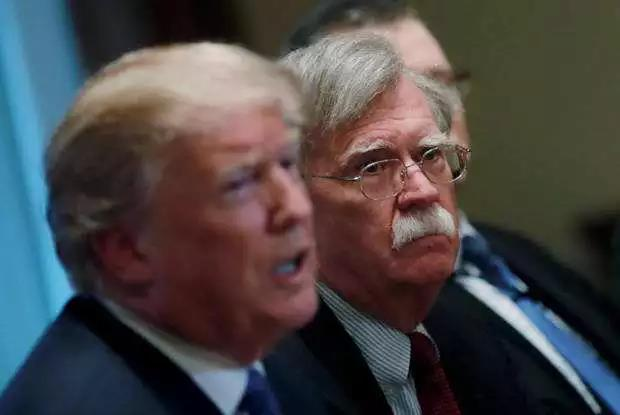

##正文

今天凌晨，美国又搞了一个大新闻，众议院以232票赞成、196票反对的表决结果，通过对特朗普的弹劾调查程序。

这也意味着，特朗普成为了美国历史上第四位进入弹劾调查的总统，对此特朗普表示“这是美国史上最大的‘猎巫行动’（Witch Hunt）”。

 

不过，政事堂却认为，这次投票结果意味着特朗普取得了一次重大的成功。

这是因为没有一名共和党众议员对议案投出赞成票，而民主党却有两个红色州的众议员投出了反对票。

美国的弹劾调查是众议院启动，参议院裁决，成功干掉特朗普需要2/3也就是67名的参议员的支持。由于共和党在参议院拥有53个席位，这意味着，至少需要20名共和党参议员倒戈，弹劾才有可能成功。

而此次共和党众议院无一人倒戈，向外界展示了一个非常明确的信号，那就是**目前共和党在弹劾问题上，最起码在大选之前是精诚团结的。**

如此的铁板一块，意味着民主党方面很难有动力去逐一拉拢，共和党方面也很难有人率先跳出来倒戈成为党内的叛徒，想把特朗普弹劾下去已经变成了不可能。

而令民主党难堪的是，如此党派一致的行动，竟然还会出现有两名众议员考虑民意而倒戈。

这意味着随着大选的接近，越来越多红色州和摇摆州的民主党议员们，行动将越来越倾向于避免刺激特朗普的铁杆支持者，这将使得民主党在众议院的优势将越来越小，能做的事情也越来越有限。

而美国选民主要看的是与自身利益密切相关的经济与就业，弹劾调查对于特朗普的打击非常有限。

所以特朗普投票前发推特“弹劾骗局只会伤害美国股市”，再加上弹劾结果出来后美股的暴跌，反而成为了特朗普反击民主党的的武器，这一轮弹劾调查使得一些选民因此坚定投票特朗普。

 

那么，明知民意会迎来打击，为何民主党还会选择推动弹劾调查，搬起石头砸自己脚？

民主党也有自己的小算盘，那就是在特朗普支持率保持强劲的情况下，把水搅浑来寻找机会。

之前的调查，都是民主党的闭门调查，而弹劾程序结束之后，调查都将变为公开，可以通过电视和互联网对美国民众直播，让在野的民主党把这场对抗带入自己掌控的舆论主场。

而另一方面，启动弹劾之后，意味着民主党控制的众议院可以随意征召白宫官员们，要知道白宫大量的基层公务员，尤其是外事与安全领域的公务员（Deep Government），普遍反感特朗普，很愿意对特朗普背后来一刀。

在这两个情况之下，**被特朗普打脸式炒掉的博尔顿，就将成为这一轮博弈的关键。**

白宫大部分部门都是各司其责，有自己的办事规范，只有国家安全顾问可以跨部门协调，因此，白宫绝大部分不合规的事情，都需要博尔顿去居中协调。

换句话说，特朗普最近一年多自认为合规，但是美国民众认为不合规的事情，很多都是经博尔顿之手做的。

 

政事堂认为，博尔顿就算作为一个铁杆的共和党，虽然在乌克兰问题上会选择一定程度上保护特朗普，不揭老底，但是在其他领域就不好说了。

与乌克兰类似，特朗普在跟俄罗斯、沙特、以色列、土耳其、印度、日本，甚至叙利亚和朝鲜等国的外务和安全问题上，都存在着大量非常直接“艺术的交易”。

而其中很多的交易，尤其是中东与东亚两个方向，博尔顿与特朗普有着巨大的冲突，特朗普也是因此，以非常不给面子的方式炒掉了博尔顿。

 

而接下来将要被众议院叫去接受询问的博尔顿，一方面要面对不少外交与安全公务员们大规模的反水，另一方面面对反水后，又要面对电视与网络直播带来的民意监督。

因此，以特朗普与俄罗斯、土耳其、伊朗各方达成的中东撤军密约为代表，博尔顿能否继续为那些他强烈反对的交易，继续为特朗普保密，就要打一个问号了。

 

而这也是民主党在无法将特朗普弹劾下台而依然强行选择弹劾的主要原因之一，在特朗普大量地缘交易即将最后结算的时候，把交易直接摆在美国民众眼前，可以直接打乱特朗普的交易节奏。

而这些交易，都是特朗普在明年大选中兑现选票的重要筹码，对比昨天文章我们就会明白，狙击掉特朗普的交易，对于民主党有多么的重要。

所以，以中东诸国为代表，那些自以为跟特朗普快要或者已经达成地缘交易的国家，接下来的一段时间内，都得小心盯着博尔顿的“复仇”........

##留言区
 

