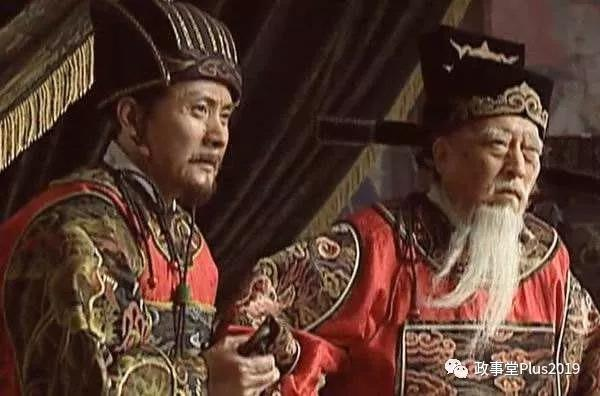

##正文

今天的文章是本系列的第八篇，聊的是宋明两朝的财阀政治。

读中国历史，会发现一个很有趣的事情，朝廷内一直都在博弈，从汉朝的宦官外戚，到唐朝的牛党李党，宋朝的新党旧党，明朝的东林阉党，似乎这条主线一直都没变。

但实际上，从宋朝开始，朝廷里面的博弈跟以往出现了巨大的变化。

就像上一篇文章写得在唐朝初期之前，所有的博弈都是按照姓氏来区分的，每次一出场都是一大家子的人，譬如西汉，吕雉和吕泽、吕禄、吕产、吕台；窦漪房和窦长君、窦广国、窦婴；卫子夫和卫青、霍去病、霍光........

可是到了宋朝之后，姓氏之间的博弈，转变为地域之间的争斗。
俗话说得好，经济基础决定上层建筑。

宋末的新党和旧党之争，并不是什么理念之争，而是南方人和北方人之间的博弈，查一下履历就会发现，旧党大佬们一色都是北方人和内陆省份，而新党大佬几乎一色来源于东南沿海。

譬如旧党的领军人物中，韩琦是河北人，司马光和文彦博是山西人，富弼是河南人，欧阳修是四川人。

而王安石的新党中大佬们几乎一色都是南方人，王安石、曾布是江西人，吕惠卿、章惇、蔡确、蔡京都是福建人。

甚至后期围剿新党也变成了各个省份组成的联盟，譬如司马光为代表的朔党（山西），以二程代表的洛党（河南），以三苏为代表的蜀党（四川）。

这是因为从北宋中期开始，资本主义萌发迅速发展，各省内部形成了代表着各自利益的财阀，而台上的政治人物不过是各地利益的代理人，也就很少出现父子相承的情况。

最接明朝近于门阀的严嵩严党，儿子严世蕃也不过才做到了工部左侍郎，然后就被拖出去斩了，不仅没有撑到第二代，儿子反而死在了老爹的前面。

 

在财阀政治下，各地选择的是朝中帮助自身推行经济政策的代理人，代理人的博弈也都是利益之间的博弈。

这个从经济的角度很容易理解，王安石的变法遭受到巨大的反噬，本质是南方人推行有利于南方而不利于内陆的政策，遭遇到了北方和内陆省份的集体围剿。

换个角度，我们就能够理解王安石改革的困难，一个南方人搞一刀切下岗，在南方没事儿，但是在北方必然会被骂惨......

同样，明朝也是如此，如果读书读得浅的，会认为明末是阉党和东林党之争。

但实际上依然是地域的财阀之争。

由于明朝是两京十三省，东林党汇聚的南直隶，是现在的江苏、安徽两个省，因此，东林党的大佬们也基本都来源于这个省。

而所谓的阉党，并不是魏忠贤的私人势力，而是由浙江的浙党、山东的齐党、湖北的楚党、陕西的秦党、宣州的宣党、昆山的昆党等诸多包围着南直隶的地域一起组织起来的一个联盟。

 

而东林党和阉党之间的冲突，本质是南直隶与其他省份这些不同的利益集团，在朝堂上政治与经济政策的竞争。

所以，读历史如果没有捅破这层窗户纸，基本就只能在门外转。

而捅破了之后，就会发现脉络突然变得非常清晰，简直就是明牌。

由门阀向财阀的转变，是由很多原因共同决定的，其中有两个特别有趣，一个是宋朝开始全面执行的科举制，另一个是宋朝首创的不杀士大夫。

在宋朝之前，官员和地主们都是没有人身以及财产安全保障的，因此只能依附于能跟王权博弈的门阀，以保全自身以及财产。

可是随着宋朝优待士大夫，地主阶级迅速解除了束缚，形成了一股独立的政治势力。

同样，过去魏晋以来的九品中正制使得人才的向上进阶，只可能通过依附于门阀，普通民众被死死的框在土地上，根本没有向上晋升的机会。

可是科举制的全面铺开，使得地主阶级迅速拥有了直接参与政治的阶梯。

 

因此，如果把北宋的政治领域改革，跟经济领域80年代做一个对比，就会发现，科举制在经济领域相当于“解放生产力”，允许民营企业经商，而不杀士大夫相当于“保护私有财产”，让民营企业放心经商。

对比西方资本主义的发展就会明白，在解放生产力和尊重私有财产之后，资本主义就会取得迅猛的发展。

当然，经济基础决定上层建筑，地主阶级们崛起之后，相互之间也开始了权力的不平衡。

随着北宋降雨线南移和气温的下降，江南地区人口与经济飞速崛起，诞生了以王安石为代表的新党。

同样，随着明朝商品经济的初步发展，以及大航海时代后中国加入到了国际贸易，南直隶地区凭借着江苏的盐和丝绸，安徽的瓷器和茶叶所带来的超额垄断利润，经济在江南地区独树一帜，因此也诞生了顾宪成为代表的东林党。

而这些利益集团形成之后，必然要寻求政府的政策向其倾斜，因此就会跟北方以及西部那些经济落后地区形成激烈的政策冲突，而且随着经济发展的拉大，都会逐步演化为不可调和的矛盾。

因此，无论是新党还是旧党，东林党还是阉党，他们之间的矛盾，都是资本主义发展过程中不可避免的矛盾，是中国自宋朝以来财阀政治的体现。

财阀政治会推动经济的高速发展，但是也会导致社会发展不平衡的矛盾迅速激化。

因为重商的经济发达地区官员执掌了中枢权柄后，中央会执行较低的商税，但是国内各省之间没有关税壁垒，很容易导致经济发达地区对落后地区形成倾销，导致落后地区大规模的农民破产。

而且，更可怕的是，在财阀势力执掌权力之际，国家的战略往往会选择战略收缩。

在财阀们看来，只要北方能够成为商品的倾销市场，那么南宋并不介意北方姓金还是是宋，南明也不介意北方是姓朱姓李还是姓爱新觉罗。

尤其是媾和后的贸易能够带来巨大的商业利益，而北伐拓土反而会给南方政府背上沉重的财政负担，因此走“北府兵”路线的岳飞，必然会被南方财阀集团的代言人秦桧干掉。

 

而且，财阀执掌权柄之下，一部分地区必然会先富裕起来，但是随后发达地区对内陆的商品倾销，会导致了国内出现巨大的贫富不平衡和农民破产，从而引发一系列的混乱，也给了北方各股力量入侵的机会。

纵观历史，财阀控制之下，南方的经济抽血使得北方经济崩溃，是宋元明清乃至北洋民国崩溃的根源。

所以，写到这里我们就会明白，为什么政事堂会一直认为，分税制和转移支付是中国90年代改革开放以来最重要的两个制度，朱总理是中国历史上最伟大的改革家之一。

##留言区
 无留言