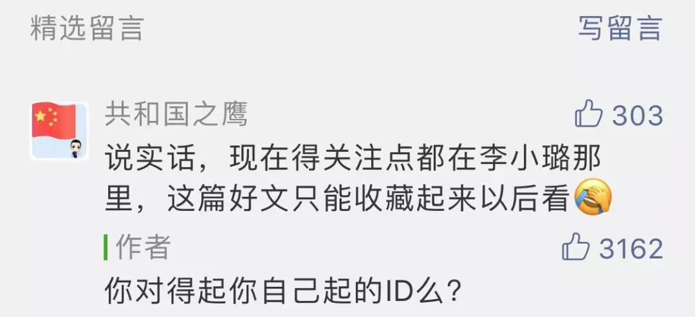

##正文

记得前天政事堂写美联储降息与APEC取消，有个读者留言，说当天大家都在关注抖音上的李小璐，被我借着他的ID调侃了一番。

 

可是今天美国调查抖音新闻一出来，令政事堂觉得那个“共和国之鹰”的眼光还真有点“毒”。

据美联社、路透社等媒体报道，美国外国投资委员会11月1日发布消息，将对抖音母公司字节跳动两年前一场十亿美金的并购案展开调查。

调查的起因，是美国参议院的两位议员认为抖音国际版的TikTok，“可能被外国势力利用左右美国大选”。

 

一夜之间，一个娱乐八卦的APP突然成为了“共和国之鹰”，属实令不少人是大跌眼镜。

当然，很多人并不知道的，抖音此次被美国审查的并购，并不是中国公司收购美国公司，而是中国公司之间的一次收购。

Musical.ly之前叫做妈妈咪呀，是一家上海的创业团队做的APP。2017年头条张一鸣以10亿美元的价格将其收购，使其成为了抖音海外版的基础。

因此，美国此次审查又是一次“长臂管辖”，来管中国公司之间的“家事儿”......

 

当然，能够惊动参议院来打压一款咱们都没用过的软件，并不是人家闲得无聊。

抖音国际版截至去年5亿的全球活跃用户，已经成为了中国海外影响力最强的APP，而且增速也极为强劲，在上个月的全球下载排名位居第二，仅次于任天堂刚刚发行的一款游戏，吊打了Google和Facebook旗下的诸多竞争软件。

而且，美国一共就三亿人，抖音国际版近三千万的美国活跃用户中，有60%是16岁到24岁，几乎实现了对美国青年人的全覆盖。
上千万的美国活跃用户，

所以，这种对年轻人影响力极大，能够带动舆论的互联网软件，必然会被美国政府盯上。

 

要知道，互联网一直是近年来美国进行颜色革命的重要手段，2010年希拉里主持的中东颜色革命，靠的就是Facebook、Twitter以及YouTube。

而阿拉伯之春中率先垮塌，引发骨牌效应的突尼斯和埃及，正好就是整个阿拉伯世界里面互联网通讯最发达的国家。

 

在美国基金会的指导下，大量的年轻人利用这些互联网软件迅速串联，令阿拉伯世界爆发了几十年不遇的政治剧变，这场剧变造成损失之大，不亚于一场全面地区战争。

不过，令美国人自己没有想到的是，就在阿拉伯之春后，美国也因为贫富不均，迅速爆发了包围华尔街的活动。

 

考虑到特朗普减税政策迅速推动了美国国内的贫富差距激化，未来美国经济一旦出现震荡，这类主打青少年的互联网软件必然也会成为美国的一把双刃剑。

所以，美国政府对于抖音国际版的打压是必然的事件，谁也不希望床榻之下有一只不受控制的老虎。

 

不过，美国人可能头疼的是，这一类问题，可能只是刚开始。随着中国主导的产业布局，未来相似的事情必然会越来越多，防不胜防。

 

政事堂经常会在文章中用“基建动能”、“千金马骨”等逻辑来分析事情，并不是因为政事堂有多喜欢，而是因为自新中国成立以来，我们一直都是用这一套逻辑来追赶和反超。

在4G时代之前，美国的互联网基建远远领先于中国，因此，那个时代中国BAT们只有抄袭美国的份，没有一款软件能对美国“反攻”。

但是，随着4G中国基建的大规模铺设与提速降费，中国移动互联网基建水平比肩于美国，于是阿里搞出了移动支付，腾讯搞出了微信小程序，抖音也实现了在海外的逆袭。（反之，曾经一哥的百度落后的重要原因，是其智能化主航道的国内基建太差）

而且，中国人虽然在实打实的硬件方面有着巨大的劣势，但是灵活的软件方面却有着天生的优势。

且不说上一个时代，马云在电视上大卖成功学吸流量，马化腾坐在电脑桌前装妹子聊天，抓的都是人性。

如今抖音无论是国内还是海外，在启动之初都会搞“千金马骨”，在发现一个好视频之后，会通过后台让这个人“先富起来”，把这个视频让所有的用户都看到。

很快，先富起来的那个用户就会带动起来后富加入进来，大量的追随者进入，跟着创造类似的内容，使得小生态迅速集中富裕了起来。通过这一种有中国特色的市场模式，来打造时尚潮流与明星效应。

而这种中国人已经很熟练的模式，使得我们在公平的竞争中拥有巨大的起步优势。

就像Google的技术和Facebook的用户都无法对先发的抖音国际版造成冲击那样，一旦我们积累下了这个优势和大量的素材，那么后面的“二哥”没有中国式的套路，想要追赶前面的“大哥”，难度就会登天......

这就像我前几天文章中介绍的，我们在5G、物联网、区块链和新能源方面的基建，并不是要让这些基建去赚钱，而是要通过这些基建来复制我们4G时代成功模式，让5G时代出现更多的移动支付、小程序、抖音......

而从去年开始，腾讯、网易、头条等公司都遭遇到了国内各种的压力，而这些压力，也是倒逼着他们把游戏、娱乐等中国已经成熟的产业杀向海外。

中国的网络基建与国内市场远远领先于其他的发展中国家甚至不少发达国家，因此中国的互联网公司就可以利用国内累积基础，然后在其他国家基建提升完成后迅速杀入，利用先发优势占领市场。

而这种市场一旦占领，依照我们中国人的能力，从当年的中国制造到如今的信息产业，我们制造占住了，就很难被后来者赶上。

 

说完了逻辑，我们可以预见的是，随着中国产业的布局和发展，未来像抖音被美国审查之类的事情必然越来越多。

而也不是一定就是啥坏事儿。

在此过程中，能让未来的同志们提前学习经验，以方便更好的应对。因为以后在5G物联网时代，这种咱们在老美地盘上攻城略地的事情，还会经常发生。

 

##留言区
 

