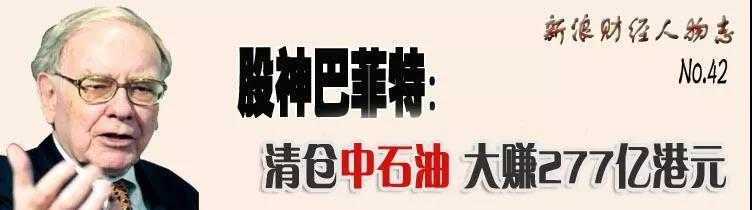
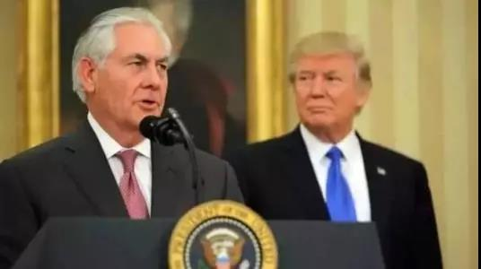
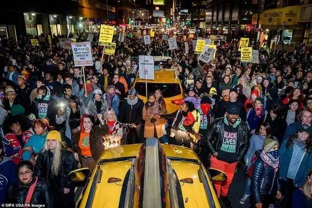

##正文

昨夜，股神巴菲特成为了全球资本市场的焦点，其麾下伯克希尔公司的三季报出炉了。

令市场吃惊的不是股神的利润超预期，而在特朗普式助跑下，今年的美股一路高歌猛进，而股神却在逆行“逃跑”，伯克希尔的巨额现金储备已升至1280亿美元的历史最高位。

1280亿美金是什么概念呢？

约等于股神在美股持仓前五大的股票总和。

 

而这五家公司的持仓，占了股神全部持仓的三分之二。

由于近年来股神消极的投资策略，其持仓水平与08年股灾之前几乎相当，因此其公司市值远远跑输于今年大涨22.34%的标普500。

尤其是今年三季度特朗普三次降息，将美股直接拉出了历史新高，而股神依然不为所动，也导致了当了伯克希尔几十年的老股东罗尔夫，怒而出清了价值千万美元的该公司股票。

在大牛市之下，巴菲特依然选择以08年式的低仓位运行，甚至趁着行情出售资产换取现金，令不少投资者担心，是不是这位股神看到了什么令他担心的事情。

 

无独有偶，就在巴菲特财报公布的前一天，一直坚持自持物业的潘石屹，被媒体曝出计划在两年之内，将麾下的“八大金刚”分批打包出售。

作为中国房地产圈的超级IP，当年以几斤橘子套取信息，逃掉海南房地产泡沫崩盘的潘石屹在中国房地产圈有着巨大的影响力，此次，他的清仓式逃离，也让人怀疑潘石屹是不是又提前看到了什么重要的消息。

不过，政事堂的读者们应该知道，新闻不能光看表面。

就跟巴菲特总是讲价值投资那样，潘石屹那段发家史中的橘子换南海住房数据，也都是在给自己打造公众面前的“人设”。

当年海南房地产泡沫是被1993年新一届政府上台，一位来自上海的铁腕副总理主动捅破的，跟潘石屹口中的海南房产供求关系并没有直接的关系。

如果不是政策的突然转变，海南的房子最起码还能再炒几年，真若如此，靠着数据分析而提前撤离的潘石屹只会成为全行业耻笑的对象。

而真正让万通六兄弟下决心在房价高涨之际撤离的，实际上是冯仑，从国家体改委出来的他提前拿到了房地产要被遏制的消息。

只不过，巴菲特的价值投资人设，是装给别人看的，自己心里清楚的很，而潘石屹“数据分析”的面具戴久了，就摘不下来了。

2013年，潘石屹看到中国房地产数据又一次供过于求时，选择逃离，结果没想到棚改和虚库存政策的推行，让这位曾经中国房地产的风云人物，如今已经彻底沦为三流开发商。

所以，潘石屹的动作没啥值得分析的，有那功夫不如盯着许家印，而真正值得我们跟踪的，还是全球股神巴菲特。

 

那么，巴菲特的判断逻辑是什么呢？

我们可以拿股神在中国仅有的两次投资来判断，一个是2003年投资的中石油，一个是2008年入股的比亚迪。

相信看了最近《降维打击系列》文章的读者们，其实很容易理解巴菲特这个国际资本大佬的投资思路。

2003年1月，小布什率领的共和党同时拿下参众两院，几个月后巴菲特就大规模投资跟美国石油公司一起开拓海外市场的中石油。

 

2007年1月，民主党从小布什手里抢回了参众两院，几个月内巴菲特就清仓了传统能源的中石油，拿着这笔钱转投了新能源的比亚迪。

 

看着共和党与民主党的能源战略分歧，再看看巴菲特精准到月的布局，就会知道，早已捅破那一层窗户纸的股神，根本不是在玩书本上所谓的价值投资，而是在进行政治投机。

所以进一步，我们再来看巴菲特在美股的投资之道：

2017年1月，特朗普上台后，巴菲特一个月后就大举买入特朗普最重视，并使用两台手机的苹果，几次增持使得苹果占了巴菲特持仓总量的四分之一，打破了巴菲特不重仓科技公司的先例。

 

2018年1月，石油大佬前美孚CEO、美国国务卿蒂勒森与特朗普矛盾迅速激化，并在两个月后被开掉。巴菲特在不到一年内就清仓式甩卖了作为第一大股东的石油公司菲利普66。

 

所以呢，如果相信巴菲特投资是所谓的价值投资，不管他江湖地位有多高，归根结底也是韭菜一族，顶多是高级一点的韭菜。

记得政事堂之前两篇文章介绍自己“武学”的文章，其中讲招数的下篇《政事堂：如何提升分析能力（下）》，讲的是提高预判成功率，最好的方式是锚定预判成功率最高的那个人。

而明白了股神巴菲特对于美国政治生态研究之深，所接受信息之广，就可以利用他的预判来对接下来的国际局势进行预判。

以股神的关系网，今年三季度美联储连续三次投票降息这种事情，对他来说几乎是完全透明的，但是他却没有事先加仓，反而手握的现金进一步增加，空仓率保持着08年股灾前的水平。

考虑到，如今美国已经陷入到巨大的撕裂当中，掌握着国际资本的民主党对于特朗普的各个议案都是坚决抵制，但是在降息的问题上，民主党能够施加影响的美联储，却以压倒性的优势配合特朗普进行降息，美国的媒体也没有对特朗普的降息进行打击。

因此，不排除一种可能，以巴菲特为代表的资本家们正在利用特朗普的降息作为掩护来出货和调仓，以换取手头巨额的现金储备，等待危机的出现。

那个时候，到处煽风点火的资本家们不介意把战火烧到自家家门口，“疯起来连自己都打”的国际资本家们，届时不仅可以低价购入大量的非卖品，而且将以救世主的形象出现。

而目前全球各地的混乱已经开始在蔓延。

昨天夜里，长期不满地铁的高票价的美国民众，被一名青少年在地铁中遭警察殴打的视频引爆了，仿佛前几天取消了APEC的智利那样，爆发了布鲁克林街头的大游行。

 

可想而知，一旦特朗普景气接下来被引爆，美国乃至全球会爆发什么样的混乱。

不过混乱并非完全是坏事，因为对于我们来说，混乱就是阶梯。

近期关联文章：

美联储的降息，与APEC的取消

弹劾特朗普，博尔顿的复仇？

抖音也能干涉美国大选了？

##留言区
 

