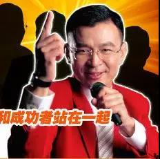
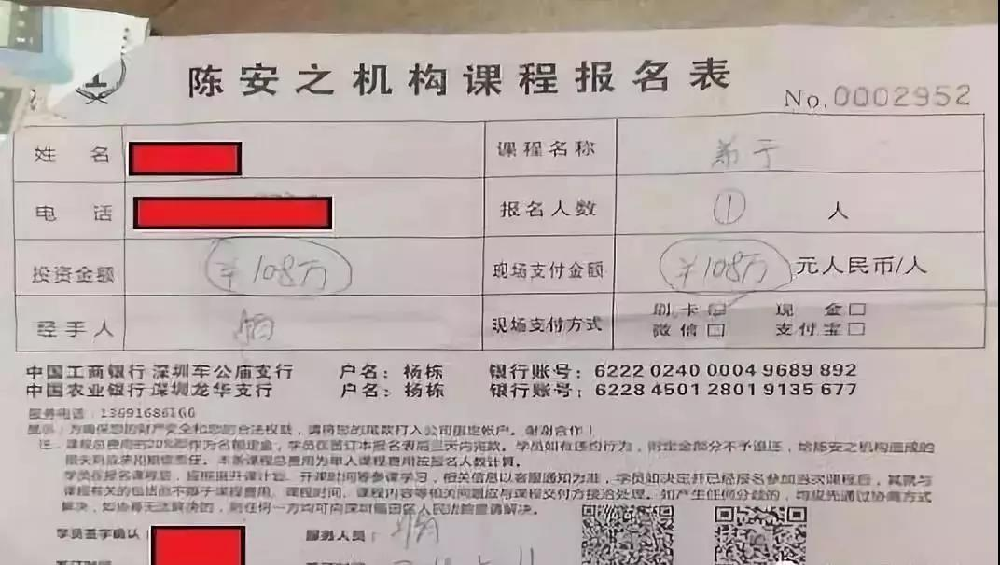
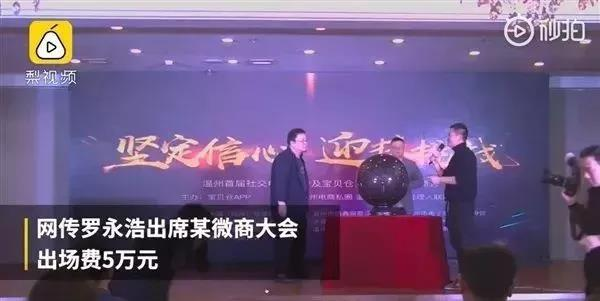
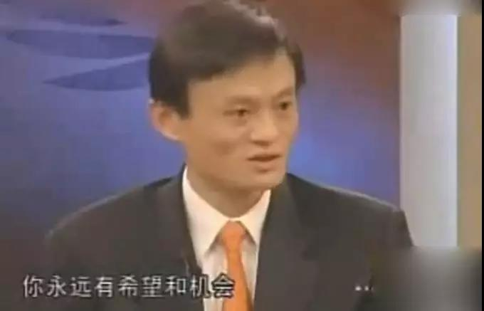

##正文

 
一

2005年的央视《对话》节目上，当时的成功学“大师”陈安之主动教马云什么是成功。

这位成功学“大师”告诉当时活跃在国内主流媒体上的马云，“谦虚是持续成功的保证”，以老师的口吻教育张扬的马云，以后应该低调一点。

 

而一贯与人为善的马云，少有的回怼了“大师”。

马玉非常不谦虚的表示，自己作为达沃斯论坛的主持人刚刚回来，并告诉成功学大师，“我不知道什么是成功”，不漏声色的表示大师的成功学屁用没有。

节目播出几年之后，常被人舆论骂做骗子的马云，成为了中国首富。

而一度被人尊为大师的陈安之，则晋级成为了一个传销骗子。

 
二

2018年5月，家住遵义的养殖户牛芳芳在村里养着300多只羊和几十头牛。

如果按照历史的进程，在肉价上涨的2019年，勤劳牛芳芳会迎来大丰收。

可是，一条偶然的微信彻底改变了他的命运。

牛芳芳的一个朋友向她推荐了陈安之的成功学，将其牛皮吹得震天响。

本着对朋友的信任，牛芳芳交了1680元，千里迢迢跑到河南郑州，参加所谓的陈安之成功学培训。

 

可是不曾想，一心想着成功的牛芳芳却掉进了“传销窝”。

在两天的传销大会上，陈安之和弟子们不断灌输成功学的心灵鸡汤和并对牛芳芳等人洗脑，并许诺，依靠陈安之的人脉资源和名望，拜他为师后，随便指点几个项目，都能让他们赚上几千万。

在现场陈安之一众托儿们的烘托下，脑子一热的牛芳芳回家就甩卖了家里的牛羊，又跟亲戚朋友东拼西凑，凑够了108万拜师费。

 

可是，倾家荡产交了108万拜师费的牛芳芳很快就发现自己上当了。

成为陈大师的“终极弟子”之后，培训地点改到了上海，除了陈安之和弟子们反复吹嘘他们所谓的成功之外，并没有什么新的内容。

而所谓的大师级人脉，也很快变成了传销推介，每次培训一半的时间洗脑，另一半的时间，陈安之和他的弟子们就开始了推销起来各类传销产品。

也许是南方妹子春晚看的少，不知道“大忽悠”的套路，扛不住一轮轮陈大师“组团忽悠”的牛芳芳，继续借钱，甚至还买了陈大师所谓台湾公司的股票和数字货币。

 

迟迟没看到盈利的牛芳芳，又被告知是自己名字的风水问题，临到最后还交了3万多块的改名费。一轮一轮的洗脑，直到把她彻底榨干。

而跟牛芳芳一起在上海培训的秦雪更惨，为了成为陈安之的入门弟子，辞去了工作，不仅抵押了房产交上了31万的拜师费，也买了很多的传销品。

可是陈安之说的随便给几个项目，让她们赚几千万的事情也同样没有发生，有的，只是一轮轮重复的洗脑和一轮轮的传销。

而此时的秦雪，因为一意孤行的拜师，老公愤然离婚，她一个人带着孩子，背着40多万的债务，差一点就拉着牛芳芳一起跳了黄浦江......

 
三

如果说国内互联网领域，最像陈安之教出来学生的，也许就是那个自称要“收购苹果”的罗永浩。

 

不过，曾经风头无二的老罗，随着一则法院限制消费令，正式成为了老赖。

对此，罗永浩很快就以《一个“老赖”CEO的自白》回复自称清白，并表示，在过去的10个月里，锤子已经还掉了3个亿左右的债务，个人也以各种方式筹款帮公司还了数千万。并承诺即便公司关掉，他也会以“卖艺”的方式把债务全部还完。

 

当然，罗老师这段对粉丝的深情告白，也就能忽悠一下小白，他所说的“本可以破产赖掉公司债务，然后东山再起”恐怕是给自己贴金。

因为进入破产清算，所有的财务账目都将面临诸多供应商视野下的清查，老罗一旦被曝出财务方面的问题，那么他的公众形象可就毁了。而且，破产三年之内不能出任董监高，三年消失公众视野，他的流量也就废了。

而更重要的是，老罗自己身上背着一个亿的连带担保，就算公司破产也要偿还，一个亿和三个亿之间其实差别也不大，因此还不如由公司撑在前面，避免自己成为直接的债务人。

那么，罗永浩能靠卖艺还债么？

理论上也不是不行，前段时间网传罗永浩出席浙江温州的某微商大会，出场费5万块，

 

这次让老罗成为老赖的公司江苏辰阳供了老罗三百多万的货，可老罗迄今为止一共才给了对方5万块钱，也不知道是不是这笔钱。

不过，按照5万一场的报价，考虑到锤子还有3个亿的债务，不算利息以及老罗的商业信用编制，需要“卖艺”至少六千场，才能把债务还完。

1972年出生的罗永浩现年47岁，按照每年365天每天一场“卖艺”，他大概卖到65岁退休，正好可以兑现承诺偿还完毕。

只是不知道那些被老罗欠了货款的供应商们，能不能活到哪一天。

 
四

老罗无路可走了吗？

其实，就像前段时间给微商站台那样，老罗还有另一种选择，那就是彻底成为传销骗子陈安之。

而且，还是陈安之的升级版。

随着老罗手机事业的彻底失败，最近被区块链推倒风口浪尖的币圈纷纷向老罗伸手，十余位币圈大佬接连表示希望老罗能够过来站台或者加入公司，甚至还有要给老罗域名让其东山再起。

 

不得不说，如果老罗选择这一条路，也许还真的能够短期内还清欠款。

因为这些空气币圈的生意逻辑，就是陈安之的成功学，不断的催眠自己能够一夜暴富。而币圈的扩张模式也是陈安之传销的那一套，就像跟着牛芳芳秦雪一起上台向陈安之拜师的，基本上都是请来的托。

只不过，这些技术男的通过技术虽然能达成很强的传播力，但是却没有强大的说服力和感染力，所以才有了前段时间币圈学西虹市首富，买下了巴菲特的饭局。

而拥有大量粉丝，拥有德云社级讲相声能力的罗永浩，正好满足了币圈最紧俏的流量需求。

因此已经通过锤子手机“割”了一波自家粉丝的罗永浩，也面临一个抉择，是否要向陈安之那样，把粉丝们吃干榨净，逼上绝路。

 
五

说起来，老罗当老师的时候，并不是以教学生出色而闻名，而是以新东方第一网红而出道，擅长的就是自我营销。

但是，老罗在做手机的时候，需要的是企业管理和供应链管理，这些都是他之前毫无经验的地方。因此，锤子手机在营销方面一直都是行业典范，可是供应链管理上却是一塌糊涂，最终被洗牌出局。

而陈安之也类似，作为成功学老师，资料本来是源于日本和美国的企业管理学，但是毫无企业管理经验的陈安之们根本教不了大家管理，因此就只能像电信诈骗一样，通过专门的“话术”对粉丝洗脑，再以传销的模式让他们交钱。

所以，教师出身的马云早在十四年前就看透了这个骗子，在央视直播间里面，直接怼了贩卖成功的陈安之，表示：

我不懂成功，只懂得失败。如果你放弃了，你就失败了，如果你有梦想，你不放弃，你永远有希望和机会。

 

如今，第三位老师出身的罗永浩，面对币圈大佬们纷纷抛出来的橄榄枝，站在了他人生的十字路口。

他要在“成功学”的陈安之与“失败学”的马云之间做一个艰难的选择。

政事堂希望，他不要愧对那些信赖他的学生，别放弃自己的梦想和希望。

最后，用群里一个妹子今天说的话，作为文章的结尾，希望大家共勉：

>作为普通人只要足够优秀，是有足够的成长空间的。所以年轻人需要认真钻研投入的是自身能力和工作，只要你真的优秀的拔尖，到时是关系和资源来找你。如果把时间花在钻研如何寻找关系和资源上反而会走弯路。

参考资料：消费日报《陈安之118万的成功学培训,几乎令我家破人亡》

##留言区
 

