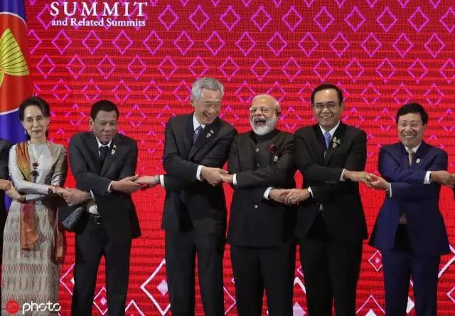

##正文

 

2014年7月31日，WTO自1995年成立以来达成的第一个全球关税协定即将签订之际，印度在最后时刻跳出来反对，导致一百多个国家历时数年的谈判功亏一篑。

五年后，昨天，就在各方确定文本，准备签字的最后一刻，又是印度，宣布决定不签署RCEP。

随即，面对这个扶不起来的猪队友，东盟宣布，15个亚太国家完成贸易协定的谈判，不带印度玩了。

 这下可就有意思了。

因为虽然RCEP是东盟主导，但是有中国和日本两个的巨无霸，因此“小马拉大车”的RECP内，中日两国的话语权非常高。

但是，中日之间对于RCEP也有着不小的分歧。

中国主张搞东盟与中日韩搞单纯东亚的10+3自贸区，而日本希望制衡中国，主张继续拉上澳新印，组成10+6。

这使得在RCEP在过程中一直麻烦不断，前有美日主导的TPP截胡，后有印度这个不靠谱的拖后腿，从2012年一直拖到了现在。

因此，**印度在最后时刻的反悔，对于我们来说反而是好事儿。**

一方面可以不再迁就印度，搞出来一个高标准的自贸协议，另一方面则是箭在弦上不得不发，趁着美国大选之前通过各国议会立法，以避免夜长梦多。

而印度的损失可就大了，因为日本为了制衡中国，中国和东盟为了尽快达成协议的情况下，各方都对印度进行了一定的妥协。

而此次各方不带印度签署之后，印度再试图加入，不仅无法享受创始国的优惠，也无法获取各方的额外妥协。

更悲剧的是，即使强势如莫迪，都无法带领印度加入RCEP，这意味着未来印度加入的难度将更大。

未来印度丧失融入以中日韩为首的大东亚工业体系的机会，东盟各国也将抢占中日韩的产业转移过程中原本可以属于印度的产业。

 

那么，莫迪为啥放弃这么好的一个机会呢？

首先，是印度自己的经济结构有问题。

虽然印度人口众多，经济规模强大，但基本上带动经济的主要就是内需，对外出口的拳头产品非常至少。

譬如我们在周星驰电影里面多次看到的印度神油，实际上是香港生产的，超市上到处可见的印度奶茶，则是台湾生产的。

 

由于印度工业发展较慢，也缺乏工业体系的转移，使得其几乎是靠卖原材料获取外汇，然后在外海加工之后再买回来。

譬如RCEP体系内，印度出口的大头，是向中日韩出口铁矿石和化工材料，而印度进口的大头，是从中日韩进口钢铁和化工产品.......

而且，在RCEP体系内印度每年的逆差超过千亿美金，一旦降低了关税门槛，估计逆差会进一步的扩大。

因此，印度国内种姓门阀为代表的利益集团对于签署RCEP有着巨大的排斥，今年已经组织民众进行了多次游行。

其次，是经济问题传导至了政治上。

由于印度出口乏力，莫迪为了争取民众支持改革，对于影子银行秉持着放纵的姿态以刺激国内消费，

但是，出来混都是要还的，去年印度的影子银行爆了，引发消费的断崖式下跌。

 

而消费断崖式下跌传导至房地产和基建，又导致钢铁水泥等行业受到冲击，导致失业率大增，进一步拖累居民消费，形成了经济上的恶性循环，导致GDP增速迅速下滑，失业率创了新高。

尤其是莫迪的人民党正在从革命党向执政党转型的大背景之下，GDP和就业率是莫迪改革获取支持的关键，因此，票仓不稳的莫迪，也必须要看控制着印度大量产业门阀的脸色，选择跪着要饭。

最后，国内政治又是与国际政治密不可分的。

莫迪在前往曼谷之前，可以说是在“大杀四方”，在各方努力克制帮助其塑造超级鹰形象的背后，说明莫迪本人是准备签约，也跟各方有过一定的默契。

但是，莫迪在国际博弈上有一个巨大的软肋。

印度最大的贸易顺差国是美国，而且在美国工作的印度IT精英往国内源源不断汇出的美元，是印度支撑着巨大贸易赤字还能够高速发展的关键。

可是，就在莫迪赶往曼谷准备最终签约的路上，美国在WTO框架之下对印度提出的诉讼，WTO判定美方获胜。

这意味着印度与美国没有就争端达成补偿协议的话，美国将有权力对印度进行贸易报复。

而目前印度脆弱的国内经济形势，以及国内门阀势力的坚决反对，使得莫迪承受不住美国的压力，使得为了RCEP付出多年努力的莫迪，不得不选择为山九仞功亏一篑，在最后时刻拒绝签字。

 

而与特朗普已经混成兄弟情的莫迪，竟然在去曼谷签字的路上遭遇到这个打击，并非巧合。

同样，也是在前往曼谷签约RCEP的路上，日本首相安倍乘坐的波音专机突然冒出浓烟，乘务员发现后在第一时间使用灭火器灭了火。

遭遇了如此惊魂的安倍，怕是也要琢磨琢磨了。

 

不过，敌人反对的，往往代表着正是我们做对的。

在政事堂看来，后发展国家签署自贸协议的意义，是以出让部分利益，以换取全球产业转移这个更大的利益。

1999年，我们在国内的下岗危机，国际的大使馆轰击等诸多压力之下，最终还是跟美国签署WTO协议，全球产业链转移使得我们的经济取得了迅猛的增长，成为了仅次于美国的全球第二大经济体。

而反观印度，前些年一直拖着RCEP不签，导致了最近两年中日韩的产能纷纷向东盟内的越南转移，让越南取代了印度，成为了全球新兴市场增速的一哥。

回过头来，纵观亚洲儒家文化圈，除了正在谈判的朝鲜之外，中日韩新越与台港澳，全部都抓住了历史的进程，争取到了全球产业转移的机遇，取得了飞速的发展。

我想，这不是巧合。

因为在这一方的土地上，自古就能孕育出最伟大的政治家。

##留言区
 

