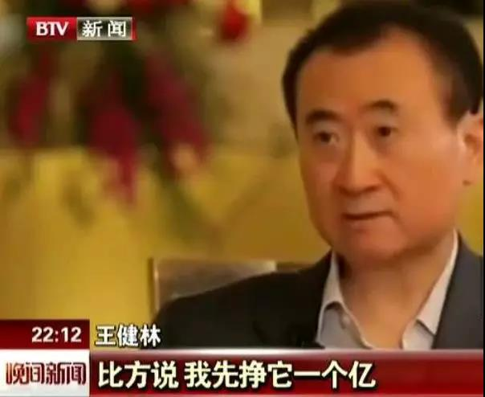
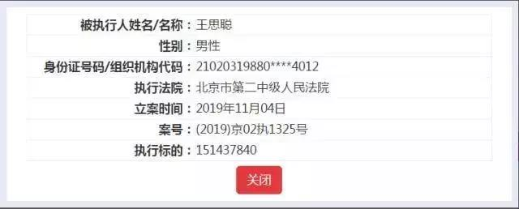
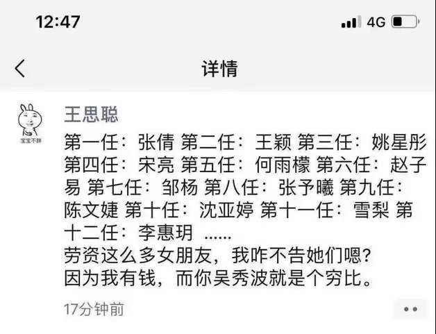

##正文

今天上午，首富之子王思聪成为“老赖”的消息不胫而走，抢占了今天的头条，网友们纷纷调侃，继贾跃亭、罗永浩之后，又一名流量巨星坐不了飞机，住不了五星酒店了。

 

当然，这都是网友们编排的段子，毕竟是首富之子，家里又有私人飞机又有酒店，就算成了“老赖”，虽然买不了票，但也有的是办法绕过解决。

更不要说，老爹随便一努力，一个小目标就到手了就把账给还了，至于让自家的宝贝儿子当老赖嘛？

 

于是，谣言很快就被证伪，王思聪只是被列为了执行人，还没有成为“老赖”。

 

不过，有个随便就挣一个小目标的老爸，还这样被拎出来，身份证号码也暴露了，对于王思聪还是有点丢人的。

 

记得上次吴秀波跟女朋友打官司的时候，还被王思聪公开开骂穷逼，不晓得被法院执行之后，是否影响王思聪继续频繁的更换女朋友的心情。

 

当然，政事堂关注王思聪并不是为了八卦，而是因为王思聪作为中国流量届的天王，他的动向本身就是一个重要的风向标。

而非常有趣的是，以王思聪在微博上销声匿迹以及沦为被执行人为代表，从贾跃亭到罗永浩再到王思聪，中国最近五年互联网的流量三巨头，如今已全部陨落。

而且，如果细细品来，贾跃亭是罗永浩的债主，王思聪是贾跃亭的债主，因此这场国内顶级流量明星一个接一个的连环爆，恐怕也并非偶然。

尤其是王思聪，不仅是国内的顶级流量，稍微有点新闻就霸占微博头条，在投资界也算是一块金字招牌，就跟股票界的徐某人类似，王思聪投哪，就有一大堆的资金跟着投。

而这些资金，可都是给王思聪先进去的资金接盘的重要力量，因此，一方面，不到万不得已，王思聪不会砸自己的招牌，另一方面，王思聪既然选择砸了这个招牌，以后多半也不准备继续混投资界了。

因此，政事堂推测，即将从投资圈回归娱乐圈的王思聪，也就不介意“被老赖”的流言了。

 

而与王思聪“被老赖”流言相似的，是昨天央行又一次在媒体的鼓吹下“被降息”了。

2019年11月5日，人民银行开展MLF操作4000亿元，期限为1年,中标利率为3.25%，较上期下降5个基点。受消息面的“降息”影响，当天A股一度盘中站上了3000点。

在MLF（麻辣粉）下调的消息刺激下，忽悠别人炒股的和忽悠别人买房的那帮专家们，又开始打了鸡血一般的兴奋起来，开始炒作降息周期。

不过很显然，市场上并没有什么靠谱的专家帮助民众来解读懂央行此次的目的与意义。

央行此次发行4000亿MLF，下降了5个基点的利率，意味着向国内银行免费送提供了一共2个亿的利润，对金融机构有利好。

但是，此次对冲的MLF总量却下降了35亿，这一顿操作下来，使得市场急需的流动性正好被对冲了。

那么，央行这一轮调整MLF究竟是什么意思呢？

其实，都写在了央行过去一年的公开发言里面。

自今年以来，央行一直在力推传统利率转LPR，并推动LPR降低利率，用双轨制以降低实体经济的融资成本。

不过，LPR是银行间利率，是一个市场化的行为，今年8月9月连续两次的下调之后，到了10月各家银行为了利润，纷纷不想继续下调，甚至还想在11月上浮。

而LPR最重要的锚点就是MLF。

因此，这一轮下调MLF最主要的原因，是央行对于商业银行与市场化的一次妥协，为了交换商业银行继续下调LPR，通过MLF的操作，向商业银行输送利润。

 

此次MLF调整的幅度，也就是在央行“窗口指导”下，希望商业银行在11月20日公布LPR的调整幅度。

所以，商业银行在MLF吃进去的利润，在LPR还得再吐出来。

 

之后，央行通过继续调整MLF利率来窗口指导LPR利率。

好了，绕了这么大的一个圈，MLF、LPR跟流量大佬王思聪有什么关系呢？

LPR换个说法，也叫无风险贷款利率，央行在大力推动银行采用LPR记账和LPR降息的背后，是在**引导资金更多投向无风险或者低风险的投资领域，并给予低风险领域更低的融资成本。**

所以，力推LPR的另一种说法，就是**央行在推动银行的资金从房地产和虚拟经济中流出来，转而支持实体经济的发展。**

而把这个思路提升到宏观层面。

推行LPR之前的三年，中国忍着巨大的经济压力遏制了房地产和虚拟经济主要资金来源的影子银行，使得中国主要的放贷机构变为银行。

而在影子银行被终结后，央行推行的LRP，则是通过双轨制，利用政府能够窗口指导的银行，将虚拟经济的资本规范化的引导进实体经济。

所以，想明白了LPR的机制与原理，是在推动中国经济由虚转实，我们就明白了，王思聪为什么会强忍着巨大的名誉损失，也要果断收手了。

一方面，随着这场经济换轨进入下半场，王思聪的主要投资领域虚拟经济，正在被国家通过LPR机制进行强力的去杠杆。学习他老爹那样早一步离场，能给自己未来留下更多的筹码。

而另一方面，除了虚拟经济之外，房地产是LPR机制另一个严厉打击的对象，而王思聪投资事业五个亿的启动资金，就是中国最大商业地产商国民老公公王健林提供的。

看着恒大投汽车，碧桂园投机器人，万科投物流，万达去扶贫养猪种茶叶，随着中国经济由虚入实，从许家印到王健林挣钱都变得不容易，自然也就无法继续给儿子大规模的补血。

而没有了王健林们的补血之后，回顾王思聪们的资本链条，就会发现很有意思的事情，罗永浩在最困难的时候问贾跃亭借了一个亿，贾跃亭的乐视体育坑了王思聪的一个亿，王思聪这次欠款被执行的，还是一个亿......

**二十多年前中国因为过剩产能导致的三角债，如今又一次神奇的复活了。**

所以呢，随着年初国家开始力推LPR机制，推动经济由虚向实，中国最果断的商人王健林必然不会继续放纵儿子在虚拟经济领域继续折腾，并停止对他的资金投入，王思聪从今年年初就低调的消失并不偶然。

当然，这对王氏父子来说也不是啥坏事儿。

毕竟王思聪也算是国内最顶级的流量，未来可以回归娱乐圈，充当万达重要的发声筒，找找女朋友，搞搞娱乐八卦，帮着老爹的地产生意扯大旗，效果远比那些鼓吹降息的经济专家们靠谱多了......

 

 

##留言区
 

