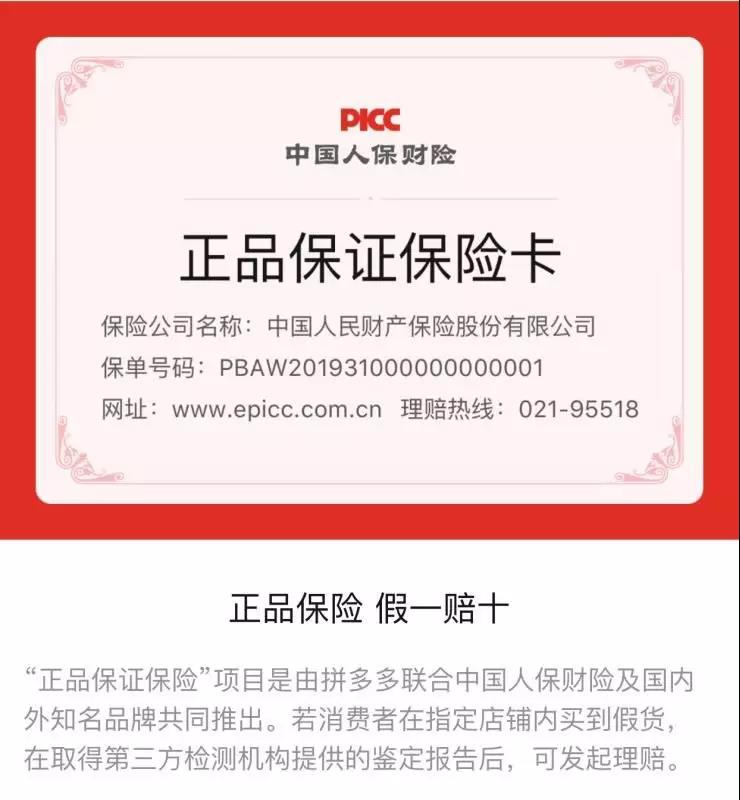

##正文

金庸大师笔下，人气最高的女主角，恐怕非黄蓉莫属，不过，很多人纳闷这个古灵精怪的小丫头怎么会爱上憨憨的郭靖。

 

对此，网上不少人带入了后世的观点，认为郭靖是横扫欧亚大陆之成吉思汗的金刀驸马，是元睿宗拖雷的义兄弟，是个顶级的二代。

再加上全球限量版的阿斯顿小红马和爱马仕手工定制貂皮大衣，一套不惜成本的“买买买”组合拳，一举赢得了黄蓉的芳心。

不过，这都属于没好好看小说的，书中郭靖跟蓉儿妹妹一比，其实就是个屌丝。

因为对于当时还没听过蒙古的宋人来说，多年之后才开始横扫欧陆的铁木真和拖雷，此刻跟周星驰饰演的匪兵甲、匪兵乙并没有什么区别。

 

相反，黄蓉所在的南宋，正是中国古代繁荣的巅峰，西湖歌舞几时休的临安（杭州）更是纸醉金迷。

黄蓉住的桃花岛，就是南宋首都临安边上的一个私人岛屿，不仅黄金地段而且极度私密，相当于后世美国富豪汇聚的纽约长岛。

 

郭靖的小红马超跑算个啥？

人家桃花岛大小姐出门都是坐着三层的奢华大游艇。

至于黄蓉的老爹黄药师，几乎就是南宋版钢铁侠，擅长奇门遁甲的“黄老邪工业”有着大量超越时代的科技，黄蓉出门穿的都是“伤害免疫+攻击反弹”的软猬甲套装。

就像陈道明的女儿看着“闹太套”，内心不会有一丝波澜。想一想，有着世间第一奇男子的老爹，郭靖的小红马和貂皮怎么能入黄蓉的法眼。

而且，金庸小说写得是江湖，地位取决于武功和师门。

郭靖刚出场武功很渣，而且师门江南七怪加在一起打不过一个丘处机，丘处机七兄弟加在一起打不过一个黄药师。

甚至连黄蓉的那些师兄师姐，如陈玄风梅超风，武功也能排进射雕江湖的前十。可以说，如果把江湖换做互联网，那么临安黄药师几乎就是杭州马云一般的存在。

因此，所谓成吉思汗的金刀驸马出手追黄药师的女儿，在当时，相当于中东某恐怖分子的准女婿，试图赢得马云女儿的欢心......

 

而且，财富方面，郭靖在准岳父的桃花岛上发现的密室，书中说了，里面的古物珍玩名画宝贝“没一件不是价值连城”。

因此见惯了无价宝的东邪父女，又怎么可能对钱和财产感兴趣呢？

 

而且，看看黄药师的才华和家里收藏的艺术品，就会明白黄蓉的家教，从小照着真迹临摹兰亭序，拿着焦尾古琴弹广陵散的黄蓉，能把郎朗李云迪都轰成渣。

反之，与黄蓉初次见面的郭靖，形象颇似揣着金锭子、开着红色悍马、穿着黑貂的东北大哥，画面有多么的不和谐是显而易见的。

因此，黄药师坚决拒绝郭靖当女婿也是常理，就像马云绝不可能允许自家闺女去给东北大哥当扒蒜小妹....

 

更不要说如果论钱论地位，郭靖被竞争对手欧阳克，几乎轰成渣渣辉了。

白驼山少庄主的欧阳克一出场就是轻裘缓带，俨然一位富贵王孙，出个门都有数十名白衣妙龄女子环绕身边，堪称颜值增强版的南宋王思聪。

 

可我们再看郭靖跟黄蓉第一次相遇时候。

以为牛羊肉就是天下最美味的郭靖点菜：“快切一斤牛肉、半斤羊肝”，仿佛一个东北大哥，拉着黄蓉一起撸串。

而锦衣玉食早已习惯了的黄蓉是这么说的：“别忙吃肉，咱们先吃果子....先来四干果、四鲜果、两咸酸、四蜜饯。”

“干果四样是荔枝、桂圆、蒸枣、银杏。鲜果你拣时新的...咸酸要砌香樱桃和姜丝梅儿，蜜饯吗？就是玫瑰金橘、香药葡萄、糖霜桃条、梨肉好郎君。”

在塞上的张家口，虽然没有江南的那些顶级食材，但黄蓉随后点的八个下酒菜中，炒鸭掌、鸡舌羹，都是一盘菜要吃掉几十只鸡鸭那种奢华吃法。

而且，当菜冷了之后，黄蓉并不是让小二把菜热了，而是倒掉重做新的，甚至新上来几十盘菜上来，她也不过才动了几筷子。

相比于看个管家拿个托盘装WIFI密码就颅内高潮的某上流人士，黄大小姐就点了菜，便证明了真正的贵族是传承下来的而不是嫁出来的。

 

那么，桃花岛的贵族大小姐黄蓉是如何被郭靖“逆袭”的呢？

金庸在书中说的很明确，黄蓉对郭靖动心，是他们第三次见面的时候。

当时，郭靖因为穆念慈的比武相亲来赵王府，看到了精致点心，郭靖想到黄蓉喜欢吃，便挑了四块用手帕包好装在怀内。

之后，郭靖背着师叔王处一被赵王府众人追杀，几次都在生死边缘，可是，这四块送给黄蓉带的点心，郭靖却一直带在身上。

直到与黄蓉的再次相逢，郭靖掏出点心时才发现，这一路逃命下来，点心或扁或烂，不成模样。

此时，黄蓉却伸过手来，拿了一块点心放进嘴里。几口，黄蓉便眼圈泛红，眼眶中涌上泪水:

>我生下来就没了妈，从没有哪个人像你这样记着我……

小说到这里，这才是黄蓉被感动，并爱上郭靖的关键。

黄蓉从小就缺乏母爱，而父亲东邪黄药师和金庸小说其他顶级高手一样，都是政治人物，所有的决策都要符合利益。

譬如，在桃花岛上，郭靖有资格跟高富帅的欧阳克竞争黄蓉，凭他是北丐的徒弟，但是黄药师仍频频作梗。东邪并不是为女儿着想，而是怕有郭靖这个蠢女婿导致自己被武林耻笑。

反之，欧阳克劣迹斑斑，习惯玩弄女性，但是黄药师考虑到能够通过联姻达成东邪与西毒的联盟，却也不惜把女儿往火坑推，暗中帮助欧阳克。

更不要说导致黄蓉他娘死的直接原因，就是怀孕要分娩的时候，还要帮黄药师夺取武林至尊九阴真经的秘籍。

所以，在这个环境下长大的黄蓉，最在意的，不是外表，不是才华，不是财富，而是一颗不求回报，甘愿为她付出的真心。

而这世上真心对黄蓉的，只有郭靖。

在不知道黄蓉的身家背景、性别男女的情况下，郭靖顶着刀剑追杀，不忘把黄蓉喜欢吃的糕点搏命式的送到她的面前。

这就像歌词里面说的，在我心，世间始终你好。

 

一千年之后的今天，如此真心的付出郭靖还能寻到吗？

当然有了！

拼多多在今年“电商论剑”的双十一上，启动了百亿补贴全网大牌，商品在成本价的基础上补贴最高50%。

在这场电商新华山论剑当中，相比于其他电商加价后的降价，或者平价出售，下血本补贴的拼多多，是唯一对蓉儿真心付出的“傻小子”。

以43度飞天茅台为例，某东售价949元/瓶，某宝是1009元/瓶，而拼多多却只需789元/瓶。

 

更不要说堪比硬通货的Apple家族产品了。

原价5499的iPhone 11，补贴后只需要4699，原价9699的iPhone11 Pro Max，补贴后只需要8099，原价1999的Air Pods Pro，补贴后只需要1818。

此外，还有数不清的正品补贴等着众位大侠自行来取。

今年如此内力深厚的补贴，是因为如今的拼多多，早已不是靠着江南七怪杂牌武功起家的那个少年。

在蓉儿的帮助下，拼多多随着洪七公修炼起名门正派的武功，一掌一掌的增加内功，以500亿美金市值超越百度和京东，跻身中国互联网的“新五绝”。

 

可惜，即使这样，东邪“马老云”依然看不起“郭多多”，联合欧阳克搞出了“二选一”式的挤兑，在江湖上塑造郭多多“北丐弟子”、“江南七怪徒弟”的低端印象。

因此，郭多多想要打赢这场翻身仗，摆脱固有的形象，就只能以"掌掌见肉"的巨额补贴，用100%的真品正品，向整个武林来证明自己的真心。

而且为了证明这一片真心，拼多多还邀请了中原武林的名宿泰斗中国人保来作证，当着各路英雄的面，保证所售大牌100%正品，假一赔十。
 
 

这一百亿当着武林众位英雄撒了出去，不出意外，今年双十一这场新华山论剑，电商领域又是一次大洗牌。

混乱就会带来机遇，在这论剑血拼之下，也正是各路英雄们薅拼多多正品羊毛的好机会.....

现在下单，即可享受到郭靖式全心全意的付出，不管千里万里、高山险阻，拼多多都会把宝贝送到您的手中。

##留言区
 

