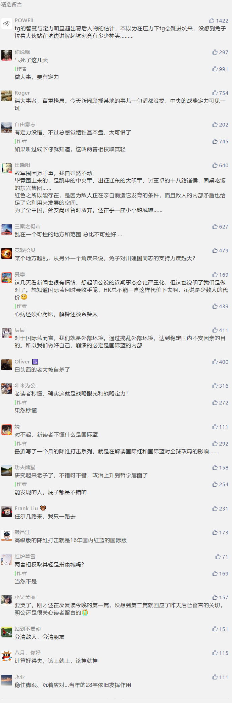

##正文

分享一篇一个月前的文章：

接下来我们最重要的，是走好自己的路

上面这篇文章是政事堂PRO高级版的第一篇文章，也是降维打击系列的序言。

这篇文章中，甩出了我在跟大家线下交流时对接下来局势做出的推论：

>因此也会遭遇国际蓝对我们的打击，因此某些地方的乱局可能会在近期严重。

大家回顾这一个月来智利APEC的取消，HK局势的升温.........

所以，明白了对手之后，就不要被乱带节奏，也不要盲目出手，就像题目中说的那样，接下来我们最重要的，是走好自己的路。

##留言区
 

