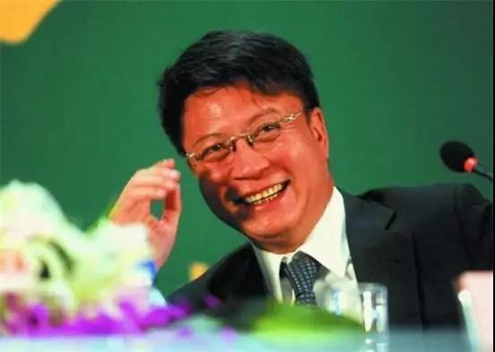
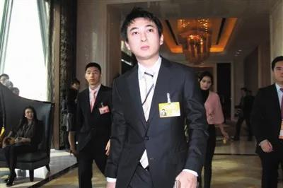
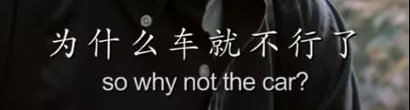
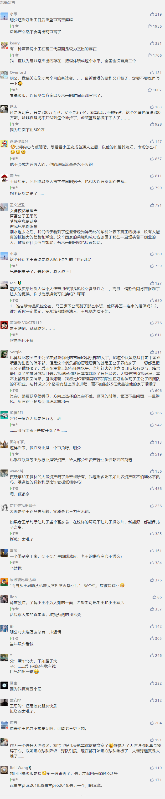

##正文

十多年前，英国伦敦大学的中国留学生们组织了一场KTV聚会。

就在身着名牌光鲜亮丽的俊男美女们大展歌喉之际，有一个穿着校服，平平无奇的少年默默的坐在角落。

爱美之心人皆有之，这个穿着校服的少年后来还是鼓足勇气，向一名混身名牌的女同学搭讪，邀请她毕业回国后能够去大连玩玩，让他一尽地主之谊。

结果并不意外，这位身边帅哥环绕的女同学，婉然拒绝了这个来自大连少年的唐突邀约。

不过，令这位高傲的女同学事后非常懊悔的，是她当时并不知道，这位长得平平无奇，穿着校服参加聚会的低调少年，他的爸爸是中国首富.......

 

作为长期霸占着中国首富位置的王健林，一直是中国最知名的公众人物。

不过，而自从王思聪从伦敦大学哲学系毕业后，王健林拿出来五个亿，成为了日后这个超级网红的天使投资人，也让儿子迅速取代自己，成为中国最知名的“网红”。

当时，这五个亿可不是小数目。

略晚于小王同学创业的TMD三巨头，首轮投资只有几十万到几百万的人民币，甚至踩着纳斯达克泡沫之上的BAT，首轮投资也不过百万美元。

背靠着首富老王，手握五亿创始资金的小王，轻易的达成了五个“小目标”的原始资本积累，在那个时代，绝对是创业者中的最牛逼的存在。

 

而且，有着靠山的小王同学也不需要考虑后续的融资，老王在接下来的每年都会打过来两三个“小目标”，包揽了小王之后的ABCDE轮融资。

没办法，人和人之间的差距就是这么大，毕竟小王的老爸是当时的中国首富。

而这种首富带来的光环，以至于中国第一代的互联网创业大佬的周鸿祎，都在微信朋友圈上，被这位带着狗坐私人飞机的首富之子赤裸裸的鄙视。

 

甚至，这位首富之子还时不时的一本正经在各种访谈节目露富。

 

只不过很可惜，随着王思聪的创业失败，一切都成为了笑谈。

法院一纸“禁高消费令”，让王思聪的狗可以继续坐着私人飞机前期抵达，但王思聪本人就只能坐着汽车或者火车二等座，从后面去追比自己先到达的狗。

 

曾经中国网络的第一流量，如今走到这个田地，不禁令人唏嘘。

要知道，把老王给小王投资的钱，按照30%的首付，在万达北京总部附近买房子.......那么到了2017年的时候，这些房子至少价值200多亿.....

而2017年逼着老王断臂求生，将文旅项目和酒店甩卖，就是因为万达商业回归A股时借的那200多亿引发的现金流危机。

搞投资却没有买房子的小王，不仅没能拉上老王一把，还把自己混成在“老赖”的边缘......

 

近期，由于王思聪微博设置半年可见后的疑似清空微博，以及一笔三百多万的债务，就把他变成了限制高消费，很多人都对这位中国的超级网红表示了巨大的不理解，甚至网络上各类谣言也开始广为流传。

不过政事堂看来，一系列事件搞的大家稀里糊涂，是因为大家网上看到的，并不是一个真实的小王。

就像王思聪微博上介绍的那样，这位“为人低调”的网红，其实本质并不是一个喜欢高调的人，否则，他也不会在大学的同学聚会上，成为唯一一个身穿校服的少年。

而王思聪过去十年的高调背后，是背负着家族责任的。

譬如这十年来，王思聪投资的两个主航道，一个是以熊猫TV为代表的影视娱乐，一个是以游戏竞技为代表的文体娱乐。

这两个主航道的背后，正是王健林的万达集团在同期转型的两个主航道，一个是在海外千亿投资的万达影视，一个是在国内千亿投资的万达文旅。

如果按照王氏父子原以为的历史进程，王思聪重金砸的那些熊猫TV的主播，以及游戏领域的上下游产业链，将是万达影视和万达文旅两大主航道“互联网+”之下，非常重要的转型资源。

甚至王思聪布局的餐饮、旅游、园林绿化的一系列投资，背后都能看到未来被他老爸的万达集团接盘的可能。

所以，从小王的投资方向再来看小王的高调，某种程度上看，也是王氏父子合力布的一个局。

虽然万达动辄千亿投资，但基本都是银行等金融机构借来的钱，而王健林每年给王思聪的钱，都是真真正正老王家自己的钱，

如果这几年资本市场跟16年之前一样放宽，王健林的万达商业、院线、体育甚至文旅等项目逐一登陆A股市场，那么王思聪投资的那些项目，伴随着小王国内顶级网红的光环，很多都会被万达系的上市公司所收购和投资，实现真正的落地为安。

所以，某种程度上来看，低调的王思聪和腼腆的贾跃亭很类似，都是被资本的洪流裹挟之下，不得不成为了中国最知名的网红。

 

但是很不幸的是，2018年，没看懂历史进程的王思聪重仓布局的影视和游戏领域，先后遭遇了泛娱乐领域的供给侧改革。

随着国家打击影视行业偷逃税款，资本纷纷从影视行业撤离，自然也就传导至下游的直播领域，导致小王的熊猫TV突然丧失了后续资本的跟进。

随着国家限制游戏版权号，导致资本纷纷从游戏行业撤离，自然也就传到到了下游的游戏产业链，导致小王投资的大量游戏公司也没有了后续资金。

而更难受的是早一步就遭遇了供给侧改革的老王。

万达电影等上市平台融资频频受阻，根本没机会去并购投资小王的关联产业，甚至能为小王的直播、游戏、旅游提供场景的万达文旅体系，也彻底归了孙宏斌所有。

更不要说王思聪布局的餐饮、园林绿化等领域，都是万达商业适合投资或并购的企业，可万达商业迄今为止，还没有取得IPO的审核通过.......

原来贾跃亭可以在非上市公司和上市公司之间腾挪，小王可以跟老王之间搞腾挪，但是随着贾跃亭和王健林的大量资产归了孙宏斌所有，很多内部腾挪之间的通道也被堵死了。

 

而接下来，明白了小王与老王的资本路线，也就会明白，王思聪现在一系列不合理动作的根源。

过去十年的时间，小王不断通过各种时间打造知名度和影响力，并不是因为喜欢如此张扬，而是这种知名度，以及首富之子的标签，能够直接影响到其所投资项目资本市场上的估值。

 

所以我们也就会明白，为什么王思聪竟然会以个人担保，如此蠢笨的方式，来支持熊猫TV等项目的融资，甚至在出问题之前，都不紧急更换法人。

因为一方面熊猫TV投进去的是老王家的真金白银，而另一方面，当时小王相信未来老王的公司会来给他接盘。

而进一步，也就会明白，为什么几百万的官司，王思聪都要斤斤计较去打，而不是想办法庭外和解，以保存对他来说至关重要的名誉。

这是因为经过这一轮的供给侧改革，王思聪投资的众多项目，很难再靠爸爸卖出高价，不如转而踏踏实实的做事业，等着爸爸的再次崛起。

因此，小王在投资圈的声誉已经不重要了，如今他要通过打官司尽可能减少损失，给自己留下更多的资金。

毕竟，虽然王健林能够轻易调动千亿投资，但这些钱都是金融机构的，而王思聪手里虽然才十来个亿规模的投资，但里面的钱却是王家父子自己的。

就像电影《私人订制》里面最后的那段经典结尾说的：
 
 

 

 

 

##留言区
 

