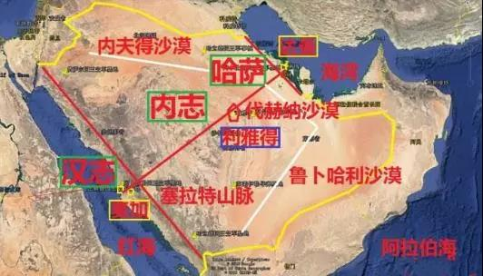
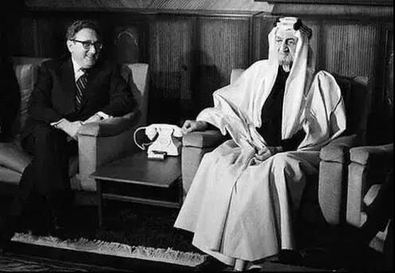
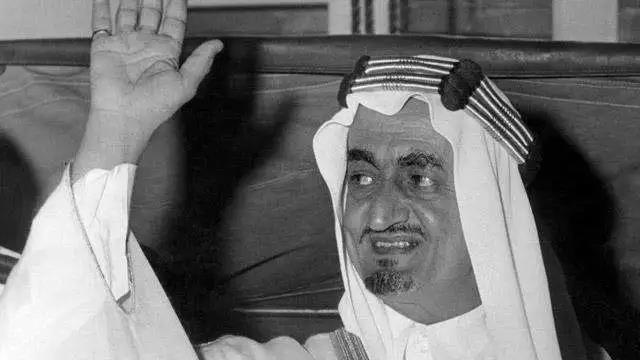

##正文

11月17日，再有三天的时间，全球瞩目的沙特阿美石油公司将开始认购。不出意外，这家净利润超千亿美金的全球最赚钱公司，也即将打破马云阿里创造的全球募资额。

相信很多中国股民对于当年问君能有几多愁的中石油耿耿于怀，甚至政事堂也认为，当阿美第二轮融资后，很可能引发全球资本市场的走熊。

但是这家沙特石油公司的上市，对于中国来说，却是有着非常深远的意义。

而这，要沙特历史说起。

一

1902年1月14日深夜，年仅19岁的伊本沙特带着40名小伙伴，骑着骆驼从科威特出发，千里奔袭利雅得。

到了利雅得城下，伊本沙特砍到了一颗棕榈树，沿着树干翻入城墙，直接斩首了当地的统治者，一举夺回了他家族的根据地。

这场夜袭，堪称现代阿拉伯最富传奇色彩的故事，被写成长诗在阿拉伯半岛传颂。

这一天，成为了沙特阿拉伯的奠基日，沙特，也成为了全球唯一用统治者姓氏来命名的国家。

 

在随后的三十年之中，凭借勇武，伊本沙特一路南征北战征服了阿拉伯半岛的诸多部落，并利用英国脱离了奥斯曼帝国的统治，又利用德国、美国和苏联，从英国的势力范围中脱离。

在伊本沙特的外交手腕下，沙特不仅成为二战之前全球为数不多没有被殖民的地区，伊本沙特也成为了阿拉伯世界公认的圣城守护者。

尤其是他通过把油田的开采权卖给美国公司，不仅获得了美国的保护，还为其创业和笼络各部落获取了重要的原始资本积累。

 

不过，俗话说，打天下易，守天下难。

为了笼络部落的酋长们，伊本沙特不得不殚精竭虑的与各部落300多名女子结婚，而且，为了维护部落间的平衡，也将传承机制从父死子继，改为了兄终弟及。

没办法，这种靠着跟酋长们联姻的模式，对于只有40个勇士的伊本沙特，在建国之初是一种无奈的选择。

但是后患也非常严重，随着“子子孙孙无穷匮”式的繁殖，沙特如今形成了一个拥有5000多名亲王的庞大王室。

 

二

1973年10月6日，埃及和叙利亚在沙特暗中的支持下，发动了第四次中东战争。

时任沙特国王费萨尔，就是伊本沙特的儿子。

作为埃及出兵的金主，沙特国王费萨尔带头，战争一起就宣布对美国及其盟友实行石油禁运，导致油价直线上涨，引爆了全球范围内的石油危机。

这一招可谓是相当的毒辣，不仅令其取代了埃及的塞纳尔成为了阿拉伯世界的领袖，也为沙特与美国的谈判争得了巨大的筹码。

1973年11月8日，刚刚就任国务卿的犹太人基辛格飞抵沙特，密会费萨尔国王请求结束石油禁运。

但是，这位美国最伟大的外交家却在沙特撞了一头包。

 

 
 “美国必须改变对以色列的偏袒政策，石油武器的应用是所有阿拉伯国家的共同决定。耶路撒冷应该成为阿拉伯人的家园，至于哭墙，可以另建一堵，您的犹太同胞可以倚着那堵墙哭。”

 
——费萨尔

在接下来的一个月内，基辛格在华盛顿和利雅得之间反复穿梭，但始终无法取得进展。

可此时，对中东国家石油需求极大的欧共体和日本撑不住了，先后发布声明，在冲突中支持阿拉伯国家。

没办法，在群友们的集体反对下，美国不得不对沙特妥协，让费萨尔这位沙特国王手握足够的筹码，最后拉着基辛格，一起构建了影响后世半个世纪的石油美元体系。

就像基辛格自己说的：如果你控制了石油，你就控制住了所有国家；如果你控制了货币，你就控制住了整个世界。

通过一场石油危机，沙特与美国各取所需，费萨尔推动了沙特的脱胎换骨，大外交家基辛格奠定了美国的全球霸主地位。

不过，美国从来就不允许中东有这么牛逼的存在。

就在费萨尔试图利用石油大棒和美苏冲突，将阿拉伯世界联合起来，成为世界新一极之际。

他一个精神病的侄子，趁他接见科威特石油大臣的时候，向他连射三枪，终结了这位一代枭雄。

 

 
三

上世纪70年代，基辛格博士推动的中美和解与美沙同盟，不仅为苏联解体敲响了丧钟，也为后来美国货币+中东石油+东亚制造的三角贸易体系奠定了基础。

一方面，沙特将石油运往东亚和美国，石油经过炼化后再制成变成各种产品再运往美国，美国再将大量的武器卖给沙特和东亚。

另一方面，亚洲国家把卖商品换来的美元买沙特的石油，沙特把卖石油换来的美元变成美债，而美国通过印美债继续去买沙特的石油和亚洲的商品。

最终，美元的美国、制造业的东亚和石油的沙特，形成了一个全球贸易与金融的闭环，美国不仅借此迅速摆脱了金融危机，还得以利用石油美元进行全球收割。

但是，这一切，随着美国的页岩油革命出现了变数，美国不仅实现了石油的自给自足，还有富余的产能把油气卖给东亚、欧盟等传统的沙特客户，传统的三角贸易开始出现巨大的裂痕。

而此时，当年伊本沙特为了统一阿拉伯做出的巨大牺牲，如今也变成了巨大的负担，迎娶的300多名女子以及他们所生的五千多名王子，还有两万多名的王室成员，全部都要领取巨额的俸禄和补贴。

而且，这些王子也不是吃素的，大量的王爷和他们背后的部落，都在纷纷插手沙特的政府生意，充当着外国公司和沙特政府的中间人，抽取巨额的佣金与回扣。

通常一份合同签订后，王爷们都能拿到20%左右的辛苦费，而且越是大合同，越需要更多的实权王爷们一起参与。

因此，看似沙特阿美很挣钱，但实际上层层都是坑。

随着亚洲各国逐步减少从沙特的石油购买，以及国际油价的迅速下跌，如今挣钱的沙特老爷们也坐不住了，近两年不得不疯狂的海外举债，以应对国内巨大的财政与外汇双赤字。

就是在这个背景之下，沙特阿美，这个除了中国烟草之外全球最赚钱的公司，决定上市了。

IPO并不是要扩大再生产，而是要解决沙特王室的生存问题。

 
四

此番推动阿美石油上市的人，是现任沙特国王萨勒曼的儿子，王储小萨勒曼。

这几年来萨勒曼父子通过一次次的洗牌，并在特朗普的帮助下，最终将伊本沙特定下来的兄终弟及，改为了父子相继。

所以，阿美IPO这件事，从来就不是一个经济问题。

过去，沙特从大到小的各种合同，都是根据实力大小相互勾兑的结果，因此阿美作为一家非上市公司，虽然利润非常高，但是被少数的几个王爷们垄断了巨大部分的利益。

而小萨勒曼推动阿美上市之后，公司将变为一家财务透明的上市公司，那些大部落的亲王们就很难再染指阿美的巨额海外合同，而那些边缘化的王子们却可以得到较好的利益保障。

因此，小萨勒曼强推阿美IPO的背后，跟当年伊本沙特取300多个妹子是类似的道理，就是尽可能争取国内更多的势力，以便于其将沙特权力控制在自己的手里。（沙特版推恩令）

而且，按照阿美最终融资要上千亿美金的规模，这不是普通民众或者私募能买得起的，必须要有各国的国家队出手，才能够撑得起来。

因此，政事堂判断，这一轮阿美的投资必然会有中国日本等沙特的大客户出手。

而且，萨勒曼家族为了改革的过程中避免翻车，也必然会学习当年伊本沙特引入美国德国以避免被奥斯曼和英国吞并那样，会给出投资国巨大的好处。

甚至如果政事堂预测没错，这些各国投给小萨勒曼的钱，又会通过小萨勒曼主导的投资，再反向投回到各国，形成紧密的资本与产业的紧密联系。

而这样下来，未来就很有意思了。

而随着美国页岩油的自给自足，沙特除了欧洲之外，主要客户就是亚洲的中日韩印，以及东盟国家。

换句话说，沙特绝大部分的石油出口，就是欧元区+RCEP区。

随着美国由于页岩油主动与沙特脱钩，沙特必须要给自己寻找到一个新的三角贸易体系，才能够维持其阿拉伯世界老大的地位。

因此阿美上市之后，产业机构决定了沙特必然要全面倒向有着产业分级并有着巨大能源消耗的RCEP区，重新形成新的三角贸易。

而这一局没有美国的三角贸易，必然需要一个更合适的结算体系。

这也意味着，我们未来很可能会在沙特石油的帮助下，在RCEP基础上，通过区块链技术形成未来亚洲的数字货币——亚元。

近期关联文章：

合作，才是区块链的未来！

莫迪拒签RCEP，是谁在搞鬼？

区块链与新能源，中国的新航道

##留言区
 

