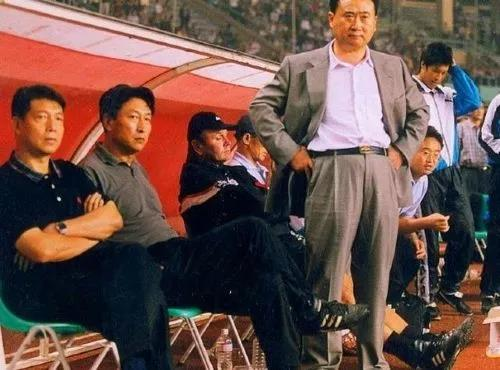

##正文

昨天夜里，众多政事堂的好友们憋着一肚子气没法睡觉。

在世界杯亚洲区的40强预选赛的一场关键战役上，中国队以一粒乌龙球1:2负于叙利亚队。

 

在上届世界杯预选赛，国足就在最后时刻惨遭叙利亚后卫萨利赫任意球绝杀，失去了参加附加赛的机会，而这一战将决定中国本次世界杯能走多远。

因此，为了这一战，主教练里皮带着国家队提前一个多星期就飞抵阿联酋，并且在古城沙迦海滨的五星级喜来登酒店备战，距离体育场仅需七分钟。

而随着中国男足同期抵达中东的，还有1152吨的大米，这是中国向叙利亚提供的救援物资。

 

叙利亚官方表示，这批中国援助的大米将极大缓解叙利亚的粮食匮乏问题，并挽救无数人的生命。

 

只是没想到，这些年来饱经战火，国家支离破碎，半数青壮流落异乡，靠着中国大米援助的叙利亚男足，最终还是击败了武装到牙齿的中国男足。

网友们纷纷调侃，赛后叙利亚主教练给每个队员一个耳光，骂道中国援助了我们那么多大米，你们干嘛要赢？叙利亚球员纷纷表示，鬼知道那傻x往自家球门踢！

政事堂作为一个中国队的老球迷，回想起90年代我们遇到叙利亚，不灌他三个球简直都不好意思打招呼。

可是最近十年，中国与叙利亚交手七次，两胜三负两平，赢得两场还都是我们掏钱请他们来的友谊赛。

大概，人家实在不好意思吃着我们的米，拿着我们的出场费，再把我们踢个灰头土脸吧......

 

今天写段子的人很多，分析中国足球的人也不少，政事堂今天也凑一个热闹，通过政事堂近期文章中的一些逻辑，分析一下中国足球失败的根源，以及未来之路在哪。

 

 

话说中国足球历史上，有两个标杆人物，一个是甲A时代的王健林，一个是中超时代的许家印，很巧合的是，两个人都是中国最知名的地产商。

而且，王健林的大连万达和许家印的广州恒大，也都是两个时代亚洲的最强的俱乐部之一，不仅在国际赛场上取得了傲人的成绩，也为中国国家队供给了大量的人才。

但是，在政事堂看来，由于中国足球已经商业化运作，正是甲A霸主王健林和中超霸主许家印两个领军人物的风格，导致了中国足球在两个时代完全不同。

王健林时代的大连万达，虽然长期称霸甲A，但人才全靠自己的梯队培养，除了引进亚洲第一前锋郝海东外，几乎是只卖球员不引内援。

因此，中国男足实力处于历史巅峰的2000年前后，正好也是王健林90年代初接手大连队后培养的那一批少年球员们都到了当打之年。

徐宏、张恩华、孙继海、李明、郝海东、小王涛.......可以说，这位中国最有钱的球迷凭借一己之力，为男足提供了一整条后防线和半支国家队。

 

而财力不逊于王健林的许家印，则走了一条相反的道路，手握支票的这位大亨不断的从其他俱乐部挖走当打的国脚和准国脚，组成了一只以恒大球员为主的国家队。

凭借着大量国脚的加入，恒大创造了比当年万达还牛逼的国内国际战绩，并稳稳的坐上了亚洲俱乐部的第一豪门。

但是，许家印的做法弊端也很大，很多原本能够在其他球队打主力的球员到了恒大之后，往往只能做板凳，大量国脚和希望之星纷纷丧失了打比赛锻炼的机会。

因此，**对比万达与恒大，虽然都是国家队的最主要人才提供者，但万达搞的是增量蛋糕，恒大做的是存量蛋糕。**

回顾甲A时代，我们国家队人才济济，大部分位置都三四个实力相当的人可以做替补，大连万达的队长徐宏以及四次银靴的小王涛在国家队都经常上不了场。

但是看昨夜这场跟叙利亚的比赛，无人可用的里皮不得不将已经受伤的张琳芃重新放回大名单之内，因此，带着伤还不得不给队友处补防的张琳芃，送了乌龙球也并非偶然。

准确来说，两个时代的人才规模远不是一个数量级的。

这背后的原因是，**王健林模式下的中国足球是增量蛋糕的竞争下越来越强，许家印模式下的中国足球是在存量蛋糕的博弈下越来越弱。**

而这两个模式，与两家地产公司老板的爱好，也有着非常深的关联。

主打商业地产的王健林，他的万达广场要赚的是未来几十年的租金，因此王健林硬顶着巨额亏损培养了一大批自营产业与共生品牌。

而主打商品房的许家印，他的恒大房产是要在交了土地款之后两年内就卖给用户的产品，因此也习惯了临时磨刀的一锤子买卖。

而两位老板的性格，也在足球当中得到了深刻的体现。

王健林就算跟当时大连市主要领导闹翻脸，也要硬顶着把重点抓梯队的徐根宝请到大连做主教练。昨夜射入中国队唯一入球的球王武磊，就是徐根宝离开大连后，回上海一手带出来的。

而恒大则是不断的买入实力球员，不断地去提升恒大的板凳深度，甚至以归化球员为代表，不断地作为中国足球作弊的试点，做的都是投机取巧短期见效的事情。

因此，甲A时代的大连万达，凭借着庞大的人才梯队培养，连大小王涛、魏益民这种甲A金靴银靴该卖就卖，给整个市场注入了强大的流动性，并压低了整个转会市场的价格。

反之，中超时代的恒大，就像炒房子一样，7年买下30个国脚的恒大迅速把中国转会市场的价格炒到天际，令大量的中小俱乐部无力承担。最终，刚刚的2018赛季，16家中超球队的投资方均涉足房地产。

不要以为高转会费是什么好事儿，只要套入经济学就会发现，这对整个行业是致命的打击。

甲A时代，当时的中国球员就像中国制造那样，凭借着市场化低廉的转会费，得以大规模的登陆海外市场，我们的国家队里面，有曼城的中国太阳孙继海，水晶宫的队长范志毅，法兰克福的头号射手杨晨，亚琛的当红前锋谢晖........

向海外俱乐部出售球员不仅给俱乐部带来了巨大的收益，也为国家队提供了实战经验丰富的人才梯队，对比里皮的无人可用，米卢当年敢禁用亚洲第一前锋郝海东和中国最强球员孙继海，靠的就是中国队强大的板凳厚度。

但是进入到中超时代，就像高房价抽空了各地实体经济的活力，没有人愿意去脚踏实地的做产业那样，高额的球员转会价格也将各个俱乐部的活力抽干。

各个俱乐部都盯着那么几个天价球员，中超各个俱乐部的青训系统也都随之濒临崩溃，最终导致少数几个还能踢的球员价格进一步飙升，形成了一个恶性循环。

所以，在政事堂看来，中国足球的未来，就像房地产一样，需要一个强力调控的长效机制，给更多年轻球员提供机会，才能遏制住转会费像房价一样侵害整个体系。

可是，已经市场化并被地产公司控制的中超联赛如何再改变呢？

也许，可以期待一位真正球迷的王者归来.......

 

##留言区
 

