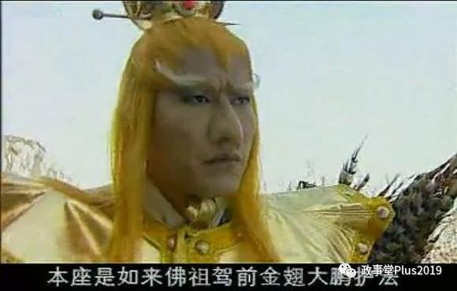
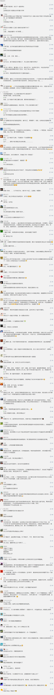

##正文

前些天留言区大家纷纷让我解读四大名著，今天闲来无事，就先写一篇，深入解读之后再与现实联系。看大家的反应，如果好评较多，那么政事堂就继续写下去。

 

说到西游记，读者们调侃最多的，是那些被孙悟空打死的妖精，都是没有后台的，而有后台的妖精，都被神仙们带回家了。

譬如金角大王和银角大王是太上老君的童子，灵感大王是观音养的金鱼，青狮精是文殊菩萨的坐骑，白象精是普贤菩萨的坐骑，白鹿精是南极仙翁的坐骑，黄眉大王是弥勒佛的童子.......

当然，如果站在这个角度，那么西游记最多就是一个给老百姓看的批判现实的小说，距离“四大名著”有着相当远的距离。

 

西游记中，我们看到的，是一个以孙悟空为代表的反抗者的视角，但实际上作者却是借助孙悟空带着我们看整个天庭的运作模式。

所以，如果以为这些妖精们只是属于神仙们疏于管教，而去调侃这些妖怪都是有后台，那么就跟老百姓讨论皇帝怎么用的金锄头并无多大的差异。

纵观西游记小说中，每个妖精都有着自己的地盘，吃着自己的香火，但实际上，这些地盘都是背后那些神仙的，而神仙也是要香火的。

所以，妖精手里往往都握着强大的法宝，他们的势力和地盘，往往都跟他背后神仙有着密切的关系，譬如西游记里面最强的妖精大鹏精，就是如来的舅舅。

 

因此，神仙、妖精、民众之间的关系并没有大家想那么简单，而是有由心理学、经济学、政治学等一系列因素构成的。

神仙们是需要老百姓贡献香油税的，但神仙们单纯的付出，往往很难获得老百姓的认可，甚至随着百姓慢慢习惯了，会认为很多事情都是理所应当，而神仙索要香油税反而成为了暴政。

因此，神仙们就必须要用很多的妖精，搁在老百姓和自己中间，来替自己收香油税，这样，老百姓的愤怒自然归结于妖精们身上，神仙们反而就成为了青天大老爷。

而回顾中国古代历史，封建政府也就是这样运作的。

官与吏两个阶层之间有着天然的鸿沟，官员在众多领域都有着无上的权力，而胥吏却是社会最底层的妖精。

譬如，即使是最穷苦的农民也有着通过科举做官，直上青云的机会，但是胥吏却是三代之内都没有资格参加科举，几乎永世不得翻身。

这形成了一个很诡异的局面，老百姓虽然日常生活中却几乎处处被胥吏所打压，但政治地位却远高于臭名昭著的胥吏。

这使得老百姓自然就会积极的烧香拜佛交香油税，并主动跟把胥吏当狗使唤的神仙们站在一个阵营。

而被老百姓群起而攻之的胥吏，自然也就像狗一样，只能老老实实的听主人的话。

 

这种例子其实早就被广泛使用了，譬如日本侵华的时候，就喜欢用朝鲜人来当“胥吏”，手持棒子管理秩序的朝鲜人也就有了“高丽棒子”这个绰号。

同样，英国人在中国搞租界的时候，也喜欢用印度人来当“胥吏”，欺凌华人的印度阿sir，也衍生出来了“印度阿三”这个绰号。

甚至当年看似高效而廉洁的港英政府，实际上就是依旧延续着官员与胥吏这个神仙+妖精组合，靠着庞大的黑社会维系着统治的稳定。

 

孙悟空一次次抓到又不得不放出来的妖精，其实跟悍匪张子强被抓后一次次的无罪释放有着异曲同工之妙。

 

就和西游记中描述的那样，在港英政府的法治保护下，黑社会就像妖精们一样，可以肆意的勒索民众，但是民众却对港英政府视若神明。

而后来，一旦没有这一层做妖精的胥吏，反而会导致政府与民众之间出现的隔阂，因为双方缺少了共同的“敌人”。

接下来，把视野放到国际角度，再用同样的逻辑看一下老朋友民主党这个老神仙。

克林顿时期引发的两次台海危机中，搞事儿的李登辉就扮演了张子强的角色；奥巴马时期的亚太再平衡过程中，参与围剿我们的日本安倍、新加坡李显龙、菲律宾阿基诺三世等人也是美国的“妖精”和“狗”。

这些故事的背后，从来就不是神仙想要让狗吃饱，而是神仙想让我们不得不赶紧上交香油税，如果不交就会被一群狗咬。

而如今我们面对的情况略有不同，有一个黄毛的孙猴子，把老美的天庭搅得天翻地覆，把妖精们拖出来挨个揍......

然后，直接找我们要香油......
 
 

一部伟大的作品，从来不是他的讽刺有多犀利或者故事有多新奇，而是他所描绘的故事内核，总在以不同的形式反复上演。

嗯，今天的西游记就聊到这里。

##留言区
 

