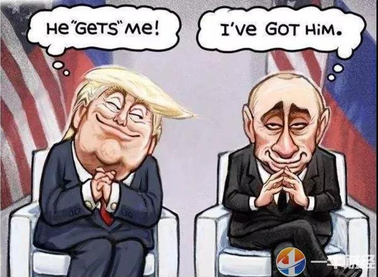
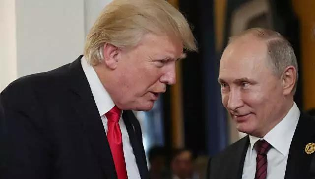

##正文

莫斯科，这座亚洲边上的超级大都市，受到蒙古入侵带来的东方文化影响，红色与黄色逐步成为了建筑的主基调。因此，克林姆林宫这座俄国历代帝王宫殿门外的广场，也被命名为红场。

尤其是1812年，法皇拿破仑入侵俄国一把火烧了莫斯科，俄国人重建时用褚红色方石重新铺建并扩大了克林姆林宫门前的广场。因此，红场的"红"，也变得名副其实。

 

而红场被世界人民所铭记，则是在1941年11月7日的这一天。

11月7日是苏联的传统节日“十月革命节”，而在希特勒入侵苏联的巴巴罗萨计划中，1941年的11月7日，他准备于莫斯科的举行德军的阅兵仪式，就像他一定要让法国人在一战的那节火车厢里签署投降协议一样，这位战争狂人非常喜欢以最能刺痛对手的方式羞辱敌人。

战争与希特勒预计的差距并不大，战争才开始三个月，红军在北线丢失了整个波罗的海地区，24个师被全歼，20个师被打残；在中线明斯克失守，30个师被全歼，70师被打残；在南线基辅失守，70个师被全歼，创造了世界战争史上最大的围歼战。

11月7日这一天，180万德军，1700辆坦克，1390架飞机，14000多门大炮和迫击炮，已经兵临莫斯科城下。德国装甲之王的古德里安，率领他的第2装甲集团军距离莫斯科最近仅有25公里，防线一旦被突破，纳粹大军就将冲入苏联首都莫斯科。

此时莫斯科的党政机关都已经撤退至古比雪夫，列宁的遗体也转移到了西伯利亚，只有三军统帅的斯大林还在莫斯科坚守着，因为，他要举行一场震惊世界的阅兵仪式。

 

随着斯大林演讲的结束，红场上响起了高昂澎湃的《国际歌》，受阅部队手握装满实弹的钢枪离开红场直接奔赴前线，与入侵的德军做最后的殊死搏斗。

 

 
“俄罗斯虽大，但我们已经无路可退，我们身后，就是莫斯科！”

此刻，世界历史上第一次的实战阅兵，也通过广播向进行全球直播，让“斯大林已经撤离莫斯科”的谣言不攻自破，更是向全世界的反法西斯的人民发出了苏联绝不投降的最强音！

在苏联人民巨大的牺牲下，莫斯科保卫战和斯大林格勒保卫战的接连成功，同盟国在二战中取得了最终的胜利，世界也因此建立长达半个多世纪的雅尔塔体系.......

明年，是红场阅兵的79周年，俄罗斯总统普京，此刻正在邀请各国元首齐聚红场。

而其中的重头戏，自然是美国总统特朗普，如若成行，这将是特朗普担任美国总统以来的首次出访俄罗斯。

虽然特朗普对于出席红场阅兵非常有兴趣，公开表示“我愿意去”，但是出席却不容乐观，美国国内的阻力异常强大，正值竞选的关键期，一旦出席很容易被扣上“通俄”的帽子，成为被攻击的对象。

因此，外界普遍对特朗普的出席持悲观态度，毕竟俄罗斯的红场阅兵每年都搞，甚至经常一年两次，但好多年都没有西方领导人出席了。

 

不过，政事堂看来，此次特朗普出席红场阅兵的可能性反而非常高。

首先，此次的红场阅兵，有一个非常好的理由，明年不光是红场阅兵的79周年，更是盟军战胜轴心国75周年，赶上了“逢10逢5”的重要节点，普京有足够的理由去邀请各国元首。

其次，西方领导人连续多年拒绝出席也是有原因的，2014年的乌克兰事件以及克里米亚的并入，俄罗斯遭遇到了奥巴马带领着美国盟友的全面抵制，这导致之后的红场阅兵，大家只对唱着喀秋莎的中国仪仗队略有印象。

而如今，随着民主党扶持的乌克兰总统波罗申科被民选总统泽连斯基干掉，乌克兰开始推动缓和与俄罗斯的缓和，如果政事堂没猜错的话，马上就会出现乌东问题的“四方会谈”。

在“四方会谈”上，体制优势的普京可以利用乌克兰东部作为筹码，不仅实现俄乌关系的和解，还能够拉拢法国的马克龙和德国的默克尔。

相互交换一轮政治筹码之后，泽连斯基收回乌东的领土，马克龙和默克尔展现了大国政治家的手腕，普京则可以邀请这三个人参加反法西斯胜利75周年的大典。

毕竟，乌克兰在二战中以巨大的牺牲发挥了巨大的作用，演员泽连斯基需要以此向欧洲展示自己的重要性；默克尔为了加强欧盟中的位置，也需要参加各种洗刷与纳粹德国关系；就算最没用参加意义的马克龙，考虑到国内的民意压力，也不排除选择参加露露脸。

而且，随着美国从叙利亚撤离，俄罗斯在中东地区的影响力急剧扩张，土耳其、沙特等美国在中东的铁杆盟友也将寻求俄罗斯的支持，因此伊斯兰国家参加红场阅兵的可能性也在急剧提升。

再加上急于解决北方四岛问题的安倍以及推动朝核问题的文在寅，只要看到乌克兰不再是问题，这些东亚的政治家必然会寻求与普京的政治妥协。

更不要说特朗普的基友英国首相约翰逊，如果明年他成功带着英国实现了大选和脱欧，必然需要积极参与欧洲事务，访问俄罗斯的可能性也将急剧提升。

因此，具有着强大体制优势的普京，只要肯下血本，必然能够凑齐这一场美国主要盟友们都在场的阅兵盛宴。

在这种情况下，连美国的盟友们都来了，民主党和媒体自然就很难阻碍普京与特朗普的这一场重磅会面。

 

而且，明年的阅兵，普京必然的把主题设置为反法西斯胜利75周年，通过树立法西斯这个共同的敌人，并宣扬俄罗斯人民巨大的牺牲以及美俄之间的传统友谊，能够从意识形态上弥合美俄之间的巨大分歧。

这也是普京送给特朗普最大的一记助攻。

因为明年大选，通俄门必然是民主党攻击特朗普最厉害的武器，可是在大选的最关键时刻，普京用美国人民与俄罗斯人民一场肩并肩的血战友谊，以及同盟国之间元首的齐聚，把美俄之间的冲突迅速淡化。

这一招，这将使得民主党的通俄门甚至通乌门调查引起部分美国民众的反感，导致选票流失，普京让特朗普的对手们搬起石头砸自己的脚，给好基友送出一记绝杀的助攻。

 

回顾历史，普京真的不容易。

希特勒巴巴罗萨的70年后，2011年，美国带着众多盟友搞了一场对俄罗斯展开了一场巴巴罗萨式的突袭，不仅包围了叙利亚的大马士革，击落了俄罗斯的战机，更攻陷了乌克兰的基辅，让莫斯科直接暴露在美军的眼皮之下。

油价的暴跌，经济的封锁，盟友的惨败，势力范围的背叛，让普京一度陷入到严重的内忧外患之中，曾经高涨的支持率也在不断的下滑。

可是，面对围剿，普京选择卧薪尝胆，隐忍不发，只是将筹码都压在特朗普的上台。

 

这一场豪赌，普京赢得非常痛快。

随着2017年特朗普的上台，俄罗斯在地缘上开始了绝地反击，用了三年的时间，将一个个围剿自己的对手成功的拉拢到自己这边，在远东，在中东，在近东，在北非，甚至在美国后花园的委内瑞拉，俄罗斯重新成为了能够影响全球格局的超级大国.......

而明年，又到了美国的大选年。

普京想要延续辉煌，就只能不惜代价继续豪赌特朗普，利用美国的战略收缩为俄罗斯争取地缘的生存空间。

因此可以预见的是，普京会通过这场俄罗斯历史上最盛大的红场阅兵，给足特朗普竞选所需要的帮助，而特朗普的对手民主党，也会想尽一切办法阻挠。

这使得明年特朗普的红场阅兵之旅，也将成为历史的一个重要转折点和各方角力的中心。

嗯，就像1941年的红场阅兵。
 
 

##留言区
 

