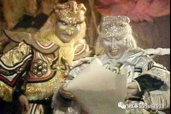
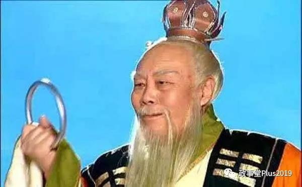
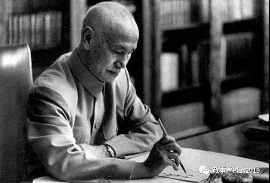
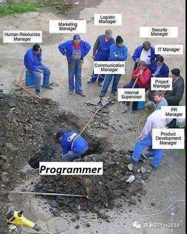

##正文

书接上文：顾子明闲扯西游记（一）

相信读这个系列的过程，会让你发现，之前读的小说都白读了........

关于西游记，后世讨论最多的，往往就是孙悟空诡异的战斗值，大闹天宫的齐天大圣近乎天下无敌，而取经路上的大师兄却遇到了太多打不过的妖精。

数百年来，对于孙悟空战力的直线下滑，很多人给出了不同的观点，找了各种理由，但少有人能踩在点子上。

 

原因，就在于思考的维度上面。

书评家往往都是涉世未深的书生，而四大名著的作者，却都是身处中枢的大佬。

因此，书评家们看到的，往往都是作者包装在外面的壳，而没有去用作者的内核构架去考虑问题。

西游记的作者是一位匿名的大佬，因此非常不屑于搞武功的比拼与设定，主要人物也被简单分成了两组，一组是跟孙悟空武力差不多的，一组是打不过孙悟空的。

甚至，小说中绝大部分神仙除非剧情必须，否则都会设定为没有武功，或者根本不施展武功。

譬如三清四帝从来没有动过手，唐僧作为如来二弟子转世但是毫无武功，文殊菩萨这种级别的大佬甚至都可以被凡人抓住丢在河里。

这对应现实很容易理解，大佬们本身是没有武功的，倘若写民国的小说，里面的主人公若是神拳无敌袁项城、狂风快剑孙逸仙、铁面判官陈独秀、千手人屠蒋中正........一群掌管着亿万人命运与前途的大佬如地痞流氓打成一团，怎么可能成为古典名著？

 

但是，把天庭大佬们往朝廷里面套，瞬间就会明白，神仙们就像各派势力，比的是谁手上的小弟（下属）强，谁手上的宝物（权力）大。

所以对应现实，小说中个人能力的影响微乎其微，真实的实力取决于他们手握的宝物（权力）。譬如每次金箍棒被收去，被“免职”的孙悟空就没有了攻击输出，只能靠筋斗云逃命。

同样，天庭派系的实力也与个人能力无关，而是取决于麾下小弟以及小弟手上都握着的宝物，说白了就是麾下代表人物都处于哪些重要的位置上。

譬如说西游记中，道家一哥的太上老君，遭遇孙悟空的时候从来就没有动过手，甚至还被这泼猴差点绊倒。但是老君手下的金角大王、银角大王，实力就跟孙悟空不相上下，手握金刚琢的青牛精更是吊打孙悟空。

 

而且，金刚琢、七星宝剑、紫金红葫芦、羊脂玉净瓶、芭蕉扇、幌金绳......太上老君拥有全西游最强大的法宝矩阵，把它们一一对应权力，这就是书中对太上老君势力的直观描写。

甚至太上老君坐下骑的青牛精，作为一个下属，拿着老君的金刚琢就能一己之力横扫三界九天，这才是西游记中描绘道家一哥的方式。。

 

所以呢，高纬内核的西游记根本不会描述天庭上各位大佬的武功，就像黄埔军校的蒋校长只会写日记，不可能自己拿着冲锋枪上抗日战场是一个道理。

 

而明白了这个逻辑，对于小说中的很多道理就会豁然开朗。

譬如孙悟空大闹天宫能够横行无忌，不是因为他的战斗力强，而是因为天庭势力几乎都在坐山观虎斗。一群能够捏死孙悟空的道教大佬们，都在“ 该配合你演出的我演视而不见”......

 

可是等孙悟空败局已定的时候，太上老君和观音菩萨就开始抢功，一个要掷瓶子，一个要掷金刚琢，一本正经抢着对这妖猴打出致命一击。

这种高纬生态投射的描写，这才是西游记的牛逼之处。

对照成书之后的历史我们就会发现，明朝李自成这个孙猴子刚闹的时候，江南的财阀势力在搞视而不见；清朝洪秀全这个孙猴子刚闹的时候，江南的财阀势力也搞视而不见.......

行为动作，跟天庭上一众吃瓜的神仙一模一样.......

而这也是后世很多人搞不明白太平天国失败的原因。

其实如果洪秀全帅军直扑北京，那么江南的财阀地主们以及在华的各股外国势力就会学习明朝时对李自成继续视而不见，争先恐后的积蓄力量。

但是，当洪秀全想要在江南偏暗一隅，不思进取的时候，曾国藩的湘军、李鸿章的淮军、左宗棠的楚军，英法租借的常胜军，就会从“视而不见”，变成围剿他的对手.....

这些诸侯们就像大闹天宫时，天庭的太上老君和观音菩萨那样，一边聊着，一边手握必杀，就等着给精疲力竭的孙悟空最后一击。面对摇摇欲坠的太平天国，清廷攻入南京的功劳大家推来推去，最后让给了曾国藩的亲弟弟曾国荃。

 

所以，我们也会明白，孙悟空第一次被太上老君和二郎神合力抓住之后，很快就逃了出来，不是因为他厉害，而是因为朝廷的各方诸侯们，都需要这么一个闹事儿的猴子。

甚至，通过几个小妖口中说了，在孙悟空被镇压的500年内期间，没有孙大圣的日子里，各路妖怪大闹天宫也出现了很多次，这是因为神仙们都要扶植妖怪闹事儿来谋求利益。

同样对比历史我们就会发现，天平天国被剿灭之后，清廷依然摇摇欲坠，后来八国联军侵华的时候，各路诸侯直接搞了一个东南互保，西游记的故事就像教科书一般上演，黄毛的猴子势如破竹杀到南天门，天宫里的慈禧被吓得撒丫就跑.......

再后来，辛亥革命的一声枪响，各地的神仙们都在翘首以盼袁世凯这个齐天大圣把玉帝小儿从龙椅上赶下来......

可以说，回顾一下孙大圣横行无忌大闹天宫的小说背后，大家看到的不是一个个神仙，而是一个个鲜活的人物。

所以，孙猴子被太上老君抓住之后，反而因为一系列的“机缘巧合”，让着孙猴子拥有了铜筋铁骨和火眼金睛，又搞出来第二次大闹天宫.......

 

最后，天庭各路诸侯的“视而不见”，逼着玉帝不得不向外请来了西天如来，把孙猴子压在五指山之下。

 

说了这么多，那么西游记究竟有多厉害呢？

我们可以对比一下成书之后的发生的故事。

明末，养马的“弼马温”李自成受诏安后又造反了......接下来，被镇压后又在各方的支持下再次造反掀翻了天宫.......最后,大明决定放西天剃发的清兵入关打猴子，把李自成压在了五台山之下.....

 

牛逼不？把历史一一对应之后，就会发现这才是真正牛逼的小说.......

西游记中的大闹天宫几乎完美复刻了明朝晚期的走向，因此，书中的逻辑之高，这才是这部奇书能够渊源流传成为四大名著的根源。

 

而逻辑往往都是普世通用的。

当一只金毛猴子奔着美国最高权力冲刺的时候，支持地方独立的共和党神仙们，必然会默许并支持他把世界搅个天翻地覆。

同样，当这只金毛猴子奔着全球最高权力冲刺的时候，那些试图从美国权力笼罩下挣脱控制的各路诸侯，必然也会支持这只孙猴子。

**各路神仙们的唯一诉求，就是猴子能继续闹下去......而正是有着神仙们的支持，猴子才能坚持到现在.......**

 

所以，看完国际局势再回头看看几百年前的古典小说，就会发现，即使时代再怎么发展，人心还是永恒不变的.....

其他顾子明闲扯四大名著系列：

顾子明闲扯西游记（一）

##留言区
 

