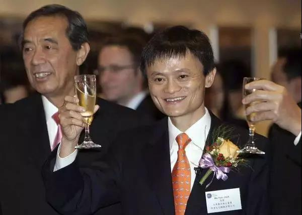
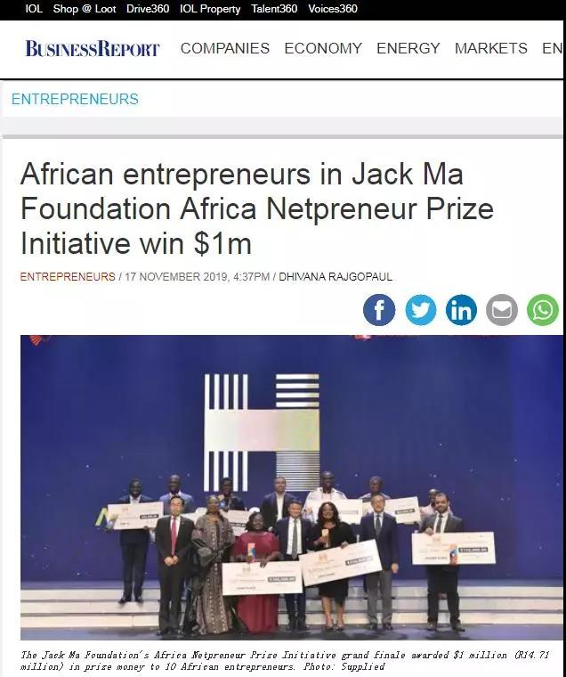

##正文

马上，阿里巴巴将在港交所二次上市，发行5亿股普通股，这也将成为2019年资本市场最大的IPO。

不过，阿里的此次上市，让很多人都摸不清头脑.....

首先，截至今年三季度，阿里巴巴的账面现金余额约为2500亿，足以争夺京东和拼多多的控制权，属于钱多到花不出去的那种，融资也没啥可买的。

其次，多一个上市的交易场所，意味着面临双一重的监管，为了各项合规还得付出巨额的成本。

而最头疼的，是目前香港局势，对于阿里股价可能会造成非常大的波动，并最终传导至美股，纯属自找麻烦。

可以说，从资本的角度，阿里并没有什么选择香港上市的意义。

 

不过，看着这几天在非洲翩翩起舞的马云，就会明白，阿里的行为已经不能单纯以钱来计算了。

 

首先，今年年中左右，东盟与中日韩就基本确认了要今年年底确定RCEP协议，预计明年就能正式签署，接下来中国与东盟之间的贸易必然会取得飞速的发展。

凭借着制造业的优势，中国必然会增强对东南亚的出口。而为了对冲东南亚的贸易逆差，中国又必须对东南亚进行大规模的投资。

因此，对贸易起家的阿里来说，从哪个角度都需要加注东南亚，选择东南亚金融中心的香港二次上市，属于历史的进程。

其次，随着中国的产业升级需要以及对外不确定性的增加，在美上市的互联网中概股的回归，也不得不一个个的提上日程。

而直接回归国内资本市场有着结构性和外汇方面的巨大难题，在CDR被搁置后，选择香港这个双轨制的资本市场上市就成为了一个最佳的选择。

而以阿里的二次上市为代表，沪港之间搞不好就会进一步加强互联互通的机制，为资本的国际化打开新的窗口。

最后，也是最重要的，美国处于减税效应末期和降息的阶段期，美股的股价也比较高，而我们国家目前也正处于财政去杠杆周期，市场上的流动性比较高，资金成本比较低。

因此，这是一个股权融资的绝佳机遇。

看着以国家强推京沪高铁上市为代表，各家央企都在想办法趁着这个时机修复资产负债表就会知道，嗅觉秒杀央企的马云必然早就想明白了要为冬天以股权融资的方式，拉着更多的人，储备更多的粮食。

当然，想明白马云为什么这么做并不重要，尽快跟着马云动，才是最重要的。

毕竟，完美避开每轮周期危机的马云，在99年，07年，14年的三次大规模融资的一年后发生了什么，大家心里都应该有点数......

##留言区
无留言