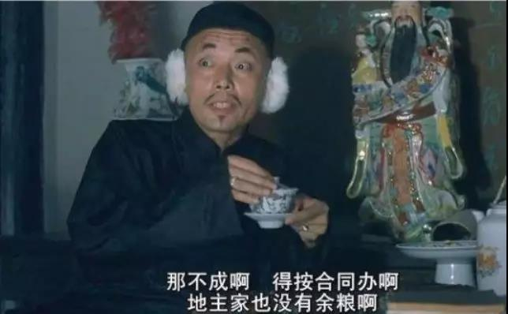

##正文

今早，全国银行同业拆借中心宣布，1年期和5年期LPR均较9月报价下行5个基点，1年期LPR降为4.15%，5年期以上LPR降为4.8%。

一时之间，经济学家们又开始高呼降息了，房地产置业顾问们又开始高喊房价要涨，今年不买明年后悔........

不过，同样的那群经济学家，上个月的时候还在鼓吹LPR本月要上浮呢.......大家就当听听德云社的相声就好了。

而一直认为LPR会持续下降的政事堂，在本月本月初就预测了本月20日的LPR要下降。

没办法，下调LPR不是经济的逻辑，而是政治的逻辑。

那么，本次下调LPR到底对房地产会有什么样的影响呢？

首先，我们要从给房地产提供资金的银行来看。

政府推动财政去杠杆，银行资金最大的借贷方地方政府和国企，相比于以往，降低了市场上的融资规模，导致银行手握大量的钱，贷不出去。

根据市场供求关系，借钱的大客户变少了，自然导致实际贷款利率下行，而且，更多的银行资本找不到投放，只能在银行间低利率流转。

**在利率和规模双下滑的叠加之后，让银行的利润受到了很大的冲击。**

利润的下滑也间接引发了不少银行的紧衣缩食，银行基层的工作强度上升，待遇反而下滑。

而且，目前国内银行都在强推LPR计价贷款，越来越多的优质客户都开始按照LPR计价。

因此，在前面的大背景之下，下调LPR利率对于银行那是相当疼的，尤其是本次的5年期LPR。

更不要说，央行下调的4000亿MLF相当于几百家银行平分20亿的利润，完全是杯水车薪。

这使得银行对于央行希望的下调LPR利率必然是有阻力的。这也是最近俩月，为何LPR利率上升的呼声特别的高。

好了，明白了这个大背景，接下来就比较容易推导房价。

由于银行是不情愿下调LPR的，因此央行想要继续下调LPR，只能想办法在MLF等各种粉上继续下调。

但是，MLF相对于银行资金来说，只是很微小的补充，央行此举，就像一个孙猴子那样，逼着各路诸侯不得不按照MLF的降低幅度来降息。

面对实际贷款利率下行、银行贷款规模下滑，优质客户的利率更因为LPR下滑，可以说，银行的利润下滑是难以阻挡的。

甚至，未来就算央行降准给银行带来的也不一定是利好，反而会因为供求关系而降低银行的利润。

因此，虽然未来有着地方政府专项债这个新开通道，但是利润和规模都不足以支撑银行的利润对冲。

这将使得银行只能把目光回到房地产上面。

由于目前国家死死的控制住了房地产的信贷规模，根据市场供求关系，银行瞬间就成为了房地产的大爷。

 

这使得急需资金的房地产开发商，将不得不以更高的利率向银行支付贷款的利息，而银行面对多家地产公司的贷款渴求，自然可以寻求更多的利润，以补充LPR利率降低带来的损失。

因此，**算一个总账，在国家控制房地产信贷规模之下，下调LPR，相当于从地产公司手中获取利益，以补贴实体经济。**

在这只看不见手的调控之下，市场上出现**以LPR计价的实体经济利率急速下滑，但是以基准利率定价的房地产的融资利率却在不断上浮。**

而房地产融资利率上升，对于这个高倍率加杠杆的行业来说，又会以实际利率数倍上升的方式体现。

这对于房地产公司来说，从资金平衡的角度，在经过精密计算后，**杠杆率越高的开发商，越会选择以适度降价，以换取时间带来的资金成本。**

因此，政事堂的结论，就是接下来半年多的时间里，如万科之类的低成本融资的开发商的可能没有什么变化，**而业内知名的那几个高杠杆率的巨头，很可能在开春后有一波强力的打折换时间成本。**

有趣的是，正是LPR利率下调导致了房地产融资和成本的进一步收紧。

可是，为了配合这一波房地产去库存，估计专家们又不得不把LPR利率下调包装成降息，来鼓动民众抓紧时间买房，然后手舞足蹈的表示坚决支持央行，在那打肿脸充胖子.....

 

在央行这一套的组合拳之下，企业拿到了低成本的资金发展实体经济，暴利吸血的房企吐了大量的血，而普通的老百姓借机买到了便宜的刚需房产，如此皆大欢喜，竟还没有一个人跳出来骂......

不得不慨叹，央妈这招LPR阳谋玩得是真漂亮......

欢迎关注政事堂四大名著系列：

顾子明闲扯西游记（一）

顾子明闲扯西游记（二）

顾子明闲扯西游记（三）

##留言区
 

