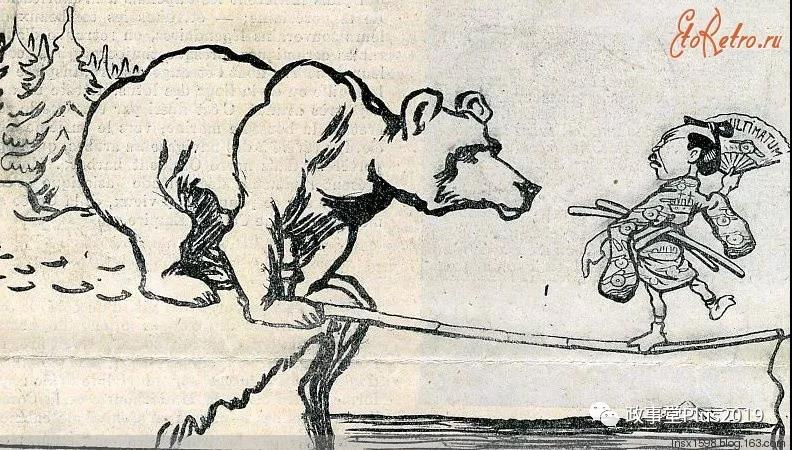
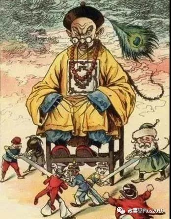

##正文

关于晚清至民国的中国近代史，研究者如汗牛充栋，但是有一个普遍的现象，就是低估晚清至民国时期的那些执政者。

在那个百年未有之大变局之下，英雄们有了凭本事晋身的阶梯，从曾国藩、李鸿章、左宗棠，到袁世凯、孙中山、蒋介石，这些太平盛世期间很可能无法留下来名字的人物，借助混乱迅速寻找到了展现自己才华的舞台。

不过，很多教材甚至影视方面的编撰者往往都犯了一个致命的错误，那就是忽略了他们的牛逼。

只要说明了他们的才华是如何的逆天，但因为路线选错，再强大的个人力量也无法对抗历史的进程，就很容易得出我们现在的路线有多么的正确。

但后世往往把他们拍得、写得傻Ⅹ了，反而无法证明了选对了路线的我们才是天选之辈。

嗯，扯得有点远了。

从晚清到民国，如果研究历史，有一层窗户纸，那就是是否认识到中国的外交精英们，一直在联苏（俄）抗日和连日抗苏（俄）之间做平衡。

 

从李鸿章时代的引俄罗斯干涉，逼着日本还辽，最终引发日俄战争开始，中国的外交家们面对俄罗斯和日本的“亡我中华之心不死”，一直都秉承着利用两者的巨大矛盾而求生存。

从孙中山与袁世凯之争，黎元洪与段祺瑞之争，孙中山与张作霖之争，到民国时期蒋介石与汪精卫之争，孙科与何应钦之争，背后都是整个中国对苏和对日政策的摇摆。

 

甚至回顾晚清李鸿章的海权与左宗棠的陆权之争，区别也是把陆地上的沙俄与海上的日本，谁视为大清最大的威胁。

 

更不要说那段历史上的重大事件，譬如被泄露出来的21条内容，918之后老蒋的调停，虽然被我们骂的狗血喷头，也从技术角度，也是刺激俄日之间的对立。

在这种平衡之下，从晚清到北洋再到民国政府，直到西安事变彻底站队之前，虽然我们的政局变换莫测，但是在外交的平衡之下，日本与苏俄政府为了避免我们彻底站到对方，从政府层面都不敢于对中国施加过大的压力。（918绕过政府的日本军部和张学良太坑除外）

而这，就是抻的意义。

抻到沙俄内乱后变苏联，之前吃进去的就能有机会吐出来，抻到美国对日宣战，以后就有机会在日本驻军，抻到自己有实力跟他们去掰手腕。

不过，抻的过程中，还需要去承担巨大的压力。

譬如袁世凯对日本抻的时候，日本直接把他手下们策反，搞了护国运动，张作霖对日本抻的时候，被日本直接搞了一个皇姑屯，蒋介石对苏联抻的时候，苏联也扶持了......

所以，抻的过程不是要跟谁都死磕，而是要把所有打过来的拳头与暗箭都化于无形。

而这，也就所谓的战略定力。

##留言区
 

