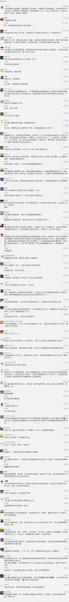

##正文

接着前天的文章，今天简单聊两句民国的历史。

 

我们的历史上对于袁大头，普遍是抹黑的存在，甚至大家往往也都把21条之类的事情往他身上扣，说他向日本出卖利益。

但实际上，很少有人会发现，在护国战争过程中，蔡锷以贫瘠的云南一省之力竟然能对抗整个北洋军阀，这完全不符合政治军事定律。

而且，北洋军头们纷纷开始出工不出力，甚至集体对袁大头捣乱。

更有意思的是，接受袁大头利益输送的日本，竟然也公开表示，袁大头是中日亲善的绊脚石，要让袁大头下野。

很显然，袁大头并没有大家宣传的那么不堪。

反袁的梁启超和蔡锷师徒，一个负责宣传一个负责运动，全部都是拿着日本的军火和资金援助，如果袁大头真的对日丧权辱国的话，那么日本人才是脑子进屎了。

而真正的历史，是日本出人出钱出枪，来扶持一个亲日的政权，于是也有了北洋后期执掌北京的皖系军阀和奉系军阀。

同样，老蒋的北伐能够势如破竹也没有那么简单。

随着孙逸仙从亲日转向亲苏，苏联对国民党那是一个全力支持，从党建到军校，从教官到枪炮，从党建到央行，都是亮闪闪的金卢布。

以至于北伐的时候，国军每个师都有老毛子的顾问，各个技术兵种的负责人都是老毛子，甚至打武汉的时候，老毛子的顾问们都直接开飞机参战了......

所以，历史不过是被人打扮的小姑娘，民国时期的中国，几乎就是日本和苏联角力的战场，一股势力能够卷起多大的风浪，很大程度上决定于其背后势力的投入力量。

因此，如果低估了这股力量，就很容易出现袁大头、张作霖式的翻车。

但是，翻车并不可怕，只要不把枪杆子丢了。

当年袁大头最大的对手，并不是搞宣传的梁启超和搞运动的蔡锷，而是北洋军阀中的段祺瑞和冯国璋被日本人收买了。

同样，张作霖最大的对手，并不是搞宣传的老陈和搞运动的老蒋，而是北洋军阀中的冯玉祥和阎锡山被老毛子收买了。

所以，如果明白了只要枪杆子还在，那么就会知道，翻车没啥事儿，乱点也没啥事，这些乱象，只会打破某些人的幻想罢了........

##留言区
 

