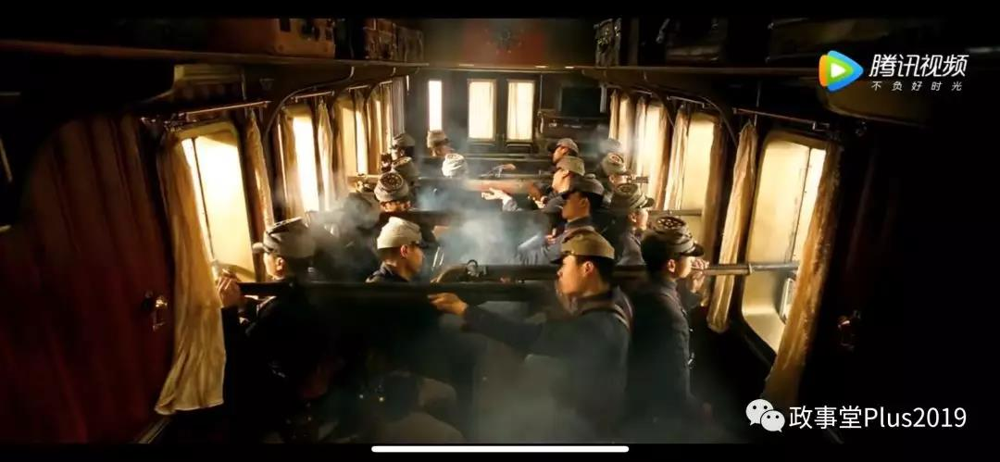

##正文

如果翻翻北洋的历史，对于战争会有着很有趣的评价，那就是打仗几乎是在放空枪。

就像陈毅在《华东一年来自卫战争的初步总结》中说得那样：我说我军切不要像张勋的军队，他与段祺瑞打仗，打了三百多万发子弹，才打死二十八个人。

嗯，这就像子弹飞里面开场的那样。

 

因此，很多人基本上也都判断北洋军阀们一色都是吃空饷的战五渣。

但是，很多人并没有注意到，连这群渣渣中最渣的张学良，都竟然敢出兵中东路，跟列强的老毛子掐一架，虽然最后输了，但底下的嫡系部队也真的就敢打。

很显然，我们对于北洋的实际战斗力，历史上是有着过于的低估。

其中的原因很简单，那就是北洋之间的战争，一贯都是台面上打得响亮，但实际底下却不流血。

其中一个很重要的原因，就像前文说的，北洋这帮头子们背后都是有着日俄等外部力量的。

既然大家都明白，当时局面的背后是外部力量，那么很自然的就一个个成为了中央戏精学院毕业的那样，开始了争先恐后式的演戏与欺骗，让俄日两国大肆提供军事援助和干涉，可最后都成了竹篮打水一场空。

所以呢，学习一下北洋，我们就知道了，在势力远不如对手的时候，一方面要合理的利用帝国主义之间的矛盾来求生存，另一方面，则是要学会忍和装，每一战看起来他们获益颇丰，但是实际上我们却要做到实力未损。

就像历史上，拿着日本补贴的张作霖，不断的抻着日本人，把关东军的胡子都快气歪了，更不要说老蒋，一手拿着毛子的补贴，一边对.....下手.....

所以，真正会抻的高手，越是处于北洋的境地之时，越应该嘴炮打的震天响，但是私底下却在积极筹备力量。

而且，他们也不需要去争夺名义上的胜利，

毕竟，就像日本扶持的张学良易帜，倒向了亲俄（以及英美）的老蒋，日本很快就发动了918。

所以，就像那句俗话说的，闷声，才是最好的！

##留言区
 

