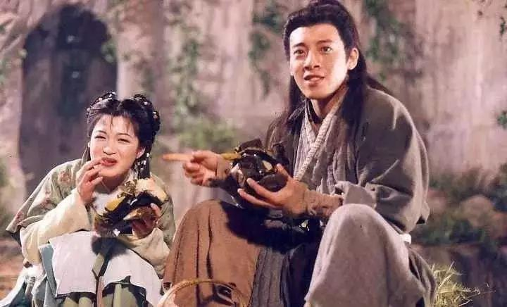

##正文

如果说中国地产圈是一个江湖，那么最像令狐冲的那个，非那个生性放荡不羁、爱开玩笑，却又喜欢拔刀相助当白武士的孙宏斌莫属。

孙宏斌早年的时候，就颇有点令狐冲式的没落。

即使冒着漫天大雪骑着自行车从北京狂奔到大连，也无法挽回相恋多年的小师妹。

 

更可悲的是，作为华山派的大师兄，一心为了本门拼命，却由于路线问题，被师傅栽赃陷害锒铛入狱，最终内力散尽。

 

但是，主角毕竟是主角。

就在其他地产商纷纷低价甩卖，准备猫着过冬之际，昨天下午，融创发布公告，以152.68亿的价格，收购云南城投持有的环球世纪51%的股权。

如果政事堂判断没错，剩下的股份，恐怕用不了多久也将被孙宏斌收入囊中。

拥有六千万平土地储备的环球世纪被孙宏斌拿下后，全球文旅地产方面再无融创敌手。

而连续蛇吞象式的吃下了联想地产、乐视地产、万达文旅、泛海国际、环球世纪等的孙宏斌，仿佛练就了魔教十长老武功的令狐冲，迅速从二流高手跻身于超一流地产巨头的行列。

不过，资本市场对于孙宏斌天马行空的收购动作以及超高的负债率，一直秉承着怀疑的态度，市场上也不时有着坐等融创什么时候垮的声音。

对此，政事堂认为，如今的孙宏斌，就像被各路英豪注入真气后的令狐冲，虽然走起路来都有点摇摇欲坠，但却有着未来爆发的潜能。

而要理解孙宏斌的潜能，就要从2016年政事堂为什么会认为贾跃亭和王健林必定从鼎盛骤然坠落开始。

明白那两场的坠落，就会明白昨天融创的那一场收购环球世纪，跟接盘乐视和万达文旅本质并没有什么区别，孙宏斌不过是又一次去当了一把白武士，而附着于环球世纪的资本，又一次选择孙宏斌作为新的宿主。

 

而随着这一次对环球世纪的超级收购，与对万达、乐视、联想、泛海等动作一致，孙宏斌的版图也在渐渐明朗。

一方面，如果不是在法国的一次意外跌落，孙宏斌应该能完成超级大满贯，将过去八年中国房地产高溢价的超额土地储备几乎一网打尽。

其他的地产巨头再厉害，也就是小说中配角那样，只能一点点累积内力，最多是加杠杆练魔教武功，速度虽快但后患无穷。而融创这种桃谷六仙式的内力灌入，虽然有点乱，但分分钟就能催出来一个顶级内力高手。

而一方面，融创这些年的收购，大都指向了一个操盘手。因此，以蛇吞象的方式吃掉了乐视、万达文旅、环球世纪等巨型企业的融创，吃掉的不仅仅是土地储备和优质资产，而是获得的一整套原本分散于不同企业的产业顶层设计。

因此，如今融创拥有的不仅仅是来源于不同高手的强大内力，更是学到了独孤九剑式的顶级武功。

目前孙宏斌的问题，只是缺乏时间，将内力化为己用并将招数与内力进行打通，融为一体。

只要撑过这几年，孙宏斌这个孙猴子，凭借着低廉的土地价格和产业配套，就能把中国的房地产行业重新洗牌。

不过最后，成为桌上玩家的孙宏斌可能也要面临令狐冲式的难题：

师门和盈盈之间，到底应该如何抉择？
 
 

##留言区
 

