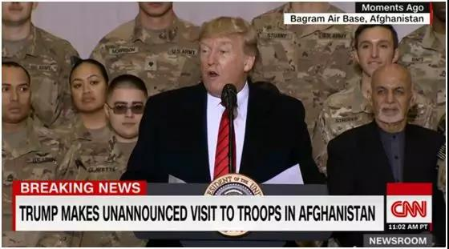
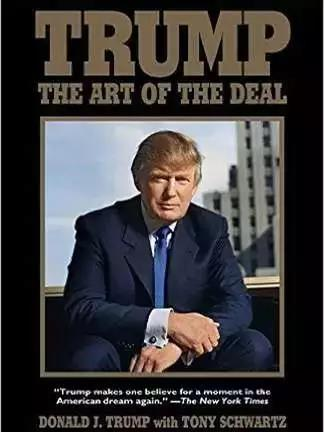
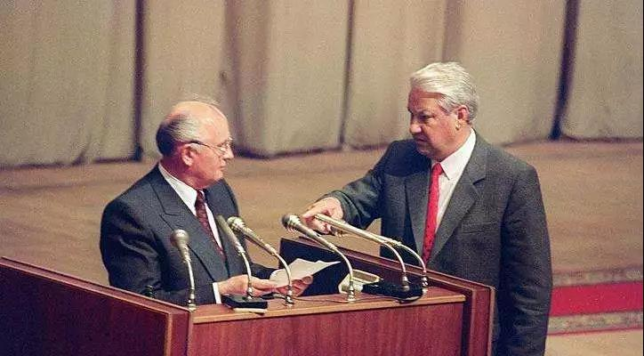
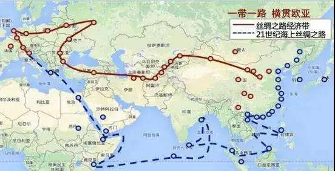
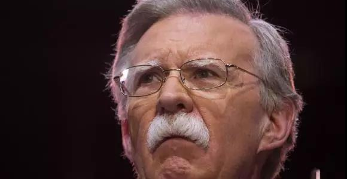

##正文

昨天的感恩节，通常上午频频发推特的特朗普，却保持了静默，只是发了一则很简单的祝福。

 

而这一则推特，也不是本应呆在海湖庄园过感恩节的特朗普手动发送的。

这位美国总统，此时正乘坐着空军一号，试图进行一场瞒过全世界的秘密旅行。

而那一则推特，也不过是考虑到特朗普发推特的习惯，为了避免这场横跨半个地球的旅行被发现，所设定的定时推动。

做戏自然要做全套。

为了瞒天过海，特朗普先是借着感恩节带着出访团队从华盛顿溜回自己的大本营海湖庄园装作庆祝，然后再从海湖庄园溜到附近的一个秘密机场，通过一架简陋的军工飞机再飞回华盛顿。

而且，特朗普并没有启动“空军一号”，而是启动了空军一号的备用机。

甚至在“手机控”特朗普以身作则的要求下，飞机上所有人员的通讯设备全部被没收。那些的白宫记者直到降落才知道，外界以为正在海湖庄园度假的特朗普，终于成功踏上了阿富汗的土地。

 

虽然明面上特朗普是宣称给阿富汗的美军过感恩节，但是明眼人都知道，特朗普这次访问的重点，在于明修栈道暗度陈仓，越过白宫，与塔利班方面进行直接的交易。

 

阿富汗的反恐战争，这场美国历史上最长的战争，持续了18年，耗费超过7600亿美元，一旦走向结束，那么对世界地缘的影响，也是极其深远的。

从亚历山大大帝到成吉思汗，从大英帝国到苏联再到如今的美国，这个全球的最著名的世界岛，一直以来都是全球博弈的中心。

如今，阿富汗更是海权的美国制约欧亚大陆陆权挑战的关键点。

从地缘来看，阿富汗北侧是俄罗斯腹地的中亚五国，西侧是俄罗斯的铁杆盟友伊朗，东侧是俄罗斯的全天候战略盟友，南侧是中华好基友的巴基斯坦和俄罗斯的战略盟友印度。

 

其无与伦比的地缘价值来，源于其能够成为美国控制欧亚大陆的中心点。

因此，这场美国持续了十八年的反恐战争，历经两党的反复更迭都能一致延续，就是因为其既可以打击敌人，又可以威胁盟友。

只不过，由于驻军阿富汗带来的巨大收益，都是隐性的，而且见效又特别长，因此并不能获得美国民众的普遍支持。

更不要说对于那个到处薅羊毛的特朗普来说，他只看到了巨额的投入，却看不到这个经济基本靠羊的国家有啥价值。

 

可是，作为全球最有地缘价值的国家，回顾上世纪80年代，就像美国落子阿富汗，最终拖垮了不可一世的苏联。

美国的优势，就是有足够多的钱，对拼经济无人能敌，阿富汗作为世界岛的中心，美国在这里的投入有着杠杆化的作用，他的每一分投入，都会逼着他的老对手们在这里大出血。

 

如今美国的几千士兵，实际上更是死死的锁住了一大群美国对手的手脚。

因此，可以预见的是，一旦美国撤军阿富汗，这种不可逆的事情一旦发生，那么以俄罗斯为代表的美国对手们，将扫清后院的大火，开在其他领域跟美国开启地缘的争夺。

预计普京在神秘力量的推动下，将能腾出手来进一步压缩美国在中东的战略空间。

当然，从战略的角度，正是由于阿富汗的乱局，亚洲大陆上形成了围绕着阿富汗的上合组织，如果美国撤军阿富汗，有利于分化上合组织，特朗普有机会施展其外交的艺术。
 
的确，随着美国的撤出，以俄罗斯为主导的上合安全机制会的重要会有一定程度的下滑。

但是，随着世界岛的安定，亚洲国家们将有机会迅速推动经济上的整合，利用巨大的经济合作，取代原有的地缘合作，形成更为紧密的联合。

 

如此明白的棋局，为何特朗普还要通过秘密访问的方式推动呢？

随着明年民主党确定总统候选人，特朗普将在明年正式开始进入大选周期，他需要一个接一个的胜利，证明他是美国最优秀的总统。

因此，他在外交领域必须要寻找到足够多的突破口，证明他比民主党的总统更适合坐在这个位置上，并兑现他许下的诸多承诺。

而外交领域能够展现特朗普交易艺术的，只有那几个美国的宿敌，朝鲜、伊朗以及阿富汗的塔利班。

可惜，特朗普今年试图推动的几次和平谈判，全都败给了地缘超级鹰的博尔顿。

譬如今年跟朝鲜草签好的河内协议，被突袭大使馆给搅黄了，譬如跟伊朗的秘密谈判，被沙特的油轮和炼油厂被袭而搅黄了，譬如跟阿富汗塔利班的戴维营密会，又被突如其来的一场枪战而搅黄。
 
于是，忍无可忍的特朗普决定，不换思想就换人，直接把博尔顿给干掉了......

 

而随着博尔顿被拿下，几个特朗普的重点谈判都在柳暗花明，秘密谈判都在迅速展开，譬如塔利班刚跟某大国谈完后，就以释放两名喀布尔美国大学的老师为诚意，在多哈与特朗普的谈判团队进行了秘密会谈。

可以预见的是，特朗普此次强行绕过白宫，与塔利班直接做交易只是开始，随着明年民主党选出候选人，急于取得外交成就的特朗普，会继续仿照此次偷渡阿富汗的方式，来直接推动协议。

这对于那些有机会跟特朗普交易的国家来说，这将是一个杀价的好机会，一心想要连任的特朗普，遭遇的威胁与压力只会越来越大，因此在他接下来的任期内，恐怕没什么是不能卖的。

##留言区
 

