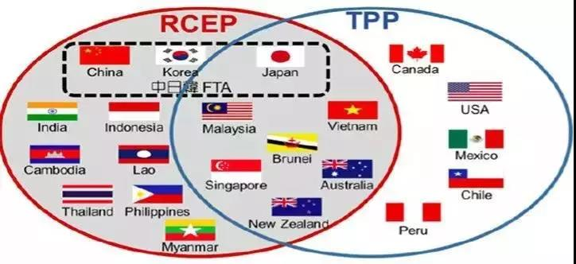
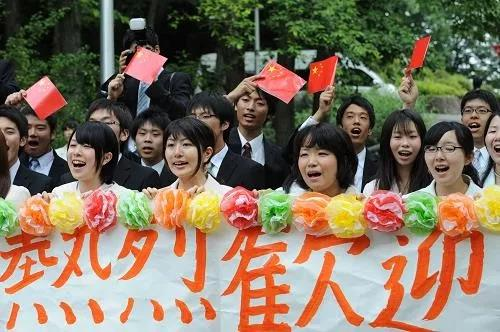
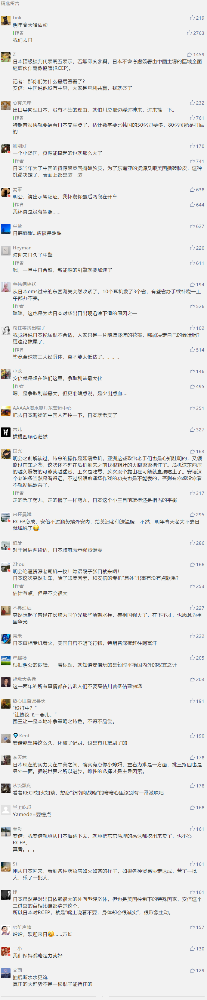

##正文

继承师傅大英帝国搅屎优良传统的日本，昨天又开始搅屎了。

据彭博社报道：日本頂級談判代表周五表示，若無印度參與，日本不會考慮簽署由中國主導的區域全面經濟伙伴關係協議(RCEP)。

就在刚刚结束的曼谷峰会后，RCEP签约各国都在推动国内议会立法之际，15个国家中经济发展水平最高的日本突然撂挑子，一时之间，很多人觉得这个拖了八年抗战的贸易协定又要歇菜了，日本要回头去搞TPP。

 

不过政事堂看来，日本不过是根据国内各方力量的诉求，进行的一次阶段性的外交策略。

首先，从RCEP建立之初，日本就强行拉着印度进来，希望能够制衡中国，尤其是随着特朗普撤离亚洲导致中国东盟关系迅速升温，以及日韩龌龊导致的两国关系撕破脸，使得印度这个盟友对于日本来说变得尤为重要。

因此，随着莫迪的临时退出打了安倍一个措手不及，所有的既定方法和战略将被推翻。这使得日本作为一个整体，有动机先把水给搅浑，争取到时间来浑水摸鱼。

其次，安倍将在12月出访印度，并举行首次的外长防长（2+2）磋商，争取签署《军需相互支援协定》，借此将印度变成日本的准盟国。

因此，无论是从经济合作、地缘政治还是选票支持率，安倍都需要倾尽一切，让这场日印准同盟级的元首会面更加完美。这使得安倍在出访前，通过威胁退出RCEP搞出一个与印度共进退的姿态，能够极大的赢得支持率危机中的莫迪与印度民众的好感。

第三，任何自贸协议的签署，虽然会有集团受益，但也会导致部分利益集团受损，尤其是RCEP协议中受益最大的中国，对日本以及美国都有一定的战略威胁。

因此，面对国内部分政治势力的呼声和国际上的压力，即使安倍和自民党政府愿意签署RCEP，他们也不会把签署的意愿表露出来，毕竟安倍飞往RCEP签署时的飞机突然着火，这事儿也是有点后怕的。

最后，对于日本国内那些愿意签署的利益集团来说，他们正好可以利用印度对RCEP的不满而大做文章，在各方已经谈妥的情况下，寻求进一步的利益诉求，尤其是在中日韩FTA也到了最后的谈判关头。

因此，日本从上至下各个方面，对于RCEP搞点文章，是有着共同的诉求，这使得各方愿意推出一个并不能代表安倍政府的高官表态，之后各方都对此表示沉默的原因。

 

不过，政事堂看来，此次日本叫嚣这退出RCEP只是阶段性的动作，随着日印12月的蜜月过去，日本这根搅屎棍，就要拔棍无情了.......

因为RCEP虽说是15国，但真正有话语权的就是东盟+中日韩，其中，东盟十国和韩国都在积极推动，因为作为97年东南亚金融风暴的直接受害者，他们都明白，只有跟中国经济挂钩了，才能够避免被金融风暴一波带走。

因此，急于签约的他们，会集体对搅屎的日本施压，

而日本，如今还真没有什么抗压的资本，就在于刚刚出来的三季度财报中，日本GDP增速仅0.2%，远低于二季度的1.8%，令市场一脸懵逼。

而导致日本这个出口导向型经济国家经济下滑的原因，自然就是出口不利。

上个月日本出口同比下降9.2%，创造了连续第11个月的同比下滑，这背后，就是日本对中国和东盟这两个最大的出口市场出现了大幅下滑。

作为一个出口导向型国家，日本在贸易谈判方面上并没有什么太多的筹码，甚至前些日子都在出口压力之下，都被逼得批准了对韩国的氟化氢材料的出口，连制裁的样子都装不下去了.....

因此，政事堂看来，未来在RCEP问题上，日本就像该国的国粹那样，嘴上说着不要，身体却会很诚实....

毕竟，到了明年春天的时候，东京的大街小巷都会竖起横幅，上面写着“欢迎来日”.......

 

关联文章：莫迪拒签RCEP，是谁在搞鬼？

##留言区
 

