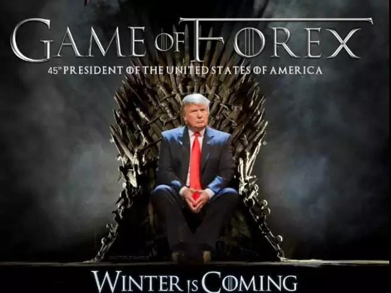
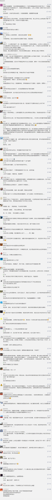

##正文

日前，超级富豪布隆伯格宣布，将以特朗普作为对手，加入2020年美国总统大选的争夺。

 

虽然很多人没有听过布隆伯格（Bloomberg）这个名字，但是他以自己名字创建的彭博社相信大家都是耳熟能详。而且，在2019福布斯排行榜中，布隆伯格紧随Facebook的扎克伯格，以555亿美金位居第九。
 
现任美国总统特朗普一直都在吹嘘自己多么的有钱，但是他31亿美金的财富跟布隆伯格相比，都没人家的零头多。
 
由于布隆伯格是临时参选，错过了很多州的竞选活动，而且以底层民众为基本盘的民主党普遍不喜欢富人，因此坊间并不看好这位超级富豪。
 
不过，政事堂却认为，这位世界顶级富豪很可能会赢得初选，成为明年特朗普的竞争对手。
 
最主要的原因，就是他有足够的钱，而且是完全可自由支配的钱。
 
特朗普大战希拉里的2016年美国大选，创下了美国竞选募资的记录，但是原计划投资1亿美金的特朗普最终才掏了6500万美元的腰包。
 
而布隆伯格在前些年在慈善上面，就有超过80亿美金的捐款。更不要说，在去年跟布隆伯格没啥关系的中期选举上，这位超级富豪就投入了一个“小目标”的美金来支持民主党。

钱对于这种超级富豪来说，只不过是一个账面上的数字而已。
 
因此，按照布隆伯格每年赚50亿美金的速度来看，在接下来的一年时间，他只要用自己一年的收入，在能在竞选费用上面，可以吊打全美国的特朗普支持者。

 

当然，并不是有钱就一定能够拿到美国总统。
 
但是超级富豪布隆伯格的参与竞选，也标志着美国的政治结构出现了一个重大的变化，那就是资本开始直接参与到了美国白宫政治博弈。
 
而这个打开这个潘多拉盒子的人，就是特朗普。
 
自从上世纪六七十年代肯尼迪去世后，美国总统几乎成为了一群表演艺术家的天下，各股势力在背后操纵着美国的政局，使之一直处于较为平衡的状态。

不过随着冷战结束，美国原本差距不大的贫富差距迅速拉开，经济基础决定的上层建筑，富可敌国的资本家们自然会有对权力的渴望。
 
尤其是随着特朗普上台后，超级富豪们瞅着这位摸着石头过河的土狍子一步步的迈向权力巅峰，发现了通过竞选方式登顶总统是一个稳赚不赔的买卖。
 
譬如特朗普最初竞选的时候只是玩票的心态，但是在竞选过程中，由于美国总统选举过程中吸引了全球的目光，因此即使算作给特朗普集团的做广告，那几千万美金花的也不亏。
 
而且，随着特朗普赢得了党内初选，虽说连他自己都不相信能战胜希拉里，但是这却不耽搁他借着选举与共和党内各股政治力量进行交易。
 
更不要说随着特朗普当选总统之后，不仅对内把共和党进行了大洗牌，换上了一大批跟着自己走的政客，更把交易的艺术在国际上玩得淋漓尽致，与全球的领导们大做交易。

 

因此我们再看做金融资讯生意的布隆伯格，他的彭博做的就是一份资料卖多家的生意，通过参加总统选举来提升全球的知名度，对销售的刺激都是以亿美金为计，这笔生意本就是赚的。

而且，彭博资讯的及时有效，很大程度上依赖于能否从实权人物手中获得第一手的讯息，因此只要赢得了民主党的初选，那么接下来的半年多时间里，布隆伯格能够轻易以组建内阁为名义，与美国民主党的实权人士们进行利益勾兑，建立的人际联系能够使得彭博更上一个台阶。
 
更不要说，一旦布隆伯格战胜了特朗普，那么他就可以模仿特朗普跟全球的政治家们做交易，到了那个时候，跟在全球政治家们都联系通道的彭博社，其在全球的扩张将恐怖的无法想象。

 

而且，从近年来的布什家族、克林顿家族、特朗普家族通过竞选总统迅迅速成为了美国能够传世的大家族来看，当总统对于已经阶级固化的美国来说，是有钱人变成有权人最佳之路。
 
而看懂了背后巨大的利益，就会明白布隆伯格在接下来的选举中会不吝钱财，毕竟之前做政治交易都要打着慈善的旗号捐出几十亿美金，这次自己上场完全反而可以大幅节约费用。
 
甚至这位超级富豪很可能会背叛自己的阶级，宣布竞选后会对超级富豪们征收高额的税收等手段为筹码来争夺选票，联合其他极左的候选人作为搭档。
 
而这也意味着，特朗普和布隆伯格他们只是开始，随着明年这一场超级富豪们的美元大战，未来美国会有越来越多的超级富豪们想明白后，亲自参与总统宝座的争夺。

 

这些不依赖于传统政治集团资助的这些超级富豪，未来也将会充分发挥“有钱真的可以为所欲为”的作风，利用民意作为支持，开始大秀自己的超能力，根本不顾及传统建制派们的想法与利益。
 
 

而这也意味着，特朗普打开了民粹的潘多拉魔盒之后，这些操纵民意的超级富豪们将你方唱罢我方登场，一左一右，美国国内将出现越来越撕裂的局面，未来，美国国内想要取得共识的可能性也将越来越低。

不要小看美国政局变化的影响，这场混乱，也将给其他国家一个宝贵的阶梯。

##留言区
 

