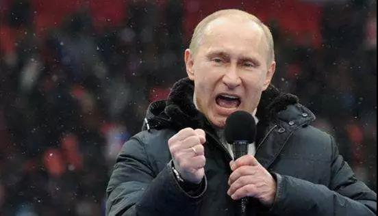
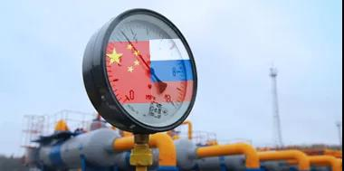

##正文

据新闻联播报道，今天下午17时，随着中俄两国元首通过视频连线下达指令，中俄东线天然气管道“西伯利亚力量”（Power of Siberia）正式通气。

未来，这条长达8000多公里的亚洲能源大动脉，将每年向中国运输380亿方的天然气。这相当于2018年中国进口天然气总量的28%，而且如果需要，该管道的运力可以提升至年600亿方。

 

说起来，这条管道的最终落地着实不易。

从1996年开始，中俄围绕它光是谈判就进行了18年，直到2014年，俄罗斯因克里米亚冲突遭受西方全面制裁才被迫松口降价，敲定了这笔仅管道投资就需要700亿美元，总价值超4000亿美元的超级合同。

 

而这笔超级合同的达成，对于中俄两国均有着历史性的意义。

之前，占据中国天然气进口澳大利亚和土库曼各占了半壁江山，由于供货方较少，以及中国冬季供暖激增的供气需求，使得全球天然气是买方市场，只有在中国是卖方市场，缺乏博弈筹码的我们，去年冬季天价格一度高得离谱。

而随着廉价的俄罗斯天然气成为了我们的交易筹码之后，今年中国的天然气进口变成了买方市场，价格比去年同期下滑了40%以上，为我们节约的大量的外汇。

同样，对于俄罗斯也是如此，由于克里米亚导致的西方制裁，以及乌克兰拒绝俄罗斯的天然气过境，使得过去天然气全部向欧洲出口的俄罗斯遭遇量价齐跌的窘境，两次关闭天然气管道更使得俄国内经济遭到了重创。

而中国庞大市场的加入，不仅缓解了俄罗斯国内的经济问题，更将极大的改善俄罗斯的对欧能源谈判的筹码，还将有利于俄罗斯通过威胁关闭能源通道的大棒在欧洲施展地缘影响力。

而且，考虑到我们支付的管道建设预付款就高达250亿美金，就会明白今年在全球能源价格下滑的情况下，普京还能逆转叙利亚，出兵委内瑞拉，在全球地缘博弈上的大杀四方。

 

同样，地缘上对于我们也是类似，随着俄罗斯的管道供气，不仅将极大的提升中国能源安全，更将刺激急于开拓中国市场的美国能源集团出手推动中美关系走暖。

而且，随着未来中美贸易协定签署，开启从美进口LNG之后，俄罗斯的供气合同就能成为我们重要的筹码，在克格勃大战美国队长的博弈之下，继续下降我们的能源供应价格。

 

更重要的是，无论是中澳还是中美的天然气交易，我们支付的都是美元，而与俄罗斯的交易则是以人民币为基础的“以货易货”。

回顾2018年的中俄贸易，中国从俄罗斯购买了400多亿美元的石化能源，俄罗斯也从中国购买了400多亿美元的中国制造。

这意味着这笔交易中，我们买进了制造业所必须的能源同时，还同时扩大中国制造的倾销市场，以规模化继续提升我们的竞争优势。

 

此外，中国巨额的天然气供应合同，又意味着经历了五年美国制裁的俄罗斯既无力独自完成能源的建设，也无法依赖西方国家的贷款，只能寻求与中国三桶油和丝路基金等中资机构进行合作，以共同开发换取中方的巨额投资。

再加上目前，西伯利亚的天然气规模又不足以支撑中国未来强劲的能源需求，中俄能源的联合体自然而然就得一起开发北极圈的油气资源，让我们这个与北冰洋不接壤的国家，顺理成章的成为了北极能源圈的一员。

 

可以预见的未来，随着中俄合作大规模开发西伯利亚以及北极圈的油气能源，推动西伯利亚西线天然气管道以及北极航线，再加上美国页岩气的大规模开采，全球的天然气必然出现过剩的局面。

而供过于求，又将使得未来的天然气市场，有机会形成一个以中国为首的买方市场，甚至不排除全球天然气将会以中国市场来定价。

 

 
位于北极圈内的中俄亚马尔天然气项目

定价权的获取也意味着，随着RCEP的签署以及区块链数字货币技术的成熟，以中俄共同投资开发的天然气能源为锚，以全球最大天然气消费市场的RCEP为依托，一个属于亚洲的数字货币也将横空出世。

就像今天会见俄罗斯朋友的外事活动中，我们说的，“我坚信，没有任何力量能够阻挡中国人民和中华民族前进的步伐”，新亚洲货币出现，也将意味着世界将步入一个新时代。

等到那一天的时候，再回顾中俄天然气管道23年谈判与筹备，RCEP历经8年的拉锯谈判以及央行为数字货币的6年磨一剑。

就会明白，任何伟大的成功，都曾历经磨难。

##留言区
 

