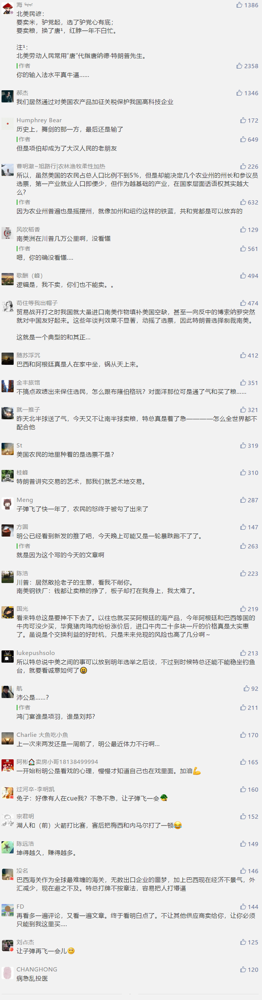

##正文

据新华社华盛顿电，特朗普在推特上发文称，巴西和阿根廷让本国货币大幅贬值，这对美国农民不利，美方要立即恢复对两国出口美国的钢铝产品加征关税。此举引发巴、阿两国不满，美国股市也应声下跌。

看到特朗普这则推特的逻辑，政事堂不禁想笑，美国的农民难道都强悍到在地里面种植钢铁了？竟然需要对巴西阿根廷钢铁加征关税来保护美国的农民.......

而且，巴西和阿根廷也根本不存在特朗普口中的货币主动贬值，两个在经济衰退边缘徘徊的国家今年都在拼命出售外汇储备以支撑本币不要跌的太难看，阿根廷为了避免过度贬值甚至几乎耗尽了外汇储备。

更有意思的是，相比于特朗普传统发推之后，美国就将祭起贸易大棒，这次特朗普的发推很显然只能是打嘴炮。

因为巴西民粹主义的总统博索纳罗是特朗普的亲密盟友，被巴西媒体戏称为热带特朗普，哥俩不仅经常在网上相互吹捧，甚至还在推动美巴自贸协定，以至于特朗普的推特一出，博索纳罗看的一脸懵逼，表示要通过秘密通道跟特朗普确认一下。

 

阿根廷就更不用说了，现总统马克里刚刚败选，没多久就要离开总统宝座，而新总统费尔南德斯率领的左翼政党联盟也将取代现执政的右翼政党联盟，换届期间的阿根廷根本没精力跟特朗普去玩交易的艺术。

更重要的是，之前特朗普挥舞钢铁关税的时候，巴西和阿根廷都已经与美国签署了配额协议，豁取了关税豁免，此次特朗普如果再次开征关税，相当于主动撕毁协议，将使得他在后面的贸易谈判中处于非常不利的局面。

那么，特朗普怎么突然变得如此“特不靠谱”了呢？

其实，总在不经意间说大实话的特朗普，此次推特上祭出的钢铁关税大棒，还真是为了地里面并不种钢铁的美国农民。

随着特朗普去年开始挥舞贸易大棒，美国的农民们便遭受到了重创，而伴随着美国农民们的愤怒，最近持续进行的美国州长选举，特朗普已经连续输给民主党八个州长。

美国的州长选举，与选举人团制度的总统选举有着非常直接的联系，如果农业州的局面不能在最近一年内得到改善，那么特朗普的2020也会非常的危险。

这才是特朗普关心农民的问题所在。

而全球农产品的总需求是一定的，美国农民粮食屯在仓库里卖不出去的同时，同为美洲的阿根廷和巴西却双翻了天，装载着粮食的货轮一艘艘的在穿越太平洋。

而明白了这一层的关系，就会明白，特朗普在这个时间点上用关税怼巴西和阿根廷的农业，只能说是在项庄舞剑意在沛公。

不过，这次的“极限施压”不仅没啥痛感，甚至远远的还把剑舞到了几万公里之外的南美洲，这恐怕也意味着表面故作镇静的特朗普，这次是真的着急了.......

因为，他手上能打的好牌，已经不多了。

##留言区
 

