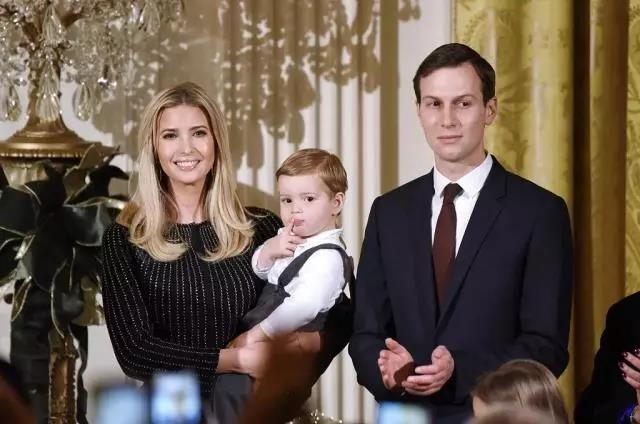

##正文

回顾2016年的美国大选，特朗普有两个令人印象最深的口号。

一个是让美国复兴的“Make American Great Again”，

另一个则是建墙的“Build the Wall” 。

 

在这两件事情上，特朗普真心是做到了“虽千万人吾往矣”。

为了兑现“美国复兴”，特朗普挥舞着贸易大棒和军费支出向全球列强“宣战”，将二战之后美国苦心经营半个多世纪建立的盟友体系搅得稀烂。

为了兑现“建边境墙”，特朗普不惜孤身对抗美国参众两院，强行宣布美国进入国家紧急状态，从而越过国会直接命令美军出人出钱来强行建墙。

甚至白宫幕僚长凯利、国土安全部长尼尔森和国防部长马蒂斯这三个白宫实权人物被特朗普炒掉，也都与他们对建墙问题不够重视有着或多或少的关系。

 

随着特朗普进入到竞选周期，今年年底的北约峰会以及原计划的智利APEC，军费和贸易问题似乎开始出现解决的契机，但是建墙却一直被拖沓着，成为了众多特朗普铁杆选民抨击他的对象。

不过近日，建墙问题似乎柳暗花明，据《华盛顿邮报》报道，特朗普任命了自己的女婿库什纳领导美墨边境墙修建工作。

为了兑现特朗普对选民建墙的承诺，库什纳在白宫成立了美国建墙工作领导小组，要求相关的内阁官员必须出席，并在会上宣布了死命令，此后保持每个月约50公里的速度，以保证在2020年底前建成700公里以上的边境墙。

而在库什纳的领导下，这个建墙领导小组看起来更像一个拆迁办。

由于特克萨斯州建墙的土地几乎都是私人拥有的，按照传统的美式谈判，下一届美国总统任期内都不可能谈完。

可是，为了老丈人连任的拆迁办主任库什纳，直接把拆迁从商业谈判变成了行政命令，要求在国家紧急状态之下，负责建墙的军队工程团可以违反法律以征用私人土地。

甚至，为了支持特朗普的选民能够看到建墙的进展，库什纳还要求在边境装摄像头来搞现场直播，并能够监督建墙。

因此，政事堂估计，如果不出意外，那么卡在2020年年底的美国大选最终之前，库什纳还是可以分阶段完成特朗普建墙的政治许诺。

唯一要防备的，就是民主党拿着库什纳与拆迁办快刀斩乱麻后，拿着人权问题来搞事儿。

 

虽然建墙这个事儿是美国的私事儿，但是对于我们预测特朗普的动作却有着非常重要的参考意义，因为库什纳一直都是近年来观察特朗普决策最重要的风向标。

特朗普上台后一改美国总统首次出访选择加拿大或者墨西哥的传统，直接飞奔沙特的背后，是库什纳这位中东事务特使在特朗普上台前，就跟中东的王爷们达成了一系列的交易。

同样，特朗普能够成为美国的真总统的分界线，是他挤走建制派们选择的国务卿蒂勒森，彻底掌控美国外交权力。而一度被誉为“影子国务卿”的库什纳，则是在一直处于替岳父大人对抗蒂勒森的第一线。

甚至回顾这三年，特朗普每一次下决心要做一件大事情的时候，总会安排这位白宫内唯一信得过的亲人来处理。

可以说，这对张老人和女婿之间，一个在明处，一个在暗处，一直在很默契的做配合。
 
 

如今，随着老丈人特朗普进入到大选周期，女婿库什纳也成为了竞选团队的头号负责人。

因此，资本市场如果想要推测特朗普接下来要做什么，并不能光看特朗普说什么，因为他现在无论说什么，都一定要站在选民的角度。

而观察库什纳这个总统救火队长的动作，才是预测未来走向的关键。

##留言区
 

