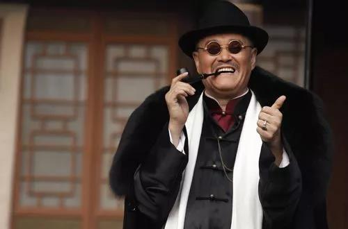
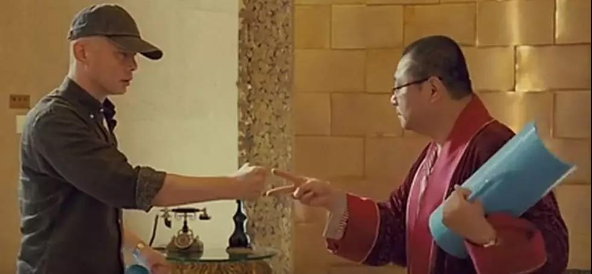

##正文

最近华为员工的事儿闹得沸沸扬扬，后台很多读者都让我谈谈。

今天讲之前，先聊一个我身边一哥们现实中发生的事情。

那哥们是个标准的东北人，为人爽快仗义，喜欢讲段子吹牛逼，有点心眼，也有点匪气。

 

不过，相比于同期入职同事们的不断晋升与调离，哥们却在最基层的销售主管位置上混迹多年。

不能说他没有理想，他的理想就是开开心心的大锅饭混吃等死.....

因此，不同于其他雄心壮志的同事在项目附近租房，等着升职调离，哥们在公司边上贷款买了自己的房子，搭起了老婆孩子热炕头，小日子过得非常甜蜜。

可惜，人在家中坐，锅从天上来......

大概是2014年左右，央企序列开启了轰轰烈烈的高压反腐。

覆巢之下无完卵，央企员工的福利纷纷被取消，奖金也大幅下滑，考勤制度也越来越严格，各项目的兄弟们都是一片哀嚎。

屋漏偏锋连夜雨，随后国资委主导的央企减员增效，又进一步激化了矛盾，哥们的销售奖金刚被下调后，紧接着位置又不保了。

那一天，以为像往常一样领奖金领到手软的哥们，在兴高采烈被HR喊进办公室后，却又哭丧着脸走了出来。

因为他被通知，他的合同即将到期，公司不续约了。

痛苦的思考了几天后，哥们勇敢的敲开了项目经理的门，反手就把门锁了。

 

嗯，不要误会，哥们是直的，项目经理也是男的。

哥们什么也没说，只在项目经理桌上放了一张纸，上面都是项目经理最近一年的违纪行为，希望这个“惊喜”能够让他留在公司。

可是，看到足够把自己拉下马的材料，哪有领导敢继续留下他？

最终，哥们还是离开了项目，不过，他不仅从财务拿到了N+1的补贴，也从经理的秘书那里，拿走了几十万的现金作为“保密费”。

意外拿到保密费的哥们，自然会跟老兄弟们大肆炫耀，那几十万虽然不多，但也都是“靠本事要来的钱”。

 

当然，散落各地的老哥几个对这钱没啥兴趣，但是却很有兴趣跟哥们一起八卦项目经理和秘书之间的种种绯闻......

 

本来呢，是一个很欢乐的事情。

不过，随后事情的发展，却出乎我们的意料。

哥们单挑项目经理的成功，就像海飞丝那样，一传十十传百，成为了整个项目皆知的秘密。

员工们的“纷纷”效仿，让项目经理也傻眼了，越来越多的人无心工作而专注于收集公司的黑材料和举报，而为了完成瘦身指标的项目经理也不得不继续违规筹钱疲于应对。

混乱之下，项目客户的信息被盗取贩卖，甚至某些胆子大的还对客户勒索钱财，相比于集团其他项目减员增效后的蒸蒸日上，该公司各方面的各项指标反而出现了剧烈的下滑。

最终，疲于应对的项目经理在上级派驻审计时被发现问题，他和他身边的小团队，被纪检部门带走一锅端了。

 

之后，新领导上任，项目柳暗花明，成为了集团的现金牛。

同样幸运的是，那个被带走的项目经理富有斗争经验，被走带的期间谁也没咬，上级领导也没去继续追究，哥们要补偿这事儿根本就没被提及。

最后很幸运的大家都相安无事，否则我们老哥几个还得想办法去捞那哥们......

 

嗯，身边的这个故事讲完了，这也是我为啥最近几天一直没写华为问题，刚爆出来的时候，我看到就不禁想笑，这位华为前员工的李兄简直就是我哥们的翻版。

没啥追求的李兄入职华为12年了，同年入行就算不是个部门负责人最起码也是团队负责人，可李兄跟刚毕业的大学生差不多，他月薪按照职级只有一万出头。

按照华为八年工作后四年一签的惯例，工作12年的李兄正好是合同到期了。当时正被美国制裁的华为，很多产品连生产都是问题，因此，需要控制成本的部门领导第一个盯上的就是他。

尤其李兄此刻正在通过一些渠道来举报他的领导.....

至于媒体说李兄从领导秘书拿到的30万补偿，很显然也不是所谓的2N，因为无论是央企还是华为，大公司都是制度化的，为了合规，解约的费用财务部门都会按照规定从对公账户正常支出，而且还要交税。

因此，这私人账户的30万实际不是华为掏的，而是部门领导在公司给出的N+1之外，另掏出来“和解费”。

当然，部门领导恐怕也不会自掏腰包，这笔从秘书个人账户转过来的钱，多半是李兄的部门领导通过违规手段挪用来的。

所以，领导此举不是要搞李兄，而是在李兄的举报压力之下，顶着违规为求自保，毕竟在华为摸爬多年的领导年薪至少有50万以上，没必要为了一个员工撕破脸导致自己仕途被毁。

而这事儿倒霉就倒霉在，李兄一边拿到了领导的钱，另一边对领导的举报又引发了华为的公司调查，把他领导和团队被几乎一锅端，被公司挨个处罚。

出了钱还毁了仕途的李兄领导，以及整个部门，估计内心是哔了狗的。

面对李兄引发的公司后续一系列调查，为了降低责罚，李兄领导自以为是的把跟李兄的私下交易添油加醋的说出来了，通过被勒索，来降低李兄举报的可信度。

而一群被李兄坑的挨处分的同事，他们的心态不问自知，自然会站在领导这一边......

俗话说，众口铄金积毁销骨。

估计从华为离职快一年的李兄怎么也没有想到，这特么的也能被领导坑了，真心是又一次人在家中坐，锅从天上来......

最终，这场闹剧变成了毫无斗争经验的领导和员工之间互殴......一根筋的华为被卷入其中，按照制度，根据李兄的举报处理李兄领导和团队，又根据李兄领导和团队的指控起诉李兄......

两方的撕逼这使得案子起诉内容不断变化，还得不停的补充证据，涉案范围也不停的扩大.....本来能和解的屁大点事儿，在双方的囚徒悖论之下撕了八个多月.......

说起来，李兄按照公司的规定举报部门领导，部门领导根据法律向公司举报李兄，华为根据李兄领导的举报向公安机关报案，公安机关根据华为的举报和人证的证词来取证，从流程来说谁都没有错。

但是李兄与其领导的这场撕逼，不断地提供新证据，导致了按程序办事儿的华为不得不为了30万而大费周章的起诉，而公安机关接到了不断更新的证词和证据，也不得不一次次的按照流程扩大调查范围......

那么，对比多年前我哥们和他领导最终都能相安无事，李兄被羁押这事儿怪谁呢？

说到这，我想每个人可能都有自己的答案吧......

##留言区
 

