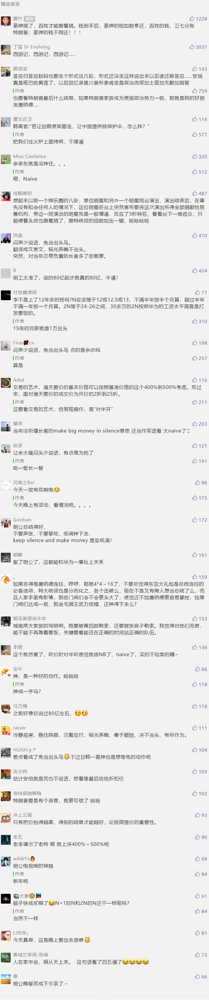

##正文

人在家中坐，锅从天上来......

最近召开的北约70周年峰会上，在特朗普拉着美国的北约小伙伴开会的时候，坐在家里的安倍却敦敦实实的吃了一个大锅。

面对一群迟迟不肯将军费提升至2%的北约盟友，特朗普放出了秋田犬，表示非北约盟友的日本都愿意将承担80亿美军的军费。

要知道，美日的军费谈判还没正式开始，特朗普就替安倍承诺了，估计安倍现在心里都快哔了狗了.....

而且相比于日本目前承担的18亿，80亿约等于过去的450%。

这个数字其实也很有意思，韩国目前承担的军费是10亿，与特朗普要求承担的47亿，大概提升的数字也是470%

我们会发现一个有意思的数字，那就是特朗普对东亚地区盟友漫天喊价式的加价，数字基本是在400%~500%之间浮动......

而有趣的是，昨天文章中，李兄“N+1”（N=4）的补偿应该接近7万，最后，他的“2N”（N=12）要到了30来万，也完美的处于400%~500%这个空间。

再看看今早的新闻，嗯，这就是有意思的地方。

特朗普的勒索数字，并不是按照相关团队根据的测算得出来的，而是他自己拍脑袋拍出来......

这使得日韩的军费支付数字，已经远超于美国在日韩的驻军花费，变成了一种收保护费的性质。

而日韩也会跟华为的部门主管一样，钱是免不了的，但估计最终不会以官方通道打过去.....

所以呢，特朗普这种勒索的路子才叫真正的“大象踩你一脚”，嗯，有种你逼逼试试？

 

最后，我们再来看东亚政治家安倍和文在寅的策略。

碰上特朗普这种胡搅蛮缠的，那就是一个字，抻。

俗话说，抻得越久赚得越多，同样，面对勒索，也是抻得越久给的越少。

历史一次次的告诉我们，闷声少说话，免当出头鸟，才是最好的。

##留言区
 

