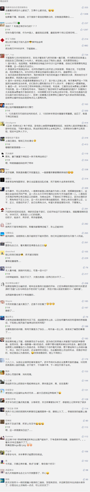

##正文

周期天王尼古拉斯金涛在去世前，留下了一个预言，人生有三次暴富机会 ，2019年将是最近的一次。

 

于是，不少人在今年又是折腾房子又是折腾股票，甚至还有折腾空气币，可是大家回顾今年，多半发现是一顿操作猛如虎，定睛一看原地杵.......

当然，政事堂的读者们都知道，之前多篇文章说了，周天王预测的经济周期，是被特朗普人为的延后了。

因此，如果教条的去理解数字，往往都是在刻舟求剑。

嗯，这两天岳飞的文章狠狠的洗了一波粉，所以呢，也可以放点能让大家致富的内容了，这样政事堂也会比较舒服。

前天政治局会议召开了，很多人都表示，要继续跟进之后召开的中央经济工作会议，来确定明年的仓位。

但实际上，12月的政治局会议上的九百多字，已经足够让看懂的人赚上一波了。

一方面，对比7月与12月，就会明白两次会议是有连贯性的，那就是烫平经济周期。在经济旺盛的七八月和金九银十轻踩刹车，在偏冷的春节前后轻点油门。

另一方面，对比今年与去年，就会明白每一年都是有连贯性的，那就是集中弹药在年初砸出去，争取一个较好的开门红和初速度。

好了，还记得政事堂之前预测2019年经济的时候，是怎么判断的呢？那就是**年初把弹药打出去，下半年紧衣缩食。**

当时不少人与我有过争执，相信大家也都会对这个推断印象深刻。

嗯，2020年在不考虑国际影响的情况下，大概率我们会重复2019年的模式。

这么做的原因很多，但是今天就不详细解释了。

但是，历史是一面镜子。

就像你看懂了宋朝的岳飞，就会明白该如何应对华为那样，在2019年和2020年经济逻辑一致的情况下，那么就不需要太多的技术，多看看历史就会明白应该怎么投资。

机会总是留给有准备的人，而不是给那些就知道抱怨的人。

接下里可以预见的是，**2020年的开春，会有一波投资高潮，股市会出现几个概念板块得到迅猛的拉升，房地产市场在部分地区也会出现一次短暂的小阳春。**

领域之前的文章都有着详细的说明，大家该提前布局的提前布局，该加紧出货的加紧出货，当然，根据不同人的情况，大家的方式可能全然不同。

国家都把致富密码几乎以明码的方式写出来，抓不住的就不要怪别人。

而重复2019的2020，也就意味着接下来的**二八效应也会越来越显著，从地域到企业，我们在2019年看到的各种趋势，将进一步加强。**

大家兄弟爬山，各自努力吧.......

政事堂在公开文章中很少会写这么通俗，再看不懂.....那我也没有办法了.......

最后，分享一下政事堂最近正在新追和“复读”的几本书，点击下图跳转。

当当图书双十二活动，图书五折基础上，政事堂读者另享受满300再减100元等活动。这个冬季，是一个低价囤书的好时节。

乌合之众

##留言区
 

