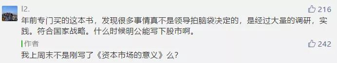
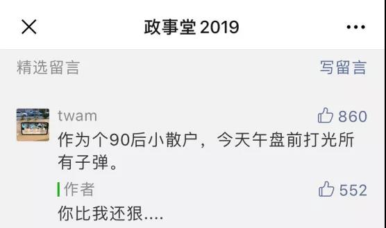

##正文

2019年即将过去，不知不觉2019这个公众号写了快一年，文章也累计了四五百篇的样子。

每到年底，大家都会写总结报告，政事堂想了想，也应该做一个年底的总结。

不过，一向交年底总结拖延症的我，发现给自己公众号写总结更麻烦，2019年的政事堂有地缘政治、宏观经济、房地产、互联网等几个主航道，单独哪一个都不是一两篇文章能总结完的。

考虑到，政事堂写资本市场的阅读量普遍是最高的，赚钱也是大众所关心的，因此，今天就对2019宏观经济下的资本市场这个版块做一个总结。

2019刚开年，在贸易大棒的威胁与科创板抽血的预期下，资本市场就像冬天那样的萧条，当时国内的经济学家们纷纷唱衰，以至于某经济学家讲的《反者道之动》，大家都习惯性的看成了“反动者之道”......

对此，2月15日政事堂发布文章《资本市场的意义》，表示“资本市场的意义，从来就不仅在于资本市场”。

文中，列举了英国、日本两个国家在总体国力处于劣势的情况下，利用资本市场对我们完成了反超；以及吉利在缺乏资本市场支持下，收购沃尔沃时的艰辛。

以此得出结论，在贸易对抗的大背景之下，中国想要弯道超车，也必须保护与利用好自家的资本市场，以杠杆化的筹措资金。

随后，政事堂继续撰文《即将到来，中国经济的大反击！》，文章引用前发改委负责重大项目的张国宝老先生的书《筚路蓝缕》，认为启动经济反击靠的是大型基建，而不是小基建。

 

 

嗯，这两篇宏观经济的文章写完后的一个月，沪指从2月15日的2682点一路上扬至4月8日的3288点，涨幅22.6%。

不得不说，这一波的涨幅也超出了我的预期。

等到后来各项数据汇总出来之后，大家才发现，这一轮股市的上涨的背后，是中央在一季度打了小半年的预算，在大型基建领域投入了大规模的财政资金......（文章是哪一篇我记不起来了）

不过资本市场并不会重视这个信息，正所谓 一根大阳线，千军万马来相见；二根大阳线，龙虎榜上机构现，随着一季度股市的高歌猛进，机构们与狂热的股民又纷纷喊出了5000点不是梦。

读者们的狂热，逼着政事堂在4月10日撰文《抓住周期》，给大家泼了一本冷水，认为目前的刺激，是“动手术的时候打麻药”。
 
文中认为不要有暴富的幻想，财政去杠杆周期大概还有两年多的时间，我们现行刺激政策背后，是抚平经济，而不是要拉出一个大牛市，真牛需要等到去杠杆周期结束之后的放水。

很巧的是，这篇文章发完后，沪指的牛头就转头向下，一个月的时间，从3240的高位跌至2850点。

当然，能够准确到天纯属巧合，重要的是推导背后的逻辑。

对比一下这两篇文章，《资本市场的意义》论证了为什么A股不允许超跌，而《抓住周期》则论证了A股为什么又不允许暴涨。

两条上下限的红线画出来了，逻辑也出来了。

于是，政事堂从5月10号开始，带着兄弟们顶着特朗普的压力开始了一个月的“为国护盘”式的做T。

 

之后，随着大阪G20，贸易缓解，护盘结束。

但随着进入到七八月，由于香港纷乱，两岸资本市场一起下行动荡。

8月6日，沪指险些跌破2700点。这一天，政事堂撰文《香港回归背后的金融战》，判断我们将从资本市场上给予反击。
 
甚至，留言区的顶部第一条留言，也表露出了政事堂当天的的操盘动作情况。

 

之后，官宣索罗斯香港折戟，沪指也一路震荡回升，没用一个月就一路涨回了3000点......
 
进入到9月，随着美联储的联系降息和央行的降准，看着美股的节节高，以某首席为代表的经济学家们带着一众证券报又纷纷开始鼓吹中国也将进入降息周期。

众所周知，一旦央行进入降息周期，中国的资本市场必然会出现一波迅猛的上涨，
 
对于这股歪风邪气，政事堂在9月14日撰文《不要轻信“经济学家”》、《不要轻信“经济学家”》、《从易行长讲话，看中国何时降息》，通过多篇文章告诉大家经济学家忽悠大家的降息并不可靠。

此后的两个多月，经济学家们预期的降息并没有到来，在特朗普经济方面的静默之下，沪指也维持在3000-2900点左右震荡。

这也使得四季度的政事堂文章主要集中在了地缘政治和互联网领域。

而政事堂2019年对于资本市场宏观领域的最后一次预测，出现在12月6日的政治局会议之后。

政事堂撰文《从政治局会议看致富机遇》，预测2020年春季将出现一波小阳春，为猪年的宏观市场预测画了一个句号......

当然，这个句号是否圆满，要看预言能否兑现了...... 

##留言区
 

