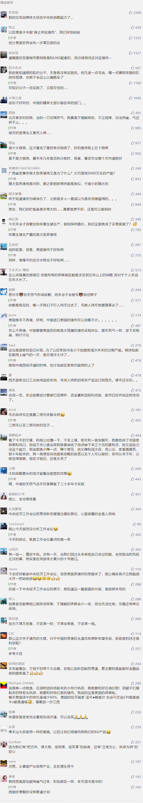

##正文

最近，留言区有不少朋友让我解读一下猪肉价格的问题。甚至还有读者调侃，今年最成功的一笔投资，是年初的时候屯了一冰柜的猪肉。

说起来今年下半年“二师兄”的上涨搞出来了不少的段子，曾经不少被视为“大猪蹄子”的老爷们也纷纷表示，“过去你爱答不理，如今你高攀不起”......

甚至占据CPI重要成分的猪肉价格，更是让不少无能的经济学家们把“猪悟能”当枪使，鼓吹起了“除去猪肉都是通缩”，用二师兄来忽悠民众相信降息。

 

当然，政事堂还有一些朋友对猪肉价格搞起了复盘研究，认为上涨的背后，是以浙江为代表的东部沿海地区搞起了环保一刀切的禁止养猪。

>过去你到农村，哪个农民家不是至少养两头猪，一头卖，一头自己吃。现在这几亿养猪农民都从养猪的变成买肉的了。 

从供求关系的角度来看，事实的确如此，大家也很容易把猪肉涨价的帽子扣在了官僚主义的地方官员头上。

当然，自媒体搞一个大新闻，把官僚主义批判一番，也许就是一篇爆款文章。不过，在政事堂看来，这些官僚固然该批判，但是我们也要搞明白，政策背后的逻辑。

而研究明白了逻辑，才会知道后续的事情会怎么发展，也才能够从中寻求到机会。

历史无数次的证明了，推测未来最好的方式，就是从历史中寻找答案。

前两年与东部沿海养猪一刀切最类似的，就是北方的煤改气一刀切，两者都是短期内把价格炒得飞高。

那么，北方的官员们为什么在2017年开始对煤改气搞一刀切呢？

其实，十天之前的新闻就给了我们答案。

12月2日，中俄东线天然气管道正式通气了，未来这条管线每年要向我们运输380亿方的天然气，新增额度相当于现在天然气进口的四成，合同总金额超过4000亿美元。

而且，这也只是中俄东线的天然气，还有一条西线以及中俄共同开发的北极天然气LNG。

可想而知，我们未来需要消化掉多少从俄罗斯进口的天然气。

而且，很多人并不知道的是，天然气贸易的国际通行标准是“照付不议”，就是双方签订了多少的天然气，如果消费方没有全额用尽，也是要按照合同付款的。（张国宝老先生的书里面有详细解释）

所以呢，想一下中俄天然气协议就会明白，我们的煤改气必然要走在前面，否则用不掉那就亏大了。

而且，我们推行煤改气的地区，也都是中俄东线天然气管道能够覆盖的中国北方地区。

这是巧合吗？当然不是。

就像政事堂之前《刚刚，中俄一起联手开创了历史》一文中分析过的。

我们购买俄罗斯的天然气，不仅可以让普京大幅缓解我们在地缘上的压力，减少我们的投入；还可以为中国制造扩张市场，带动巨大的就业和GDP；甚至不排除我们可以与俄罗斯联合，搞出来RECP机制下的天然气亚元，收取铸币税。

因此，这一笔国际大账算下来，即使天然气的价格高于传统的烧煤，我们烧天然气也是大赚特赚。

而且更重要的是，倒挂的天然气价格，是国家在利用我们在海外获取的利益来补贴国内的老百姓，咱们老百姓不仅获益，还能享受到清洁能源带来的绿水青山。

这样我们就会明白，煤改气的本质是一场服从大局的政治任务，本意是国家为了老百姓好，但是在执行的过程中，部分官僚气重的地方官员们愣是把好事儿给办砸了。

嗯，所以呢，我们批评官僚主义还是要坚决批评，但是却不要把矛头指向煤改气这个国家战略，未来随着中国从俄罗斯进口越来越多的天然气，我们只会继续推动煤改气。

而且，可以预见的是，**我们目前改造的是东线管道覆盖的中国北部，接下来将要要改造的，估计是西线管道覆盖的中部地区和长三角，未来等到北极LNG开始大规模运气的时候，估计改造的就是珠三角了。**

而这才是政事堂读者们思考问题的方式，而琢磨明白了历史的进程，自然也就能够很好地设定自己的奋斗方向。

好了，煤改气的逻辑说完了，我们再回来看养猪，逻辑是一致的。

只不过，对手盘从俄罗斯换成了美国。

自特朗普上台以来，强烈要求逆转中美之间巨大的贸易逆差，让中国进口更多的美国产品，以兑现他的竞选承诺，制造更多的就业。

而对于我们来说，从美国买廉价的农牧产品，就成为了很好的选择。

而其中最合适的，就是美国猪。

首先，是地缘上的利益。

猪肉不同于全球通用的大米小麦，由于全球有三分之一的人口不吃猪肉，而除了吃猪肘的德国人外，欧美人普遍也不喜欢食用猪肉。可以说，全球的猪肉市场几乎都被中国人消费了。

这就使得美国对华猪肉出口就算规模上来，但是却无法掐住我们的脖子，因为美国生产出来的猪肉在全球找不到其他的卖家，只能卖给我们。

而美国养猪靠的是玉米，美国种植玉米靠的又是石油和农用机械，如果未来中国大规模的进口猪肉，成为了“中美一对一”的大宗交易，那么我们将与多个美国利益集团捆绑，并与广大的人美国民形成利益共同体。

这意味着能够极大的增加回旋的余地。

而从经济的角度来看，意义也很重要。

养猪的产业链上面，美国在能源、农用器械，农业种植、养殖业等这一条产业链上，每一项都有着巨大的优势，这也就使得美国的猪肉成本比中国低得多。

而且，美国人工厂化式的养猪，不仅成本超低，他们养猪的目的也是为了猪鬃等经济产物，不爱吃猪肉的美国人普遍视猪肉为鸡肋，进一步推低了猪肉的成本。

更重要的是，美国政府还对美国的农业给予了巨额的政府补贴，这意味着我们如果从美国购买猪肉，不仅成本很低，还能够享受到美国政府的补贴。

所以呢，明白了大规模进口美国猪肉的好处，就会明白为什么今年下半年开始猪肉价格的迅猛增长了。

很简单，中国控制国内的猪肉生产规模，是预计未来会进口美国的猪肉，避免供过于求对国内民众冲击过大。

只不过这个计划，因为大家互征关税而中断了。

而这就导致了养猪行业的双方被打了一个措手不及，中国下半年的猪肉价格一路飙升，而美国也因为产能过剩而导致跌跌不休。

因此，想要解决中美之间猪肉价格的倒挂，要做的就是达成第一阶段的协议，推动中美双方的经贸合作，中国向美国购买廉价的猪肉，美国向中国购买廉价的制造业产品，双方缓和关系的同时，也享受到对方产业链优势带来的成本降低。

我们试想一下，未来美国广袤的大平原是我们的粮仓和养猪场，而我们的工业制造品源源不断的运往美国......

画面是不是很美呢？

所以呢，我们再来看东部沿海发达地区限制散户养猪，就会明白国家的良苦用心。

就像我们先在北方逐步推动煤改气，随着俄罗斯天然气的逐步加码，之后再推动中部地区、长三角乃至珠三角那样，**目前东部的限制散户化的养猪，随着未来从美国进口猪肉的逐步增量，也会向中部以及西部慢慢的扩张。**

回顾最近这两年，我们逐步降低小煤窑和小猪场的背后，看似冰冷，但实际上却是温情，因为如果不是逐步推动，等到美俄的农产品与能源进来之后靠市场调节，必然会造成震荡。

小煤窑和小猪场，其实都是中国经济的一个缩影，随着中国的不断开放与世界接轨，小作坊必定会难以抵抗西方机械化的效率，大家趁着政府给补贴给政策之下尽早转型，投向先进生产力。

各级政府也应该在升级转型的过程中，不搞形式化的官僚主义，而是要去切切实实帮助老百姓完成升级转型。

就像今天会议上说的：

**我国发展进入新阶段，社会主要矛盾发生变化，必须更加突出发展理念，推动高质量发展。切实抓好政策落实，坚决杜绝形形色色的形式主义、官僚主义。**

##留言区
 

