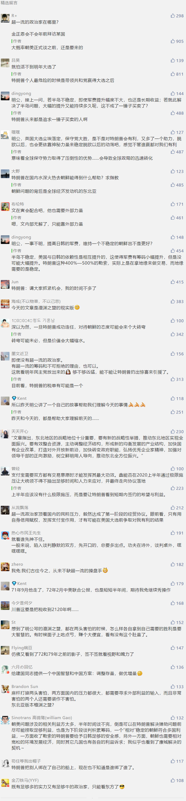

##正文

今天下午，一架美国飞机抵达韩国首尔，机上载着美国朝鲜政策特别代表比根。据悉，他将在首尔逗留三天，并于明天会见韩国总统文在寅，就朝鲜半岛局面展开磋商。

可以说，朝鲜对特朗普的极限施压，终于起到了效果。不出意外，这位特使将会带着特朗普的口信与朝鲜方面缓和关系。

联想到几天前朝鲜接连的发射导弹，很容易被联想到一贯对别人极限施压的特朗普，这一次被别人极限施压成功了.......

 

此次美方释放善意的主要原因之一，就是特朗普陷入到了巨大的危机之中。

13日，美国众议院司法委员会依次通过滥用职权和妨碍国会调查两项针对总统特朗普的弹劾条款，表决结果均为23票赞成、17票反对通过，预计众议院将于下周对弹劾条款进行投票。

目前美国已经划分成为了激烈的两党对峙，没有司法委员会委员会的共和党人投出赞成票，也没有民主党人投出反对票，估计接下来的全院投票也会如此，弹劾特朗普最快明年年初就会被交到参议院。

这意味着对于特朗普来说，争取民主党方面的支持绝无可能，而共和党大部分议员们也只能跟着特朗普才能保住明年自己的席位，这使得特朗普国内力量对比将无任何变化，只能从美国国境之外寻求力量作为自己的筹码。

而对于特朗普来说，朝鲜的问题牵一发而动全身，不仅牵扯着韩国的50亿、日本的80亿美金每年的军费谈判，更与东北亚地区的经贸谈判有着重要的关系。

因此，希望明年搞出来一系列交易的特朗普并不希望朝美会谈出现破裂。

当然，对于朝鲜来说，内部问题绝不逊于美国，如果要进行大刀阔斧的经济改革，需要投资、需要市场、需要技术引入，需要解除制裁，甚至还需要裁军和稳定的国际地缘。

朝鲜作为社会主义国家，传承了每年年底设定下一年计划的工作模式，在朝鲜每年的新年讲话上，都会宣布下一年的发展计划，其中就要明确2020年的改革计划。

这就使得朝鲜必须要在12月底之前，确定明年跟美国谈判的路线图，才好确定明年的发展方向。

所以才有了连续的导弹试射，多名高官的隔空喊话，本质就是以新年讲话为时间线给特朗普政府的最后通牒。

换句话说，对于特朗普和朝鲜来说，都是麻杆打狼两头害怕，两方面国内的压力都很大，都需要寻求外部利益的输入，而且非常害怕的两个人还需要装作不害怕。

因此，考虑到国内局势以及国际局势，对于特朗普来说，**是否达成协议不是第一要务，先通过缓和，将谈判的主动权继续握在自己的手上才是第一要务。**

所以，特朗普会在年底之前通过让步，尽可能避免与朝鲜等国家出现谈判破裂，把大家维持在谈判桌上，才能让他明年的交易留有足够的余地。

这使得朝鲜在年底出现了一个非常好的谈判机会，操作得当，将能够使得急于稳定朝鲜在谈判桌上的特朗普，给予足够多的的妥协和让步。

预计好消息大概率很快就会传出来，这将使得明年年初的东北亚局势出现缓和，有利于中日韩推动FTA以及三国之间的各项双边合作与缓和。

但是，随着明年年初特朗普大概率将躲过弹劾，特朗普愿意妥协的程度会出现下滑，尤其是进入到大选周期，特朗普的时间和能量都有限的情况下，对于短期内无确定把握签署的协议，特朗普为了安全起见有可能会选择搁置。

这意味着，明年的半岛局势大概率会出现上半年积极下半年消极的局面。

而如果想要利用2020年这个美国大选年，利用特朗普彻底改变东北亚的局面，我想，真的需要超一流的政治家来操盘了。

##留言区
 

