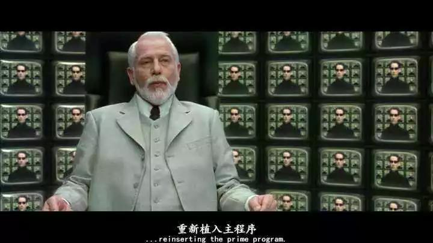
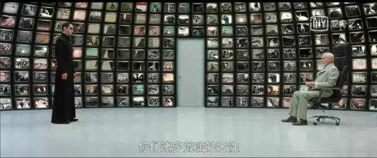
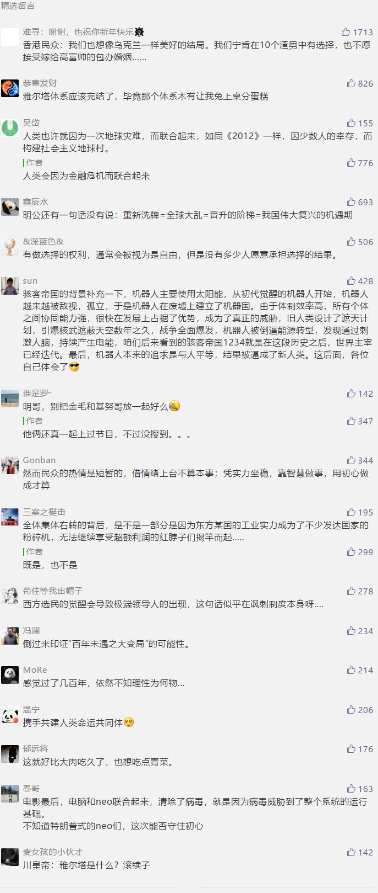

##正文

有一部电影政事堂非常喜欢，名字叫做《黑客帝国》，很多朋友看的时候被帅气的打斗或者炫酷的科幻情节所吸引，并接受了电影开场时设定，机器人需要靠养着人脑来供电。

 

但是，人脑的化学能转电能的效率低到令人发指，这不过是一个机器人欺骗人类的小把戏，电影中机器人养着人类的真正目的，是希望研究人类大脑来对自己的代码进行升级。

 

就像男主人Neo第一次遇到Matrix的设计师老爷爷时，这个机器人告诉她，第一代的Matrix由于设计的过于完美，导致系统内人类大量死亡，最终系统崩溃。

 

过程中的反思，让设计师发现了一个问题，人类需要的并不是一个完美的社会，他们需要进行选择，所以设计师先后发明了喜欢让别人做选择的法国人以及引导别人做选择的先知，来帮助它调整Matrix系统，成为一个能够选择的系统。

 

所以如果大家细看黑客帝国三部曲的话，就会发现被先知不断引导的男主角Neo，一直都在面临各种选择，最后，带着这些选择的数据返回Matrix帮助系统升级。

 

好了，电影背景简单介绍到这里，回头我们再来看特朗普和他的总统选举。

随着冷战的结束，我们会发现西方国家的选举机制，与电影中机器人对人类的控制类似，也是一种精英阶层对普罗大众的一种控制。

看起来，民众们拥有两党制或者多党制的选择，但选来选去，上来的都是布什克林顿家族这样的建制派，掌控国家的都是deep state，那些候选人的政治主张也越来越接近，老百姓选谁其实都一样。

这背后的原因之一，是西方的选举制度让西方群众认为一切的结果源于他们自己的选择，而这也使得他们更愿意去接受既定的结果。

于是，西方习惯了每隔几年一度的选举，就像Matrix每过一段时间就要重启一样，这能够大幅削减民众累积的不满。

当然，这并非真正意义上的普世，因为Matrix的世界架构源于西方的耶稣救世，而很多非耶稣信仰的民众，如东方的印度教、伊斯兰教以及佛教等文化圈，民众在不接受西方思想的情况下，就不怎么喜欢去做选择。

说句题外话，这也能体现“一国两制”的重要性，如果一个地区的主体人口意识形态上接受了西方思想的话，那么再好的福利也没用，必须要让他们去进行选择，让他们承担选择带来的结果，否则拖久了也会像第一版的Matrix那样系统冲突越来越严重。

不过，虽然选择的机制能够麻痹群众，但时间久了必然也会出现巨大的不满，尤其是随着互联网的信息爆发，这种不满是机制性的产物，所以美国民众先是选出了非建制派的奥巴马，后来又选出了叛逆型的特朗普。

就像电影Matrix系统每到后期都出现越来越多的叛逆者那样，如今越来越多的西方民众也从漠不关心变成积极投票，希望选出一个能够代表自己去做选择的总统。

 

这个机制也使得全球近年来出现了一个个有着明确民粹口号的民选总统跳出来血洗建制派。

 

回头看来2016年，有点原教旨主义，不断去创造奇迹的特朗普，本质也是另一种不受控制的救世主Neo，以基督徒为基本盘的他，必然要与建制派们决一死战。

 

而特朗普发起的战争过程中，又会让越来越多的西方选民们觉醒，这也意味着在未来的一段时间内，西方国家会诞生越来越多的代表着极端民意的领导人。

随着建制派们的纷纷离场，这也标志着，自冷战以来建立的国际新秩序，在不远的将来崩塌后重新洗牌。

##留言区
 

