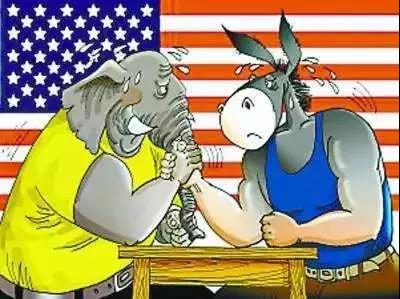
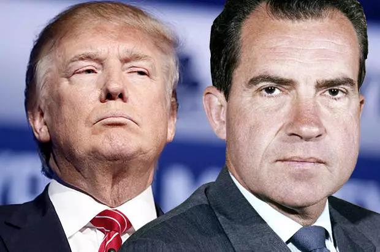
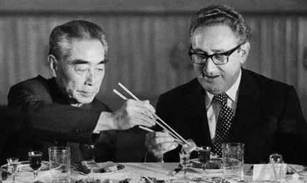

##正文

今夜，将是一个漫长的夜晚。

几个小时之后，美国众议院就将以“滥用权力”和“妨碍国会”为由，对弹劾特朗普进行全院辩论和投票。这也将让特朗普成为美国历史上第三位被弹劾的总统。

不出意外，由民主党控制的众议院能够轻松通过弹劾，赶在周五国会圣诞假休会前完成，然后交到参议院。

 

不过，就像政事堂之前分析过的，由于弹劾总统需要2/3的参议员票数，共和党占据优势的参议院绝无可能通过对特朗普的弹劾案，以通乌门在特朗普第一任任期内完成弹劾的可能性趋近于零。

但是，明知无法弹劾成功，为何众议院的民主党员还要还要弹劾呢？

其中有一个很重要的原因，两百多名民主党的众议院本身也是一个松散的团体，按照众议院每两年一换届的制度，他们大部分人也要在明年选举以保住自己的议员位置。

而这就使得民主党议员们跟民主党的利益，出现了不一致的可能。

随着特朗普的极端化，美国出现了两个大群体，支持特朗普的共和党选民，以及反对特朗普的民主党选民，两个群体不仅数量庞大、规模相当，而且还有非常强劲的投票意愿。

这就使得民主党的众议员们，面对极端的选民，不仅要战胜共和党议员候选人，还要战胜党内的同僚，才能保住自己的位置。

随着民主党的选民们强烈反对特朗普，如果自己没有在众议院投票弹劾特朗普，别说跟共和党对手竞争，都无法在选区内的同僚中脱颖而出成为候选人。

这就使得民主党的议员们在民意的裹挟下，纷纷加入到抨击特朗普的行列中。虽然弹劾特朗普对于民主党是弊大于利，但是对于民主党的众议员们却是利大于弊。

最终，民主党的众议员们纷纷陷入到了囚徒悖论当中。

同样，对于共和党的议员们来说，想要确保自己在明年连任，也必须要坚定的支持特朗普。

一旦他们在弹劾投票中体现出了对特朗普的支持不绝对，在共和党的狂热选民眼里这就是绝对不支持，明年会让他在议员的竞选中输给自己的共和党同僚。

而今夜的投票，也将深深的改变世界历史的走向，支持特朗普与反对特朗普，将成为共和党与民主党各自的“政治正确”，双方在接下来的时间将会变得越来越极端。

 

当然，政事堂看来，接下来光靠那些民主党的议员们，是不可能真正扳倒特朗普的。

就像彭博最近出来参选那样，真正有机会扳倒特朗普的，只能靠那些民主党背后的大金主们自己出马。

只有当这些超级金主们被逼到一定的程度上，才会痛下杀手通过经济危机等双输的手段做掉特朗普。

判断了在野的民主党，对于执政的共和党，我们能得出什么重要的结论呢？

我们可以对比一下半个世纪之前，1972年的美国大选。

这一年，除了引发尼克松被弹劾的水门事件之外，美国在国际上发生了两件大事，一个是尼克松访华，签署中美联合公报，结束了敌对，一个是美国宣布撤军越南，结束了越南战争。

撤军越南会导致美国的盟友南越丧失保护，像特朗普撤军叙利亚，导致盟友库尔德人被各方吊打；同样，与大陆和解则意味着抛弃台湾的老蒋，像特朗普与塔利班和解，意味着抛弃了阿富汗政府.......

回顾历史，对比尼克松对比特朗普的外交政策，这两个被弹劾的总统之间，是不是有些意思了呢？

 

更有意思的是，其实尼克松1971年就下决心要跟中国和解，要从越南撤军，但是被基辛格坚决反对，强烈要求他把时间放在1972年的大选年。

 

 原因很简单，基辛格不仅是尼克松的国家安全顾问，也是共和党大金主洛克菲勒推在台前的代理人，他要为整个共和党的利益服务，要让更多的共和党议员们控制议会更多的位置。

所以，这些尼克松外交上的大动作，不可以在1971年执行。

一方面，美国撤军越南之后，盟友南越很容易被北越攻陷，就像库尔德武装在美国搞起了舆论潮，逼得特朗普转换风口那样，不得不对埃尔多安食言。过早的战略后撤容易在大选年给自己挖坑。

另一方面，与大陆和解，撤军越南等一系列获取美国民众支持的事情，放在大选年进行不仅对总统尼克松有利，也对共和党的会议议员们有利，尼克松可以利用其高涨的支持率带动共和党占据更多的议会席位。

所以呢，我们会得出一个结论，之前特朗普一力推动，但是遭遇党内巨大阻碍的外交政策，随着美国进入大选年会出现巨大的变化。

接下来，共和党议员和背后力量，为了蹭特朗普的热度获取选民的支持，很多外交事宜上会转向支持特朗普，形成利益共同体，推动地缘战略以及各项协议的签署。

这意味着，在2020年，全球那些跟特朗普做交易的大佬们，将会迎来一个短暂的窗口期。

而能否布局成功，让特朗普以及共和党议员们，认为某些能争取民意的协议，可以在年底投票前达成，从而改变历史的进程，就看最近这几个月了。

近期关联文章：

从电影黑客帝国，看全球的特朗普效应

弹劾中的特朗普，派出了朝鲜特使

##留言区
 

