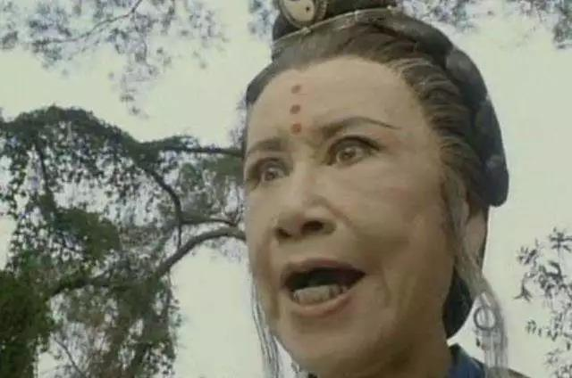

##正文

金庸小说《天龙八部》有一个情节，两位男主人公段誉与乔峰的初次见面，喝过酒之后便结为兄弟。

 

由于乔峰一直展现出来的沉稳干练，胆大心细，因此，很多人对乔峰的轻率之举表示不解。

其实，说起来，乔峰和段誉还真不是光喝了一顿酒那么简单。

当时，丐帮的根据地在北方，这次乔峰带着丐帮一众长老们南下，是为了调查副帮主马大元之死，与姑苏慕容是否有关系。

而当时“北乔峰南慕容”的称号，不仅仅是因为乔峰和慕容复是中原武林年轻一代最强的两个人，也因为乔峰背后的丐帮以及慕容复背后的慕容家族，是江湖上不可忽视的两股力量。

不要看个电视剧就以为慕容家没啥势力，人家是几代人传承下来准备起兵复兴大燕的，慕容复手下四个家将都是庄主。看看北宋末年的小说水浒就会明白，每个庄主都是着一股不俗的势力。

而乔帮主表面粗狂之下，却有一颗细腻的心，他知道如果双方在没有调查的情况下直接相遇，丐帮长老们为了报仇，很可能像杏子林一战那样直接刀兵相向，到时候他没有理由都挡不住。

于是，乔峰脱离了大部队提前达到江南，先自己开启了尽职调查，摸清楚慕容复手下的公冶乾与风波恶两大家将的势力以及性格之后，才在酒楼喝酒巧遇段誉。

当时段誉公子王孙的打扮与气质，不惧一切的自信，以及听力展现出不符合年龄的超强内力，使得乔峰误以为对面的这位公子哥就是传说中的姑苏慕容。

作为年轻一代最强的对手以及杀害马副帮主的嫌疑人，乔峰自然是要探一下对面这位“慕容复”的虚实。

说起来，金庸笔下高手和低手之间，往往很容易就能确定胜负，譬如乔峰调查公冶乾的时候，就跟这位自诩江南章法第二的慕容家将对了三掌，打得对方服服帖帖。

但是，顶级高手之间，却很少会有硬碰硬的比拼。

就像《射雕英雄传》里面欧阳锋带着侄子欧阳克，来找黄药师求亲，两个好久没有过过招的五绝级大佬都想急切交手一下。

但结果呢？

东邪吹起了萧，西毒奏起了筝。看得郭靖和黄蓉是一脸懵逼。

不过听着听着，郭靖黄蓉就很快明白了，这是两位绝世高手在利用乐器来比拼武功与内力。

作为天下五绝级别的高手，水平基本是相当的，因此相互之间的比拼也是有度的。

毕竟，东邪西毒是来结亲家的，不是来寻仇的。

而且，这种级别的人真要是动起手来，搞不好就是洪七公与欧阳锋式的同归于尽，或者胡一刀与苗人凤那样必死一人，那可就是喜事变丧事了。

所以呢，世间顶级高手之间的比拼，普遍会换一种比较文明的方式。

譬如《神雕侠侣》中，在蒙古大帐内，金轮法王跟尼莫星、潇湘子、尹克西几个人吃了一顿牛肉，就分出了谁是老大；《倚天屠龙记》中，左使杨逍与鹰王殷天正谁也不服谁，于是搞起了比拼脚力，看谁跑得更快。

毕竟，到了这个层面上，大家不是国师就是帮主，麾下都是一群小弟，比武过程中伤了谁，输了事小，颜面丧尽才是事大。

就像灭绝师太纠集六大门派围攻光明顶的根源，就是因为杨逍击败了灭绝师太的大师兄，造成了两派的不死不休之局。

 

所以呢，北乔峰的丐帮帮主，和南慕容的慕容家家主之间，如果不到万不得已，尽量要避免直接的比拼，尤其是在丐帮马副帮主的死因还不明确的情况下，无论谁赢谁输，接下来丐帮和慕容家之间都将无法避免一场血战。

在这种情况下，拼酒自然成为了乔峰非常好的一个选择。

 

一方面，两个人喝到了四十多碗，一开始还是拼酒量，到后来就是拼内力了，喝酒的过程中，就像射雕的萧筝之争或者神雕的抢肉，乔峰可以判断出对面”慕容复“的真实水平，而不伤了一团和气。

而另一方面，喝酒之后，绝大部分人都会变得心直口快，希望能够从慕容复口中调查马大元死因的乔峰，自然希望喝酒之后的慕容复能够展现出真实的样子，套出一些有价值的信息。

只不过令乔峰没有想到的是，这个跟自己豪饮四十碗，内力几乎相当的青年竟然不是传说中的姑苏慕容，而是一个名为段誉的少年。

而且，段誉述说来到姑苏的原因，路上一系列的糗事都不遮掩，甚至连自己的家世背景、武功缺陷全部告诉了乔峰，赤诚之心在江湖上也极为少见。

因此，一向喜欢结交天下英雄的乔峰，就喝着酒，拉着大理镇南王世子段誉，两人结拜为兄弟了......

现代商场与古代类似，在合作谈判的摸底过程中，双方不可能刚见面就动用资金展现实力，很多时候，都是通过酒局来相互试探。

在喝酒的过程中，对方的酒品、酒量，尤其是对酒的鉴别能力，都是对方实力的直接体现。

毕竟，穿一身几十万的衣服，租一辆几百万的豪车都能够伪装，但是多年来养成的对高档酒的品鉴以及酒量酒品，绝不是临时抱佛脚能够补上来的。

而且，酒局的杯觥交错中，在放松状态下，更是能够得到谈判桌上调查不出来的信息，吐露出很多平时说不出来的掏心窝子话，甚至还能像乔峰段誉这样碰到了意气相投的，一个行业巨擎跟一个王府的少爷，喝着喝着也就义结金兰了......

而正是这一顿酒，给乔峰带来的段誉和虚竹两个生死相随的义兄弟，让他能够面对中原武林的围剿，在少室山大战天下群雄。

 

 所以呢，买到保真又便宜的酒，就非常重要了.....

 上月末政妹儿与大家分享了自己双十一期间在拼多多上以“789元买43度飞天茅台”的经历。

这次，拼多多又拿出了“53度飞天茅台”做限时限量购活动。

拼多多“53度飞天茅台”
限时特价仅需2220元/瓶

每人限购1单！
限量1500瓶！抢完即止！

而上次拼多多双十一活动结束后，43度飞天茅台价格又恢复到了“819元/瓶”，有好多读者都在留言寻问，43度飞天茅台什么时候还能再有活动。
 
读者们的问题，政妹儿向来记得特别牢固，所以就不时地盯着拼多多，等着它再次做活动，再带大家去薅羊毛~

终于，在等了快一个月之久的今天，拼多多商城的43度飞天茅台又有活动了！
 
之前就与大家说过，43度飞天茅台在某东要996元/瓶，在某宝要1009元/瓶，那么拼多多是多少钱一瓶呢？

拼多多“43度飞天茅台”
限时特价仅需789元/瓶

这价格，真的是诚意满满了。上一次没抢到的读者朋友，这次下手可要快啊。

政妹儿双十一期间给家里人买的43度飞天茅台已经见底儿了，年底了各种家庭聚会又多，这一次政妹儿准备拼拼手速再多囤几瓶，有备无患嘛。

除了飞天茅台，拼多多现在还有几款百亿补贴产品，政妹儿也想着重推荐给大家。

还有无论小孩子还是大孩子都喜欢的
益智玩具乐高积木
在百亿补贴之下
也比其它平台便宜了近一半的价格

拿“乐高冰雪奇缘系列”为例
某东和某东都要449元/套
拼多多却仅需270元/套
过年送给小朋友，你就是他们心中最棒的长辈

这优惠力度有多大，相信不用政妹儿多说，大家也能感受得到。
 
至于拼多多百亿补贴商品真伪的问题，之前也与大家分享过两篇文章，解释了一下拼多多为什么要做百亿补贴。
 
看过文章的小伙伴心里一定非常清楚原因了。
 
它是想消除民众对自己的固有印象、证明自己是货真价实的。
 
为此，拼多多还联合了“中国人保”，承诺所有售出大牌均为100%正品，假一赔十！
 
可谓是诚意满满了。
 
话不多说，给大家奉上拼多多小程序链接。
 
趁着这次大力度活动，政妹儿也要去薅好玩的“乐高积木”，还有过节必备的“飞天茅台”了~
 
##留言区
 

