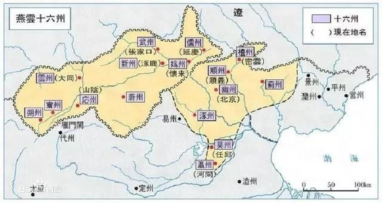
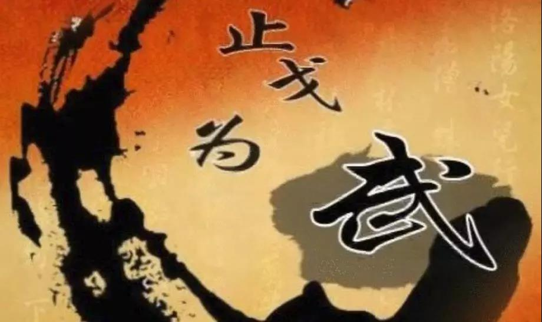

##正文

书接上文： 檀渊之盟系列（二）

随着澶渊之盟的签订，大宋与大辽之间实现了长期的和平，虽然私底下依旧小冲突不断，但是大面上两国约为兄弟之国，年长者为兄，年幼者为弟。

当时大辽的耶律延禧，嗯，就是延禧攻略的那个延禧，与大宋的宋徽宗，两人兄弟相称，两国一派祥和。

 

而这一切，随着大辽内部矛盾激化，女真的崛起而改变了。

就是天龙八部里面萧峰的好兄弟完颜阿骨打，带着凶猛的女真部落把大辽的耶律延禧揍的找不到北。

论辈分，耶律延禧是耶律鸿基的孙子，应该喊爷爷的义兄弟萧峰一声爷爷，而完颜阿骨打也是萧峰的义兄弟.......所以辽金之间的战争，颇有点爷爷揍孙子的感觉.......

 

此时，大宋收复燕云十六州的机会，来了。

 

燕云十六州对于大宋有多重要就不用说了，后世的满清在关外再怎么胖揍大明，但是也越不过山海关。

于是，宋朝上下下定了决心，跟后崛起的女真签署了海上之盟，准备与金国共同对抗大辽，以夺取魂牵梦绕的十六州。

结果我们都知道，宋辽两国大军在燕云十六州狠狠的打了一仗，打得两败俱伤，让金国渔翁得利。

最终，大辽的耶律延禧前脚刚被抓到黑龙江的五国城，一年之后，宋徽宗被金国人抓到，后脚也被送到了五国城。

据史料记载，当在黑龙江冰天雪地里烤肉的耶律延禧看到宋徽宗时，发自肺腑的说了句：来了，老弟.......

 

从此之后，哥俩在黑龙江的五国城里面，过起了大铁链子小铁锹，一天三顿小烧烤的美好日子.....

关于大宋是否应该撕毁澶渊之盟出兵，从南宋在与蒙古媾和伐金时的大廷议，到大清最后的一次科举考试的试题，都进行了反复的争论，可以说，这是一个讨论了千年的话题。

但是，很少有人会从金国的角度来考虑海上之盟。

当时金国内部也有着巨大反对跟宋联盟的声音，但是雄才伟略的完颜阿骨打认为主要的对手是辽国，因此坚决与宋国联盟，他任何条件都可以退让，只有一条死守，那就是宋国必须出兵攻辽。

而这才是问题的所在。

历史上，国与国之间的外交，靠的是力量，而不是一纸合约，**任何一股力量愿意去签署合约，背后都是有着一个更重要的对手要对付或者更重要的事情要去处理。**

金国知道辽国是自己不死不休的对手，所以希望用海上之盟让宋朝背后捅辽国一刀。同样，辽国知道金国是自己不死不休的对手，所以想尽办法维系檀渊之盟，确保自己不被背刺。

但是，对于大宋来说，收复燕云十六州，从来就不是最重要的事情，真正重要的，一个是尽快拥有能够收复燕云十六州的力量，另一个是尽可能久的维持金辽之间的战略平衡。

历史上，宋朝盲目的收复燕云十六州，不仅消耗了辽国最后的主力，也使得辽国上下的战斗意志崩溃。而金国得以迅速击溃辽国并与大宋接壤，也开始琢磨入侵大宋。

反之，只要辽国拥有反击之力，金国就绝不敢于大军南下，就算有口头威胁也绝不敢真刀真枪。

同样，只要金国的威胁还在，辽国也会牢牢地遵守澶渊之盟，为了生存，对辽国来说也没什么不能卖的。

在辽金两股力量消耗之下，大宋既可以仿照大唐那样搞节度使制，辽国合作，把燕云十六州作为自己的战略缓冲地带；也可以在辽金死磕引发的毁灭式混乱中，看准时机用金钱赎买。

 

所以呢，大宋没有必要去设置收复燕云十六州的时间表，真正需要做的，是集中精力解决内部的经济问题，然后整军备武，利用辽金之间争斗的空隙，面对这一场百年未有之大变局，尽快拥有靠自己收回燕云十六州的实力。

就像两千多年前的山东人左丘明在《左传》中写的那样：

止戈为武。

 

 
##留言区
 无留言