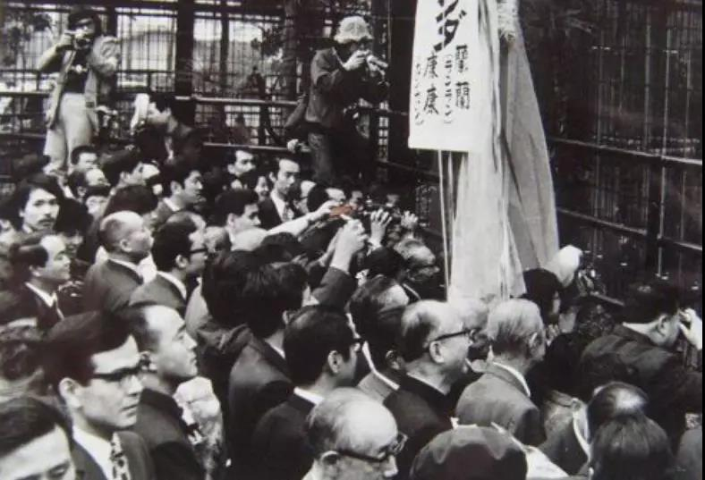
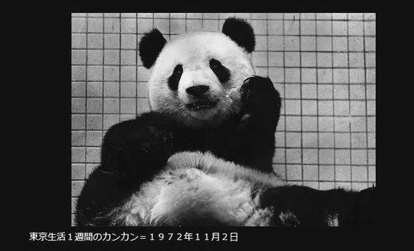
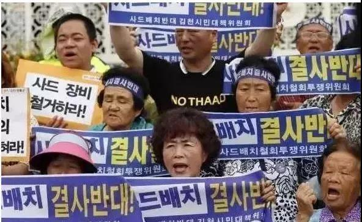

##正文

1972年11月4日，日本东京的上野公园内丝毫看不到一丝寒意，数不清的日本人凌晨就在动物园门口排起了长龙，一直排到了上野地铁站。

即使“排队3小时，见面30秒钟”，也根本挡不住狂热的日本人，五万多人蜂拥而来，可最终入园的仅不足两万。

 

令日本人如此疯狂的，就是来从成都一路护送而来的两位“旅日胖达”（Japanda），康康和蘭蘭。

 

两只胖达的来访，源于两个月前，日本首相田中角荣与外相大平正芳访华，中日实现邦交正常化，为了表达中日之间的友谊，周总理决定将来自四川的大熊猫“兰兰”和“康康”赠送给日本人民。

 

两周后，萌滚滚的“兰兰”和“康康”乘坐的专机飞抵日本领空时，由日本自卫队战机编队将其一路护航至东京羽田机场，内阁大臣二阶堂进在机场率队迎接。

由于胖达天降的惊喜过于突然，准备欢迎仪式的东京方面只能匆忙把白熊雕塑涂成了熊猫。

 

作为中日人民友好的使者，萌滚滚的两只胖达让上野动物园在1973年以920万参观人次打破了历史记录，此后七年间，到访的人数达到3200万人，相当于日本总人口的四分之一。

 

在“兰兰”和“康康”的代言之下，他们在日本待的七年里，让刚刚与中国和解的日本民众，对华好感度一路飙升至80%的历史最高点，两位胖达成为了中日友好最重的“压舱石”。

之后，“熊猫外交”也成为了中国外交史上浓厚的一笔。

自80年代之后，中国改赠送大熊猫为租借，每年100万美元，一只熊猫可就是一千万美元，这笔钱对于改革开放初期外储靠“东风”的我国来说简直就是一笔横财......

 

别觉得贵，还不是有钱就租给你的，想要萌滚滚就得拿最值钱的东西来换。

当年英国人租胖达是引擎技术换的，法国人租胖达是拿核浓缩技术换的，德国是拿汽车技术来换的，老美甚至为了租胖达连黑鹰直升机都卖.....

 

那些曾经靠着坚船利炮拿到一个个不平等条约的列强，如今又被一个萌滚滚的胖达搞的心甘情愿签下一条又一条的不平等条约.....

 

作为民间的外交大使，萌滚滚的熊猫也堪称中国外交的压舱石。

在美剧《国务卿夫人》中，有一集是中国对美国以归还熊猫方式施压，总统担心看不到熊猫的小朋友们愤怒而选择让步。

甚至现实社会中，前几年的萨德事件中，不少韩国人民就担心中国会把大熊猫要回去，为此举行了游行抗议......

 

当然现实中，我们不会以“召回”萌滚滚作为制裁的武器，但是每一次租赁萌滚滚的背后，都是两国外交与经济领域取得历史性进步的见证。

譬如看最近几年我们萌滚滚的行宫，韩国是签署了中韩FTA，澳大利亚开放了华资铁矿投资许可，芬兰和丹麦成为亚投行的创始成员，荷兰则是新丝路倡议的欧洲起点.......

所以，明天中日韩峰会放在了拥有大熊猫繁殖基地的成都，意味就很深远了。

相信只要谈判顺利，就会有新的萌滚滚成为中日、中韩友谊的坚实桥梁。

中日韩三国贸易中，日本对韩国顺差，韩国对中国顺差，中国对日本顺差，三国之间的产业链有着非常强劲的互补优势，只是由于奥巴马政府执政时期搞出来的钓鱼岛事件、萨德事件、登岛事件坠入冰点。

如今，随着特朗普政府的在亚洲的战略收缩，中日韩三国从外交、经贸到产业都有着巨大的合作空间，不仅仅是即将签署的RCEP和正在谈判的中日韩FTA，更有着推动东亚经济一体化的历史性机遇。

而这一波历史的进程的起点，也许就是几只成都来的萌滚滚.....
 
 

##留言区
 

