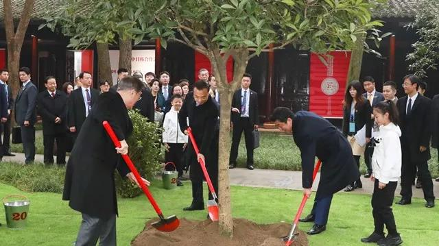

##正文

据环球时报援引日本媒体报道，今天，日本东京地检特搜部对安倍政府原内阁副大臣秋元司的两名前秘书家中展开搜查，调查他们与中国企业的关系以及被违规带入的资金动向。该中国企业的日本总部也遭到搜查。

此时，刚在成都过完平安夜的日本首相安倍晋三，正与中韩两国政府首脑共同发表《中日韩合作未来十年展望》。

 

在三国会议上，中方倡议将2020年定为“中日韩科技创新合作年”,深化金融科技领域合作，提升移动支付便利化水平，为三国游客提供更便捷的支付服务。

而很巧合的是，这次被调查的安倍内阁原副大臣秋元司，分管的工作之一，就是金融科技工作，他还有一个身份，就是金融科技推进议员联盟干事。

考虑到日本的东京地检特搜部由当年的美国人一手建立，雇员们多有亲美背景，自建立以来七十多年撂倒了无数的日本政治家，可里面几乎没有亲美的。很容易联想到此次出事儿恐怕并没有那么简单。

今年下半年以来，从文在寅的心腹曹国被调查后的落马，到安倍飞机惊魂后，自民党又一名高官被调查，看着从中日韩主导的RCEP到FTA，一项项协议的不断加速推动，也许，有势力是坐不住了。

不过在政事堂看来，这些小动作在历史的大势面前，根本无法阻挡，因为中日韩关系的回暖，是一项历史的进程。

 

首先，回顾历史我们就会明白。

20年前中日韩政府首脑的首次会面，是在东盟峰会上促成的，原因很简单，那就是97年的东南亚金融海啸，让东南亚各国以及日韩遭受到了重创，他们认识到了必须要团结在一起。

而97年我们在香港的那一战，也证明了只有中国才是亚洲经济合作的压舱石，因此，虽然有着美国的干涉与驻军，但中日韩的经贸合作却一路高歌猛进。

尤其是在2008年的次贷危机之下，亲华的安倍因为亲信被调查，刚下台，反而上来了一个更亲华的鸠山由纪夫......

反之，当全球从经济危机走出来之后，日本就先是参拜靖国神社，后闹起了钓鱼岛.......随着经济的转暖，中日之间反而越走越远.....

所以我们会明白，无论日韩都是经济大国，他们最担心的就是经济危机，90年代初的日本广场危机和90年代末的东南亚危机，让日韩两国都有着刻骨铭心的记忆。

因此，在未来几年内可以预见的一波危机之中，他们都必须要做好充分的准备。

而就拿今天新闻的日本来说，负利率之下货币政策方面已经没有了下降的空间，过去几年的安倍经济学也几乎用尽了财政政策的尺度，如果不能靠上中国这个庞大的市场，在下一波的资本主义周期中必然要重蹈90年代初的覆辙。

而国内那些经济学家们，BB降息都快BB了好几年也未见央行动静，就知道骂政府，是因为他们根本看不懂国际地缘。

我们手中的货币与财政政策准备的弹药，既是我们未来反攻时的开路先锋，也是我们现在谈判的筹码。

除此之外，还有另一个逻辑。

中国的每一次对外开放，实际上都是一次集体博弈。

70年代初，随着尼克松访华，中美和解，日本马上与中国恢复外交关系，从美国爸爸嘴里面抢了第一桶金。

90年代初，美国封锁中国，结果又是日本，第一个忤逆美国与中国恢复贸易，又抢了第二桶金，韩国也是顶着巨大的压力选择此时跟我们建交。

90年代末，随着中国与美国签署WTO协议，日韩主动搞起了中日韩首脑会议，开启了中日韩三国的蜜月期。

所以我们会明白，随着中国和特朗普即将签署第一阶段协议，嗅觉灵敏的秋田犬肯定第一个转过来舔我们，希望能够从美国爸爸那里抢根骨头。

反而接下来，中国巨大的市场空间，会使得日韩要纷纷与美国爸爸抢跑，争相对华输出高科技与产业体系。

而明白了这两点，也就明白了没有什么能够阻挡日本的政治家们选择亲善中国，就算换了，新上来的只会更亲。

更能深一步的体会搞供给侧改革和对外开放的重要性，因为只有我们自己手上握有更多的筹码，才会在国际牌局的纵横捭阖中，为祖国谋求更多的利益。

##留言区
 

