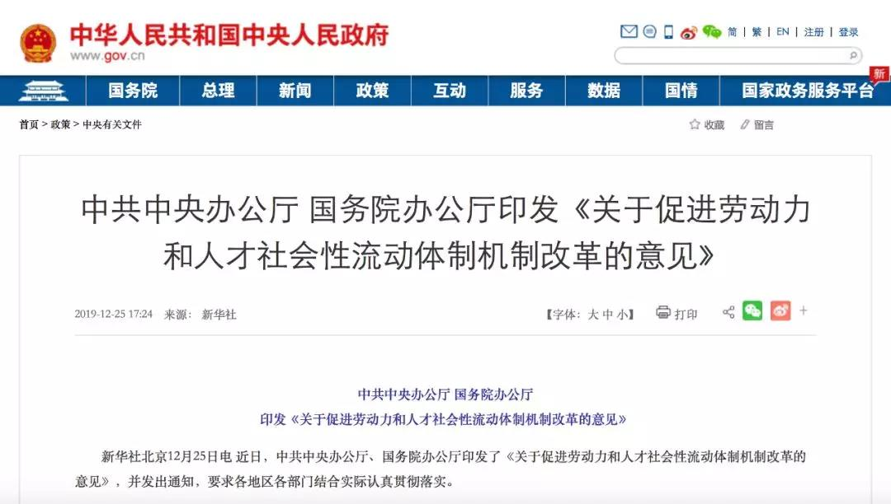

##正文

昨天，一份名为《关于促进劳动力和人才社会性流动体制机制改革的意见》的重磅文件由中共中央办公厅、国务院办公厅联合印发。

 

牵头起草的人社部称之为**“首次构建了促进劳动力和人才社会性流动的政策体系框架**”。
 
而《意见》提出的“**全面取消城区常住人口300万以下的城市落户限制，全面放宽城区常住人口300万至500万的大城市落户条件**”也激起了舆论千层浪。

这则新闻一出，很多媒体普遍纷纷看好房地产的复苏，尤其是有利于提振三四线城市的房价。

不过在政事堂看来，结论搞不好是恰恰相反，该政策的推进，反而会进一步分化国内的一二线与三四线的市场。

记得2018年，政事堂下过一个结论，那就是严控人口的京沪，未来平均房价很难涨，但是会中心化和两极分化；同样，随着中国人口红利的到顶，未来全国平均房价也很难涨，但是房价的组成结构会“京沪化”。

原因很简单，那就是根据目前改革的总思路，是市场学派的“**让市场在资源配置中起决定性作用**”，取消劳动力和人才的流动性限制，只会让市场这只看不见的手，继续推动劳动力和资本产生聚集效应。

举一个很现实的例子，随着外来人口向三四线城市的涌入，很多人以为房价会涨，但他们没有考虑的是，外来人口的入城也会导致三四线有财力的居民为了教育等资源，举家向一二线城市迁移。

大家可以对比一下全国“市场化”做的最好的上海，就会明白，外来务工人员集中的菜场小学反而会拉低当地的房价，驱使富裕阶层的搬离，市场这个看不见的手，会不自觉的推动资本向中心城区和产业城区汇聚。

这也是为啥从去年开始，政事堂讨论房地产的时候，就不断的说“地段、地段、还是地段”，因为在中国学术界市场学派已经压过了股份学派，这使得未来中国的房地产，也会从十多年来搞产权交换的老思路，变为让市场在资源配置中起决定性作用的新思路。

这不由得让我想起了年初跟温铁军老师关于农村城镇化和农民进城的一次讨论，我俩的分歧点，在于农村派的温老师认为“**应该**”怎么样，而城市派的我则在说“**会**”怎么样。

由于温老师的水平碾压我几十个来回，因此聊到后来，我就是处于一边聆听一边用脑子疯狂速记的状态.......

不过，并不是所有的理论都正在指导实践，，自2018年开始，中国的城乡改革思路已经出现了巨大的变化，不仅从“股份化”转向了“市场化”，也从各自为政的“城镇化”转向了全国一盘棋的“城市化”。

在城市化和财政去杠杆的推动下，未来拿着廉价信贷的二线城市将有余力进一步开启人才、产业与资本的市场化竞争，不断加强人才引进力度和补贴，放宽落户限制，推动以二线中心城市为主的城市群形成。

说白了，无论是从高质量发展的角度考虑，还是从供给侧去落后产能的角度，随着人口流动的加速，中国未来的那几个大城市群，都会获取更多的劳动力与资本，利用集中效应迸发出更高的生产效率，以此参与到全球的竞争当中。

而这个改革的思路总结一下，就是“发展的不平衡要靠发展来解决”，随着中国GDP高速全面增长的时代过去，在资本与人才的集中下，点爆式的增长与巨头的崛起，将是下一个时代的主流。

而把握住命运的方式，就是要跟着国家去赶上历史的进程。

##留言区
 

