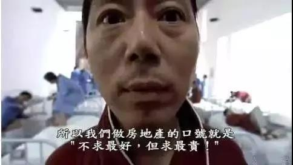
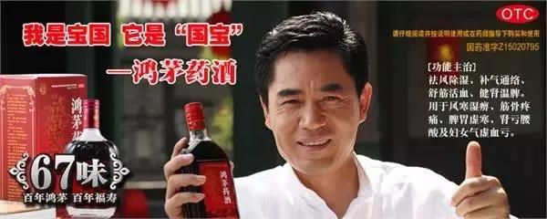
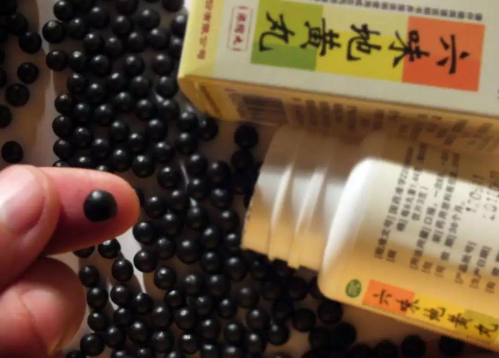
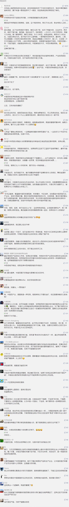

##正文

中药协终于道歉了。

昨天，授予鸿茅药酒荣誉称号的中药协终于发布道歉函，决定撤销本次表彰，纠正错误，规范管理。

道歉的缘由，是在本月20日召开的“中国中药创新发展论坛上，鸿茅药酒获得“2018年度履行社会责任明星企业”称号，鸿茅副总裁还获评“2018年度履行社会责任年度人物奖”。

考虑到2018年鸿茅药酒因为千里跨境追捕医生被国内舆论千夫所指，竟还敢说“社会责任”，中药协和鸿茅还真是一个敢发，一个敢领，不知道死字怎么写。

 

在政事堂看来，鸿茅是一定要骂的，不过介于目前网上骂声的一边倒，政事堂在骂之前，还是要先说一下鸿茅行为的一些合理性。

就在鸿茅药酒闹新闻的同一天，贵州茅台酒也搞了一个大新闻，就是茅台集团无偿将持有的4%茅台股份划拨贵州省政府。

考虑到同时贵州分管金融的副省长正在上交所考察，贵州省手里这笔茅台股意味着通过一系列的金融手段，能为高负债率的贵州解决大量的廉价资金以缓解地方债务问题。

而债务方面，全国能跟贵州相比的，恐怕就是内蒙古了，前段时间省会呼和浩特经开的城投债违约差点击溃了资本市场上的城投信仰。

看到省会的经开区都一度筹不到还债的钱，我们也就能够理解鸿茅为啥能“差遣”当地的公安搞异地追捕了。

毕竟，就像茅台之于贵州，鸿茅也是当地财政的印钞机，从就业和税收角度，的确有那么一点所谓的“社会责任”。

但是，这点“社会责任”的贡献，根本不足以阻挡政事堂继续骂他。

从90年代开始，保健品的蒙派行销全国，从杨振华851开始，红桃K、太阳神、中华鳖精、哈慈五行针、延生护宝液，到如今的鸿茅药酒.......内蒙形成了一股强大的保健品营销流派。

这个流派的特色就是疯狂的砸广告，在2000年前后的十多年里，在中国砸广告最狠的不是可口可乐而是蒙派老板们，靠着各种噱头的保健品几乎包揽了全国地方电视台的一半广告份额。

记得1994年央视春晚牛群冯巩的小品《点子公司》和后来冯小刚的电影《大腕》，便是讽刺了当时全社会造概念拼营销的现象。

 

其中，泰勒葬礼上讽刺的那个“婷美”内衣，就是鸿茅药酒老板鲍洪升搞出来的。

作为蒙系第二代领军人的鲍洪升，其代表产品就是鸿茅药酒，陈宝国“每天两口”的广告从中央到地方不计成本的砸广告，别的不说，十年来拿到的违规多达两千余条。

 

当然，由于其的确有一定的“社会贡献”，因此很多违规也就不了了之。

但是，这种铺天盖地砸虚假广告的营销模式，不仅严重透支了中药保健品行业的信用，使得中药保健品成为消费品行业中信任度最低的品类，压低了整个行业的消费规模。

而且，还让整个行业出现了“劣币驱逐良币”现象，掠夺了行业绝大部分的利益，压制了整个行业的良性发展，让那些几千年来被历史验证下来的配方，反而丧失了市场。

 

我们可以对比与保健品类似的酒业行业，茅台五粮液等国营酒厂在90年代中期之前，常常出现滞销的情况，远不如同期保健品行业风光。

但是那些国营酒厂们最起码的道德底线还是有的，没把那些老酒都炒成了包治百病的鸿茅药酒，共同维护了整个白酒行业的整体形象，维护了市场。

如今再来看，不仅成为了川贵等地的经济支柱之一，也成功抵挡住了各类洋酒红酒在中国的市场扩张。

可我们再看看用褪黑素包装出来的“脑白金”，最近史玉柱宛如智障一般的宣称吃了22年，就会明白随着未来医药保健品领域的不断对外开放，品牌做烂体系只会收割智商税的中医保健行业，未来会被打得西方医药公司打得丢盔弃甲。

医药保健未来是一个非常大的市场，国家也急需一批中药品牌能站住脚跟甚至能走向世界，因此，为了整个行业的发展，就应该对整个医药保健行业进行一轮痛苦的供给侧改革，提高行业标准，干掉落后产能，让市场自由竞争出来一批有竞争力的品牌。

看看泰国公司做起来的红牛功能饮料和香港公司做起来的王老吉凉茶，再看看横扫全球的可口可乐不过是一个止咳药配方，以及连乔布斯都在临死前拒绝治疗，只是尝试东方的草药，就会明白中国几千年流传下来的方子们是一个多大的宝藏。

对比一下供给侧改革的逻辑，我们脑补一下，未来有一天，六味地黄酒，十全大补茶之类的中药保健品能够行销全球，成为我们海外输出的一柄利刃，就会明白为什么今天要对鸿茅药酒痛打落水狗。

##留言区
 

